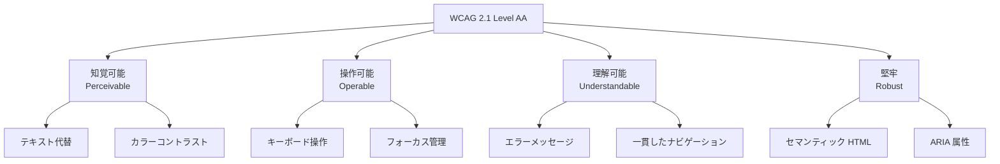

# アクセシビリティ設計

## 概要

勤怠管理システムの Web アクセシビリティ (a11y) 設計。WCAG 2.1 AA 準拠を目標に、キーボード操作、スクリーンリーダー対応、カラーコントラストの指針を示す。

## アクセシビリティ方針



## コンポーネント実装パターン

### ボタン

```tsx
// ✅ アクセシブルなボタン
<Button
  onClick={handleClockIn}
  aria-label="出勤打刻"
  disabled={isLoading}
>
  {isLoading ? (
    <>
      <Spinner aria-hidden="true" />
      <span className="sr-only">処理中...</span>
    </>
  ) : (
    '出勤'
  )}
</Button>

// ❌ 非アクセシブル
<div onClick={handleClockIn} className="button">出勤</div>
```

### フォーム

```tsx
// ✅ ラベルとエラーメッセージの関連付け
<div>
  <label htmlFor="email">メールアドレス</label>
  <input
    id="email"
    type="email"
    aria-describedby="email-error"
    aria-invalid={!!errors.email}
  />
  {errors.email && (
    <p id="email-error" role="alert" className="text-red-500">
      {errors.email.message}
    </p>
  )}
</div>
```

### モーダル

```tsx
// ✅ フォーカストラップ + ESC で閉じる
<dialog
  ref={dialogRef}
  aria-labelledby="modal-title"
  aria-modal="true"
  onKeyDown={(e) => e.key === 'Escape' && onClose()}
>
  <h2 id="modal-title">勤怠詳細</h2>
  {/* コンテンツ */}
  <button onClick={onClose} aria-label="閉じる">×</button>
</dialog>
```

## キーボードナビゲーション

| 操作 | キー | 動作 |
|---|---|---|
| フォーカス移動 | `Tab` / `Shift+Tab` | 次/前の要素へ |
| ボタン実行 | `Enter` / `Space` | クリック相当 |
| モーダルを閉じる | `Escape` | モーダル/ドロップダウンを閉じる |
| ドロップダウン操作 | `↑` / `↓` | 選択肢の移動 |
| カレンダー移動 | `←` / `→` / `↑` / `↓` | 日付の移動 |

## カラーコントラスト

| 要素 | 前景 | 背景 | コントラスト比 | WCAG AA |
|---|---|---|---|---|
| 本文テキスト | `#1a1a2e` | `#ffffff` | 16.8:1 | ✅ |
| リンク | `#2563eb` | `#ffffff` | 4.6:1 | ✅ |
| エラーテキスト | `#dc2626` | `#ffffff` | 4.5:1 | ✅ |
| プレースホルダー | `#9ca3af` | `#ffffff` | 2.8:1 | ❌ |
| 無効ボタン | `#d1d5db` | `#f3f4f6` | 1.5:1 | ❌ |

## スクリーンリーダー対応

```tsx
// ステータスバッジ
<span
  className={statusBadge({ status })}
  role="status"
  aria-label={`勤怠ステータス: ${statusLabel[status]}`}
>
  {statusLabel[status]}
</span>

// 通知バッジ
<button aria-label={`通知 ${unreadCount}件の未読`}>
  <BellIcon aria-hidden="true" />
  {unreadCount > 0 && (
    <span className="badge" aria-hidden="true">{unreadCount}</span>
  )}
</button>

// 視覚的に非表示だがスクリーンリーダーに読み上げられるテキスト
<span className="sr-only">勤務時間: 8時間30分</span>
```

## Tailwind CSS の sr-only

```css
/* Tailwind の sr-only ユーティリティ */
.sr-only {
  position: absolute;
  width: 1px;
  height: 1px;
  padding: 0;
  margin: -1px;
  overflow: hidden;
  clip: rect(0, 0, 0, 0);
  white-space: nowrap;
  border-width: 0;
}
```

## テスト

```typescript
// @testing-library/react によるアクセシビリティテスト
import { render, screen } from '@testing-library/react';

test('打刻ボタンにaria-labelがある', () => {
  render(<ClockButton status="not_clocked_in" />);
  expect(screen.getByRole('button', { name: '出勤打刻' })).toBeInTheDocument();
});

// axe-core による自動チェック
import { axe } from 'jest-axe';

test('アクセシビリティ違反がない', async () => {
  const { container } = render(<LoginPage />);
  const results = await axe(container);
  expect(results).toHaveNoViolations();
});
```

## 注意: 設計レビュー指摘事項

| 問題 | 影響 | 改善案 |
|---|---|---|
| **プレースホルダーのコントラスト不足** | 視覚障害者がプレースホルダーテキストを読めない | コントラスト比 4.5:1 以上の色に変更 |
| **`div` / `span` のクリック要素** | キーボード操作不能、スクリーンリーダー非対応 | `button` / `a` 要素に置き換え |
| **フォーカスリングの非表示** | `outline: none` でフォーカスが視覚的にわからない | Tailwind の `focus-visible:ring-2` を使用 |
| **動的コンテンツの通知** | Ajax で更新されたコンテンツがスクリーンリーダーに通知されない | `aria-live="polite"` を適切な領域に設定 |
| **アクセシビリティテストが CI にない** | デグレが検出されない | `jest-axe` を CI に組み込む |
