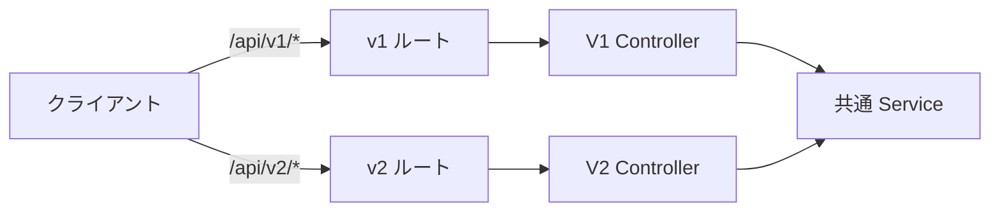
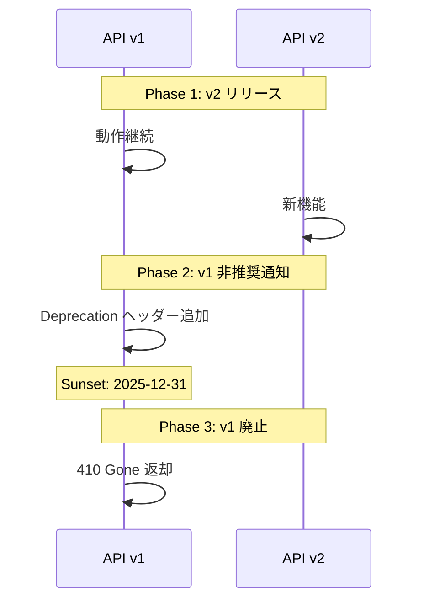

# API バージョニング戦略

## 概要

API のバージョニング戦略と後方互換性維持の設計方針。URL パスベースのバージョニング、非推奨化プロセス、クライアントとの互換性管理を解説する。

## バージョニング方式の比較

| 方式 | 例 | メリット | デメリット |
|---|---|---|---|
| **URL パス** | `/api/v1/users` | 明確、キャッシュしやすい | URL が冗長 |
| ヘッダー | `Accept: application/vnd.api.v1+json` | URL がクリーン | テスト/デバッグが困難 |
| クエリパラメータ | `/api/users?version=1` | 簡単 | キャッシュ問題 |

## 推奨: URL パスベース



## ルート定義

```php
// routes/api.php

// v1 ルート（現行）
Route::prefix('v1')->group(function () {
    Route::post('/login', [V1\AuthController::class, 'login']);
    Route::get('/attendances', [V1\AttendanceController::class, 'index']);
});

// v2 ルート（将来）
Route::prefix('v2')->group(function () {
    Route::post('/login', [V2\AuthController::class, 'login']);
    Route::get('/attendances', [V2\AttendanceController::class, 'index']);
});

// バージョンなし（現在の状態 → v1 にリダイレクト予定）
Route::post('/login', [AuthController::class, 'login']);
```

## コントローラの分離

```
app/Http/Controllers/
├── Api/
│   ├── V1/
│   │   ├── AuthController.php
│   │   └── AttendanceController.php
│   └── V2/
│       ├── AuthController.php
│       └── AttendanceController.php
```

```php
// V1 → V2 の変更点をコントローラで吸収
namespace App\Http\Controllers\Api\V2;

class AttendanceController extends BaseController
{
    public function index(Request $request): JsonResponse
    {
        $data = $this->attendanceService->list($request->user());

        // v2: HTTPレスポンス形式を変更
        return ApiResponse::success([
            'items' => AttendanceV2Resource::collection($data),
            'pagination' => new PaginationResource($data),
        ]);
    }
}
```

## 非推奨化（Deprecation）プロセス



## Deprecation ヘッダー

```php
// Middleware: DeprecateApiVersion
class DeprecateApiVersion
{
    public function handle(Request $request, Closure $next, string $sunset): Response
    {
        $response = $next($request);

        $response->headers->set('Deprecation', 'true');
        $response->headers->set('Sunset', $sunset);
        $response->headers->set('Link', '</api/v2>; rel="successor-version"');

        return $response;
    }
}

// ルート適用
Route::prefix('v1')
    ->middleware('deprecate:2025-12-31')
    ->group(function () { /* ... */ });
```

## OpenAPI でのバージョン管理

```yaml
# openapi/v1/openapi.yaml
openapi: 3.0.3
info:
  title: Time Attendance API
  version: 1.0.0
  x-api-status: deprecated

# openapi/v2/openapi.yaml
openapi: 3.0.3
info:
  title: Time Attendance API
  version: 2.0.0
  x-api-status: current
```

## 注意: 設計レビュー指摘事項

| 問題 | 影響 | 改善案 |
|---|---|---|
| **現状バージョニング未導入** | `/api/` 直下にエンドポイントがある | 段階的に `/api/v1/` に移行。旧パスはリダイレクト |
| **Service 層の互換性** | v1/v2 でサービスの返却値が異なると複雑化 | Service は共通、Resource (Transformer) で差分吸収 |
| **OpenAPI 定義の分岐管理** | バージョンごとに OpenAPI ファイルが倍増 | 共通スキーマを `$ref` で共有し、差分のみ分岐 |
| **クライアント (Orval) の対応** | バージョンごとに API クライアントの再生成が必要 | `orval.config.ts` でバージョン別の設定を定義 |
| **テストの重複** | v1/v2 の両方のテストを維持する必要 | 共通テストケースを基底クラスにまとめ、バージョン固有のテストのみ分離 |
