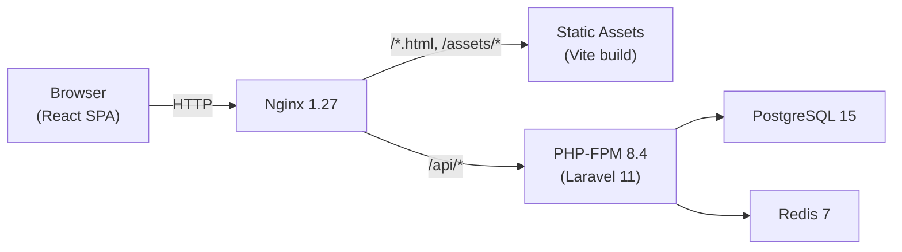

# アーキテクチャ概要

## プロジェクト概要

勤怠管理システム（time-attendance）は、打刻・勤怠履歴・チーム管理・ダッシュボードを提供する Web アプリケーションである。日跨ぎシフト・タイムゾーン対応を含む。

## 技術スタック

| レイヤー | 技術 | バージョン |
|---|---|---|
| フロントエンド | React + TypeScript + Vite | React 19.2 / TS 5.9 / Vite 8 beta |
| バックエンド | Laravel (PHP 8.4) | Laravel 11 / PHP 8.4-fpm-bookworm |
| データベース | PostgreSQL | 15-alpine |
| キャッシュ / セッション | Redis | 7-alpine |
| リバースプロキシ | Nginx | 1.27-alpine |
| コンテナ | Docker Compose | v2 |
| 認証 | JWT (tymon/jwt-auth) | — |
| API 仕様 | OpenAPI | 3.0.3 |
| パッケージマネージャ | pnpm (front) / Composer (back) | pnpm 10.6 / Composer 2 |

> **注意**: Vite 8 は beta であり、安定版リリース後に移行すること。

## アーキテクチャ全体図



### HTTPリクエストフロー

```
Browser → Nginx :80
  ├── /api/* → PHP-FPM :9000 → Laravel → PostgreSQL / Redis
  └── /* → React SPA (静的ファイル配信)
```

## 設計思想

### 1. Single Source of Truth（SSOT）

OpenAPI 定義をすべての型・バリデーションの単一ソースとする。

```
openapi/openapi.yaml
  ├─▶ TypeScript 型 + API クライアント (Orval → Axios + React Query hooks)
  ├─▶ Zod バリデーションスキーマ (openapi-zod)
  ├─▶ PHP Enum (back/app/__Generated__/)
  ├─▶ Laravel FormRequest ルール (OpenApiGeneratedRules)
  └─▶ TypeScript Enum (front/src/__generated__/enums.ts)
```

> **重要**: 手動で型や Enum を定義してはならない。必ず `make openapi` で生成する。

### 2. レイヤードアーキテクチャ（バックエンド）

```
HTTP Request
  ↓
Middleware (LogApiRequest)
  ↓
Controller (BaseController — 薄いハンドラー)
  ↓
FormRequest (BaseRequest — OpenAPI 自動生成バリデーション)
  ↓
Service (BaseService — ビジネスロジック + トランザクション管理)
  ├── Data / ValueObject (型安全なデータ受け渡し)
  └── Model (Eloquent ORM — スコープ・ドメイン判定)
  ↓
ApiResponse::success() / ApiResponse::error()
```

| レイヤー | 責務 |
|---|---|
| **Controller** | HTTPリクエスト受付と Service への委譲のみ。ビジネスロジック禁止 |
| **Service** | ビジネスロジック。Eloquent を直接使用する（Repository 層は不使用） |
| **Model** | テーブル定義、リレーション、スコープ、ドメイン判定メソッド |

> **⚠️ Repository 層について**: `BaseRepository` は定義されているが**実際には未使用**。Service が Eloquent を直接呼び出すのが現行パターン。新規コードで Repository を経由する必要はない。

### 3. Feature-Based 構成（フロントエンド）

```
front/src/
  ├── features/           # 機能単位モジュール
  │   ├── auth/           # hooks, ui
  │   ├── attendance/     # hooks, mappers, ui
  │   ├── dashboard/      # hooks, ui
  │   ├── schedule/       # hooks, ui
  │   ├── settings/       # hooks, ui
  │   └── team/           # hooks, ui
  ├── shared/             # 汎用コンポーネント・デザインシステム
  ├── lib/                # HTTP クライアント・React Query 設定
  ├── config/             # 定数・ルート定義
  ├── domain/             # ドメイン型・純関数
  ├── api/                # 生成クライアントのファサード
  └── __generated__/      # OpenAPI 自動生成（編集禁止）
```

依存方向: `features → shared → lib → config` （逆方向の依存禁止）

### 4. API HTTPレスポンス形式

すべての API は `ApiResponse` で統一されたエンベロープを返す。

```json
// 成功
{ "success": true, "message": "Success", "data": {...}, "meta": null }

// エラー
{ "success": false, "message": "...", "code": "ERROR_CODE", "errors": {...} }
```

## 環境構成

| 環境 | 説明 | 設定ファイル |
|---|---|---|
| ローカル開発 | Docker Compose + override | `infra/docker-compose.yml` + `docker-compose.override.yml` |
| 本番 | Docker Compose + prod | `infra/docker-compose.prod.yml` |
| ベアメタル開発 | Makefile 経由 | `make local-back` + `make front-dev` |

## 設計レビュー指摘事項

| 区分 | 指摘 |
|---|---|
| 🚨 問題 | Vite 8 beta を本番依存に使用している。安定版リリースまでに Vite 7 にダウングレードを検討 |
| 🚨 問題 | Repository 層がアーキテクチャ図に含まれていたが実際は未使用。本ドキュメントでは修正済み |
| 💡 改善 | JWT を httpOnly Cookie に移行し XSS リスクを軽減すべき |
| 💡 改善 | フロントエンドテスト（Vitest）の導入が必要 |
| ⚠️ アンチパターン | `front/src/__generated__/enums.ts` のテンプレートが未展開。`make openapi-enums` の実行を確認すること |
