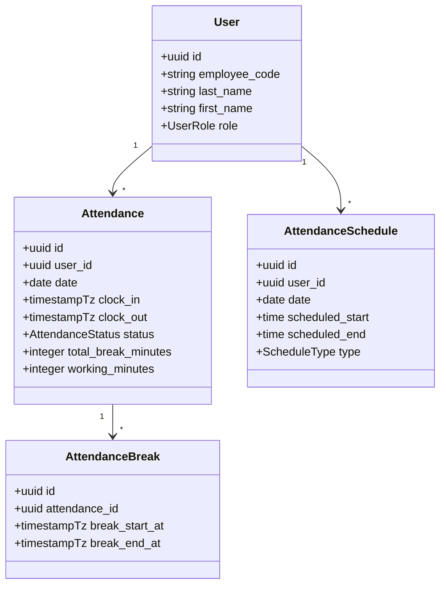
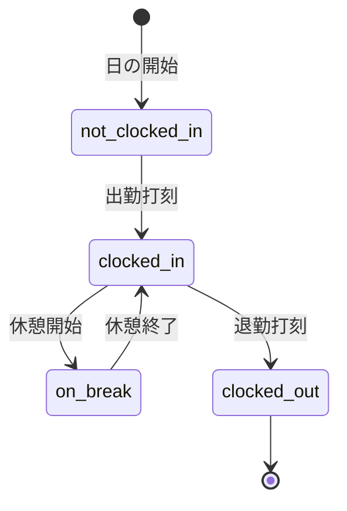
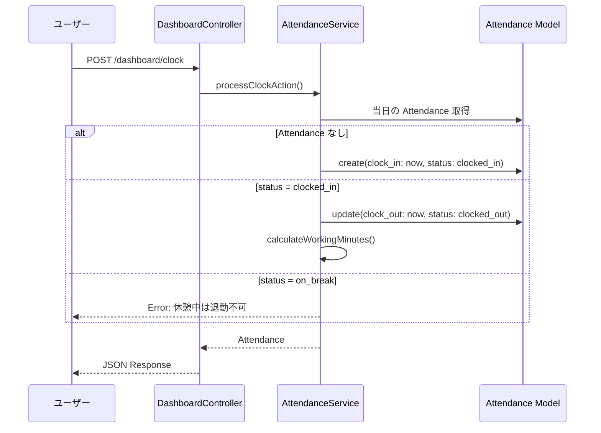

# 勤怠ドメインモデル

## 概要

勤怠管理のコアドメインモデル設計。打刻（出勤/退勤）、休憩、ステータス遷移、日跨ぎ対応の業務ルールとデータ構造を解説する。

## ドメインモデル全体像



## ステータス遷移



## 打刻処理フロー



## 勤務時間の計算

```php
// AttendanceService
public function calculateWorkingMinutes(Attendance $attendance): int
{
    if (!$attendance->clock_in || !$attendance->clock_out) {
        return 0;
    }

    $totalMinutes = $attendance->clock_in
        ->diffInMinutes($attendance->clock_out);

    $breakMinutes = $attendance->breaks
        ->sum(function (AttendanceBreak $break) {
            if (!$break->break_end_at) return 0;
            return $break->break_start_at
                ->diffInMinutes($break->break_end_at);
        });

    return $totalMinutes - $breakMinutes;
}
```

$$
\text{勤務時間} = (\text{退勤} - \text{出勤}) - \sum_{i=1}^{n} (\text{休憩終了}_i - \text{休憩開始}_i)
$$

## ビジネスルール

| ルール           | 説明                                 | 実装箇所                               |
| ---------------- | ------------------------------------ | -------------------------------------- |
| 出勤は 1 日 1 回 | 同一日に 2 回出勤打刻不可            | `AttendanceService::validateClockIn()` |
| 退勤は出勤後のみ | `status = clocked_in` の時のみ退勤可 | ステータス遷移チェック                 |
| 休憩中の退勤不可 | 休憩を終了してから退勤               | ステータス遷移チェック                 |
| 日跨ぎ対応       | `date` は出勤日基準                  | `Attendance.date` は clock_in の日付   |
| 最大勤務時間     | 24 時間を超えるレコードは異常        | バリデーション                         |

## データベーステーブル

```sql
CREATE TABLE attendances (
    id UUID PRIMARY KEY DEFAULT gen_random_uuid(),
    user_id UUID NOT NULL REFERENCES users(id),
    date DATE NOT NULL,
    clock_in TIMESTAMPTZ,
    clock_out TIMESTAMPTZ,
    status VARCHAR(20) NOT NULL DEFAULT 'not_clocked_in',
    total_break_minutes INTEGER DEFAULT 0,
    working_minutes INTEGER DEFAULT 0,
    note TEXT,
    created_at TIMESTAMPTZ,
    updated_at TIMESTAMPTZ,
    deleted_at TIMESTAMPTZ,
    UNIQUE(user_id, date)
);
```

## 注意: 設計レビュー指摘事項

| 問題                                      | 影響                                             | 改善案                                                                  |
| ----------------------------------------- | ------------------------------------------------ | ----------------------------------------------------------------------- |
| **勤務時間の計算タイミング**              | 退勤時に計算すると、後からの修正が反映されない   | 休憩終了時・退勤時・手動編集時に毎回再計算する                          |
| **日跨ぎ時の `date` が複雑**              | 深夜勤務で `date` がどちらの日付になるか混乱する | `date` は常に出勤日（clock_in の日付）であることをドキュメントで明示    |
| **`status` が DB と PHP Enum で二重管理** | 文字列カラムと Enum のマッピングミスのリスク     | Eloquent の `$casts` で自動変換。マイグレーションに CHECK 制約追加      |
| **同時打刻の排他制御**                    | 二重クリックで 2 回打刻される可能性              | DB のユニーク制約 `UNIQUE(user_id, date)` と `SELECT FOR UPDATE` で排他 |
| **`working_minutes` の整合性**            | 保存値と計算値が乖離する可能性                   | 読み取り時に再計算するか、保存値を信頼するかのポリシーを決める          |
