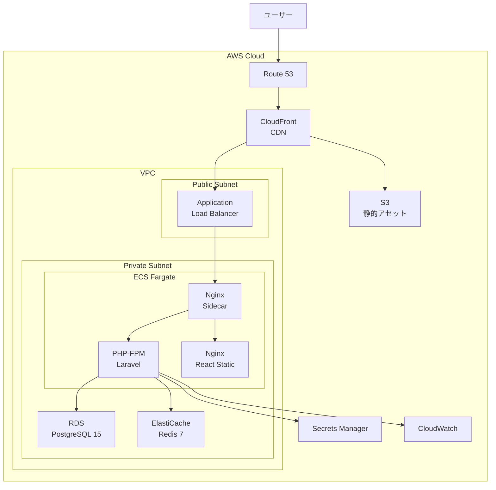
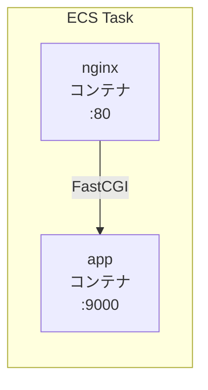
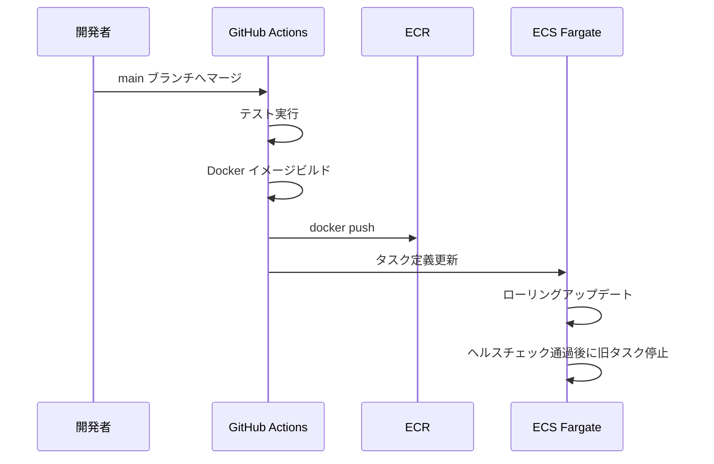
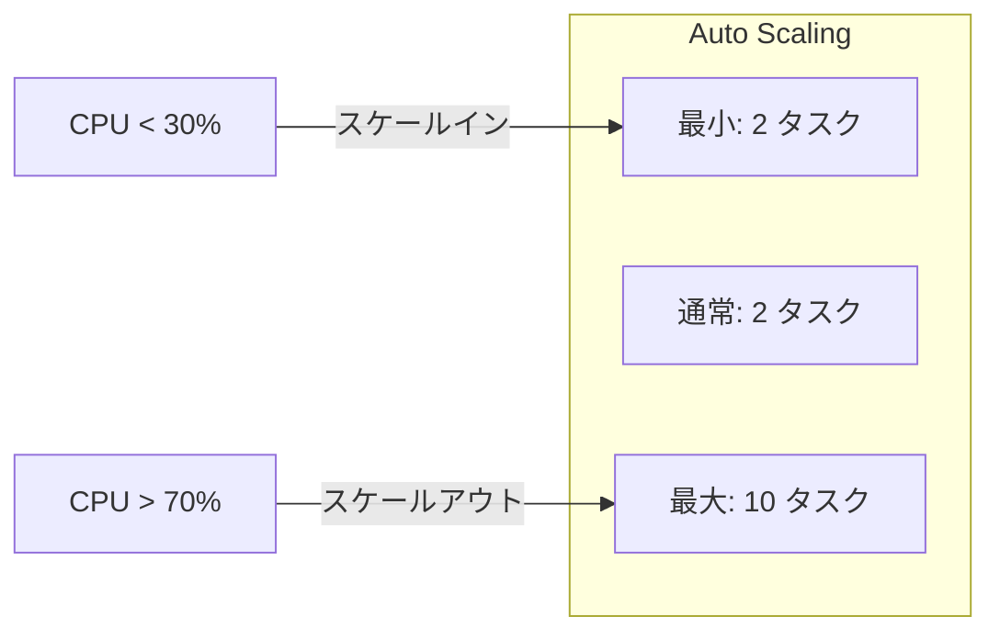

# AWS デプロイメント構成

## 概要

AWS を想定した本番デプロイメントアーキテクチャ。ECS Fargate、RDS、ElastiCache を活用したコンテナベースの構成を解説する。

## インフラ全体像



## ECS タスク定義



| コンテナ | イメージ | CPU | メモリ |
|---|---|---|---|
| nginx | `nginx:1.27-alpine` | 256 | 512 MB |
| app | `ECR/time-attendance-app:latest` | 512 | 1024 MB |

## デプロイフロー



## GitHub Actions (CD)

```yaml
name: Deploy
on:
  push:
    branches: [main]

jobs:
  deploy:
    runs-on: ubuntu-latest
    permissions:
      id-token: write
      contents: read
    steps:
      - uses: actions/checkout@v4

      - uses: aws-actions/configure-aws-credentials@v4
        with:
          role-to-assume: ${{ secrets.AWS_ROLE_ARN }}
          aws-region: ap-northeast-1

      - uses: aws-actions/amazon-ecr-login@v2

      - name: Build and push
        run: |
          docker build -t $ECR_REGISTRY/app:${{ github.sha }} \
            --target prod -f infra/php/Dockerfile back/
          docker push $ECR_REGISTRY/app:${{ github.sha }}

      - name: Deploy to ECS
        run: |
          aws ecs update-service \
            --cluster time-attendance \
            --service api \
            --force-new-deployment
```

## 環境変数管理

| 変数カテゴリ | 管理場所 | 例 |
|---|---|---|
| 非秘密 | ECS タスク定義 `environment` | `APP_ENV=production` |
| 秘密 | Secrets Manager → `secrets` | `DB_PASSWORD`, `JWT_SECRET` |
| インフラ | Systems Manager Parameter Store | `DB_HOST` (RDS エンドポイント) |

## RDS 設定

| パラメータ | 値 |
|---|---|
| エンジン | PostgreSQL 15 |
| インスタンス | `db.t3.medium` |
| ストレージ | 50 GB gp3 |
| Multi-AZ | 有効 |
| バックアップ保持 | 7 日 |
| 暗号化 | 有効 (KMS) |

## スケーリング



## 注意: 設計レビュー指摘事項

| 問題 | 影響 | 改善案 |
|---|---|---|
| **マイグレーション実行タイミング** | ECS タスク起動時に毎回実行される | 別途マイグレーション用 ECS タスクを定義し、デプロイ時に 1 回だけ実行 |
| **ログの永続化** | コンテナ停止時にログが消失 | CloudWatch Logs へ直接出力 (`awslogs` ログドライバー) |
| **ヘルスチェックのパス** | ALB のヘルスチェックが `/` だと Vite のページを返す | `/api/health` を ALB のヘルスチェックパスに設定 |
| **Blue/Green デプロイ未対応** | ローリングアップデートではダウンタイムが発生する可能性 | CodeDeploy + Blue/Green デプロイメントを検討 |
| **コスト最適化** | 常時 2 タスク稼働はオーバースペックの可能性 | 利用パターンを分析し、夜間はスケールインする |
