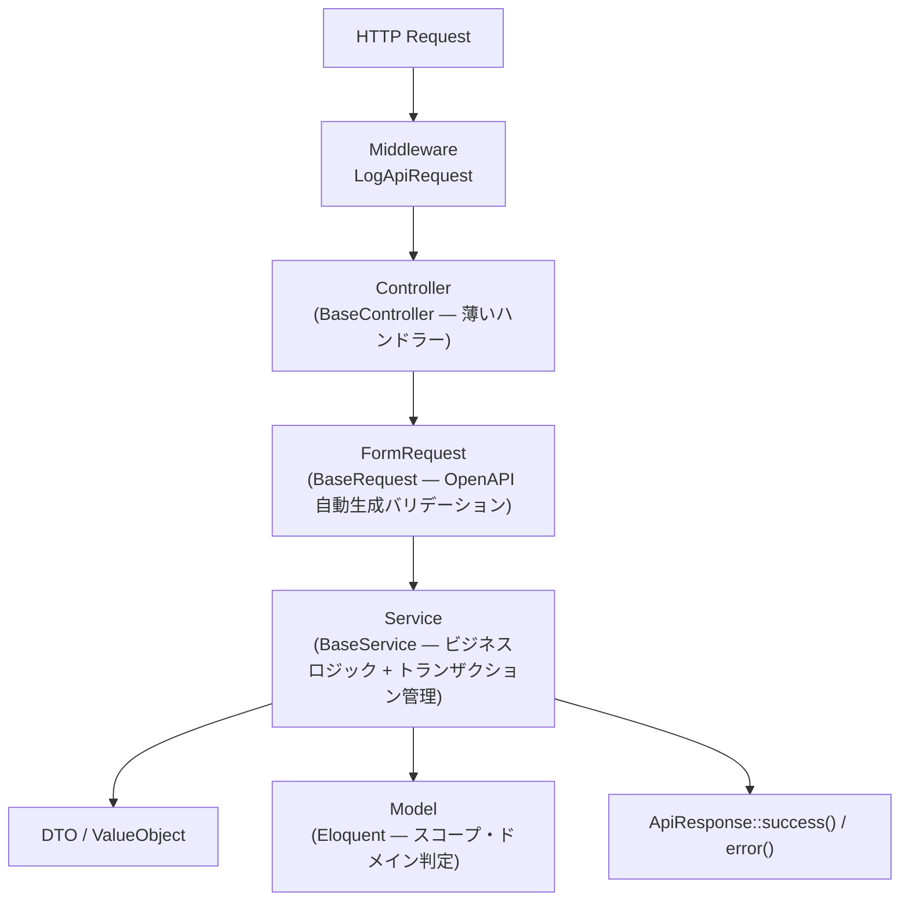

# バックエンドアーキテクチャ

## 1. レイヤー構成図



> **⚠️ Repository 層は存在しない。** `BaseRepository` は定義のみで**未使用**。Service が Eloquent を直接使用するのが本プロジェクトの正しいパターン。

## 2. 各レイヤーの責務表

| レイヤー | 責務 | やっていいこと | やってはいけないこと |
|---|---|---|---|
| **Controller** | HTTPリクエスト受付・Service 呼び出し・HTTPレスポンス返却 | `resolveAuthUser()` で認証ユーザー取得、`ApiResponse` 返却 | ビジネスロジック、DB クエリ、条件分岐 |
| **FormRequest** | 入力バリデーション・型正規化 | OpenAPI ルール参照、`filterNumber()` / `filterBoolean()` | DB アクセス、ビジネスルール判定 |
| **Service** | ビジネスルール・ドメインロジック・トランザクション管理 | `transaction()` / `log()` / `logError()` / `resolveTimezone()`、Eloquent 直接使用 | 直接HTTPレスポンスを返す、Request / Response に依存する |
| **DTO** | レイヤー間の型安全なデータ受け渡し | `fromArray()` / `toArray()` 変換、ValueObject 保持 | DB アクセス、ビジネスロジック |
| **ValueObject** | 値の妥当性保証・不変性 | コンストラクタで `assert()`、`equals()` 比較 | 状態変更、外部副作用 |
| **Model** | テーブル定義・リレーション・スコープ・ドメイン判定 | キャスト、スコープ、`isClockedIn()` 等の判定メソッド | HTTP 関連の処理、トランザクション管理 |

## 3. BaseController

全コントローラーは `BaseController` を継承する。

```php
abstract class BaseController extends Controller
{
    protected function resolveAuthUser(): User
    {
        return app(UserService::class)->getAuthUser();
    }
}
```

### Controller 実装例（実際のコード）

```php
final class AttendanceController extends BaseController
{
    public function __construct(
        private readonly AttendanceService $service,
    ) {}

    public function clockIn(): JsonResponse
    {
        $result = $this->service->clockIn(user: $this->resolveAuthUser());
        return ApiResponse::success($result);
    }

    public function store(AttendanceStoreRequest $request): JsonResponse
    {
        $result = $this->service->store(
            user: $this->resolveAuthUser(),
            input: $request->validated(),
        );
        return ApiResponse::success($result, status: 201);
    }
}
```

> **ルール**: Controller に `if` 分岐やループが現れたら Service への切り出しが必要な兆候。

## 4. BaseService

全サービスは `BaseService` を継承する。

### 提供メソッド一覧

| メソッド | 用途 | 注意 |
|---|---|---|
| `log($message, $context)` | INFO ログ記録 | — |
| `logWarning($message, $context)` | WARNING ログ記録 | — |
| `logError($message, $context)` | ERROR ログ記録 | — |
| `transaction($callback)` | トランザクション実行 | コミット後にログ記録、例外時はロールバック+エラーログ+再送出 |
| `resolveTimezone($timezone)` | null/空文字 → `Asia/Tokyo` 解決 | ハードコード禁止 |
| `weekdayJa($date)` | Carbon → 「日」〜「土」 | — |
| `calculateWorkHours(...)` | 勤務時間(時間)算出 | — |

### transaction() の動作

```
callback 実行 → 成功 → DB コミット → INFO ログ → 結果返却
                 ↓ 例外
              DB ロールバック → ERROR ログ → 例外再送出
```

### Service 実装例（実際のコード）

```php
final class AttendanceService extends BaseService
{
    public function clockIn(User $user): array
    {
        return $this->transaction(function () use ($user): array {
            $timezone = $this->resolveTimezone($user->timezone ?? null);
            $now = CarbonImmutable::now($timezone);

            // 未退勤チェック — Eloquent 直接使用
            $openAttendance = Attendance::query()
                ->where('user_id', $user->id)
                ->whereNotNull('clock_in_at')
                ->whereNull('clock_out_at')
                ->latest('clock_in_at')
                ->first();

            if ($openAttendance !== null) {
                throw new DomainException('未退勤の勤務が存在します', 'OPEN_ATTENDANCE_EXISTS');
            }

            $attendance = Attendance::query()->create([
                'id' => (string) Str::uuid(),
                'user_id' => $user->id,
                'work_date' => $now->toDateString(),
                'clock_in_at' => $now,
                'work_timezone' => $timezone,
                'start_time' => $now->format('H:i:s'), // 旧カラム互換
            ]);

            return $attendance->toLocalTimePayload();
        });
    }
}
```

## 5. モデル規約

### UUID 主キー

```php
protected $keyType = 'string';
public $incrementing = false;

protected static function booted(): void
{
    static::creating(function (self $model) {
        if (!$model->id) {
            $model->id = (string) Str::uuid();
        }
    });
}
```

> **⚠️ 既知バグ**: `AttendanceBreak` モデルに `booted()` フックがなく UUID が自動設定されない。修正が必要。

### タイムスタンプ・キャスト

```php
protected $casts = [
    'work_date'     => 'immutable_date',
    'clock_in_at'   => 'immutable_datetime',
    'clock_out_at'  => 'immutable_datetime',
    'break_minutes' => 'integer',
];
```

> `immutable_datetime` で CarbonImmutable が返り、副作用なく日時操作できる。

### ドメイン判定メソッド

モデルに密接なドメイン判定はモデルに置く。

```php
public function isClockedIn(): bool;
public function isClockedOut(): bool;
public function isWorking(): bool;
public function isCrossDayShift(): bool;
public function calculateWorkedMinutes(?CarbonImmutable $now = null): ?int;
public function toLocalTimePayload(): array;
```

## 6. DTO / ValueObject

### BaseDTO

```php
final class UserProfile extends BaseDTO
{
    public function __construct(
        public readonly string $id,
        public readonly string $name,
        public readonly string $email,
        public readonly array  $roles,
        public readonly ?array $settings,
    ) {}
}

// 使用例
$dto = new UserProfile(id: $user->id, name: $user->name, ...);
return $dto->toArray();
```

### BaseValueObject

```php
final readonly class Email extends BaseValueObject
{
    protected function assert(string $value): void
    {
        if (!filter_var($value, FILTER_VALIDATE_EMAIL)) {
            throw new DomainException("Invalid email format.");
        }
    }
}

// 使用例
$email = new Email('user@example.com');
$email->value();   // 'user@example.com'
```

> **注意**: ValueObject のバリデーション失敗は `App\Exceptions\DomainException` を使う。PHP 標準の `\DomainException` や `\InvalidArgumentException` を使うと Handler が 500 を返す。

## 7. 例外 → HTTP ステータスマッピング

| 例外クラス | HTTP | code |
|---|---|---|
| `App\Exceptions\DomainException` | **400** | カスタム (`OPEN_ATTENDANCE_EXISTS` 等) |
| `ValidationException` | 422 | `VALIDATION_ERROR` |
| `AuthenticationException` | 401 | `AUTH_ERROR` |
| `AuthorizationException` | 403 | `FORBIDDEN_ERROR` |
| その他 `Throwable` | 500 | `INTERNAL_ERROR` |

> **⚠️ DomainException は 400 であり 422 ではない。** Handler.php の実装を確認すること。

## 8. FormRequest（BaseRequest）

```php
abstract class BaseRequest extends FormRequest
{
    protected string $schemaName;

    protected array $filters = [
        'number'  => [],
        'boolean' => [],
    ];

    public function rules(): array
    {
        return OpenApiGeneratedRules::schema($this->schemaName);
    }
}
```

### 実装例

```php
final class AttendanceStoreRequest extends BaseRequest
{
    protected string $schemaName = 'AttendanceStoreRequest';

    protected array $filters = [
        'number'  => ['break_minutes'],
        'boolean' => ['clock_out_next_day'],
    ];
}
```

## 9. 統一HTTPレスポンス形式

### 成功

```json
{
    "success": true,
    "message": "Success",
    "data": { "id": "550e8400-...", "work_date": "2026-03-21" },
    "meta": null
}
```

### エラー（DomainException → 400）

```json
{
    "success": false,
    "message": "未退勤の勤務が存在します",
    "code": "OPEN_ATTENDANCE_EXISTS",
    "errors": null
}
```

### バリデーションエラー（422）

```json
{
    "success": false,
    "message": "Validation failed",
    "code": "VALIDATION_ERROR",
    "errors": { "email": ["メールアドレスは必須です"] }
}
```

## 10. 実務上の落とし穴

### パスワードの二重ハッシュ

User モデルの `booted()` で自動ハッシュされる。Seeder で `Hash::make()` を使うと二重ハッシュになりログイン不能。

```php
// NG — 二重ハッシュ
User::create(['password' => Hash::make('password')]);

// OK — モデルが自動ハッシュ
User::create(['password' => 'password']);
```

### 認証ユーザー取得

```php
// NG
$user = auth()->user();

// OK — Controller
$user = $this->resolveAuthUser();

// OK — Service
$user = $this->userService->getAuthUser();
```

### DomainException のインポート

```php
// NG — Handler が 500 を返す
throw new \DomainException('...');

// OK — Handler が 400 を返す
use App\Exceptions\DomainException;
throw new DomainException('メッセージ', 'ERROR_CODE');
```

### レガシーカラム

`start_time` / `end_time` は互換性のために残っているが、新コードでは `clock_in_at` / `clock_out_at` を使用すること。

## 設計レビュー指摘事項

| 区分 | 指摘 |
|---|---|
| 🚨 問題 | `AuthService.php` で `AuthenticationException` が未 import。`refresh()` 呼び出しで Fatal Error |
| 🚨 問題 | `AttendanceBreak` モデルに `booted()` UUID フックが未定義。レコード作成時に ID が null |
| 🚨 問題 | 既存テスト（tests/Feature, tests/Unit）が旧 DDD アーキテクチャのクラスを参照しており全て失敗する |
| 💡 改善 | DTO の使用が `UserProfile` の1クラスのみ。Service が `array` を返す箇所は DTO を定義すべき |
| 💡 改善 | `clockIn()` に楽観的ロック（`lockForUpdate()`）を追加し、レースコンディション対策すべき |
| ⚠️ アンチパターン | Service の `store()` / `update()` が `array $input` を受け取っている。型安全性のため DTO を使用すべき |
| ⚠️ アンチパターン | `BaseRepository` が定義されているが使われていない。混乱を避けるため削除推奨 |
