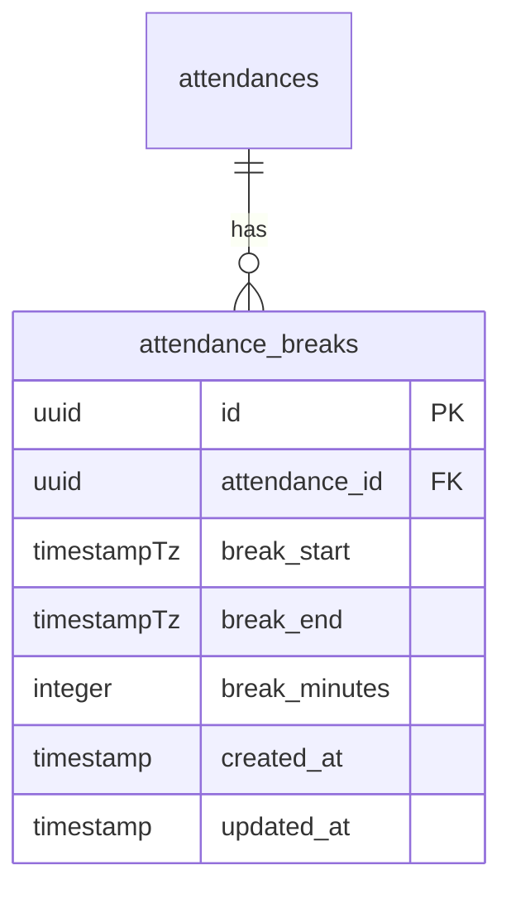
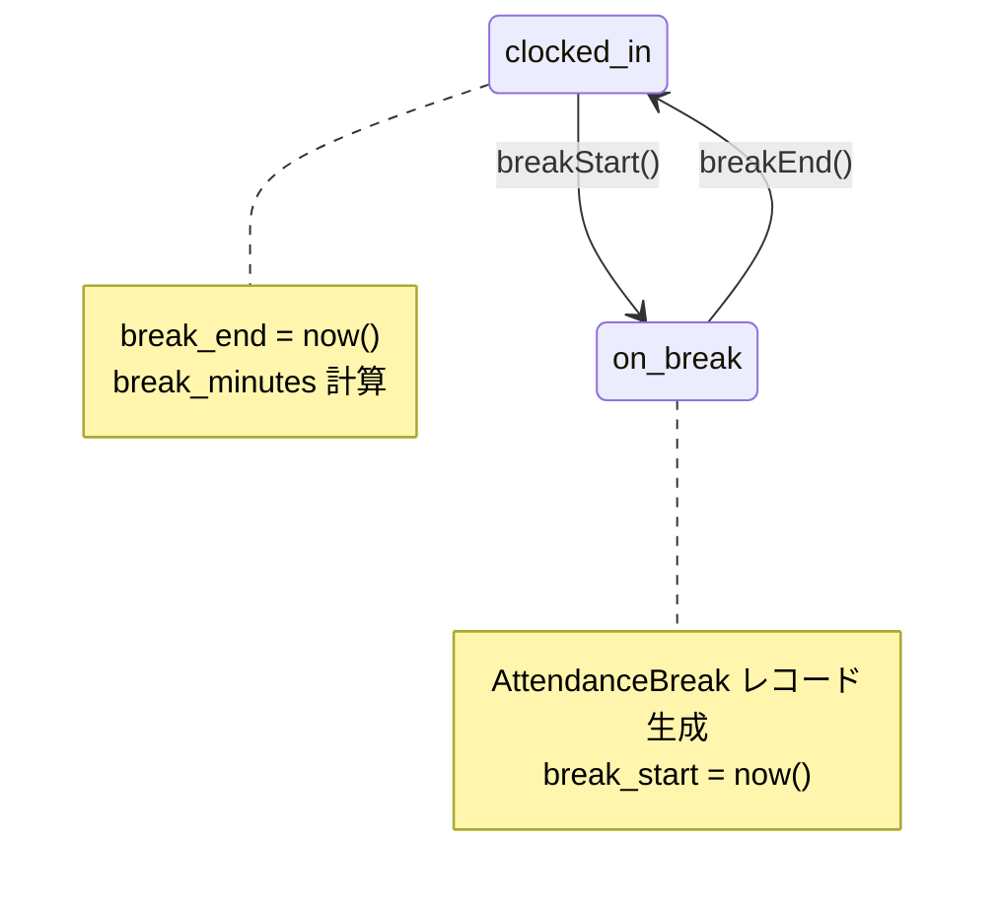
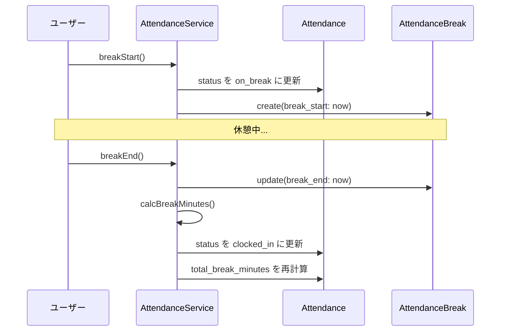

# 休憩時間管理

## 概要

勤怠の休憩時間を管理する `AttendanceBreak` モデルの設計。休憩開始/終了の打刻、休憩時間の集計、複数回休憩の対応を解説する。

## データモデル



## 休憩のステータス遷移



## 休憩処理フロー



## 実装パターン

### 休憩開始

```php
public function startBreak(Attendance $attendance): AttendanceBreak
{
    if ($attendance->status !== AttendanceStatus::CLOCKED_IN) {
        throw new DomainException('出勤中でない場合は休憩を開始できません');
    }

    $break = $attendance->breaks()->create([
        'break_start' => now(),
    ]);

    $attendance->update(['status' => AttendanceStatus::ON_BREAK]);

    return $break;
}
```

### 休憩終了

```php
public function endBreak(Attendance $attendance): AttendanceBreak
{
    if ($attendance->status !== AttendanceStatus::ON_BREAK) {
        throw new DomainException('休憩中でない場合は休憩を終了できません');
    }

    $currentBreak = $attendance->breaks()
        ->whereNull('break_end')
        ->latest('break_start')
        ->firstOrFail();

    $currentBreak->update([
        'break_end' => now(),
        'break_minutes' => $currentBreak->break_start->diffInMinutes(now()),
    ]);

    $totalBreak = $attendance->breaks()->sum('break_minutes');
    $attendance->update([
        'status' => AttendanceStatus::CLOCKED_IN,
        'total_break_minutes' => $totalBreak,
    ]);

    return $currentBreak;
}
```

## 休憩時間の集計

| 集計 | 計算式 | 用途 |
|---|---|---|
| 1 回の休憩時間 | `break_end - break_start` | 個別休憩の記録 |
| 合計休憩時間 | `SUM(break_minutes)` | 勤怠レコードの `total_break_minutes` |
| 実労働時間 | `(退勤 - 出勤) - 合計休憩` | 勤務時間の算出 |

## 複数回休憩の対応

```php
// 1 日に複数回の休憩が可能
// attendances: { id: att-1, status: clocked_out }
// attendance_breaks:
//   { attendance_id: att-1, break_start: 12:00, break_end: 13:00, break_minutes: 60 }
//   { attendance_id: att-1, break_start: 15:00, break_end: 15:15, break_minutes: 15 }
// → total_break_minutes: 75
```

## 注意: 設計レビュー指摘事項

| 問題 | 影響 | 改善案 |
|---|---|---|
| **休憩終了忘れ** | `break_end` が NULL のまま放置され、合計時間計算が壊れる | 日次バッチで未終了休憩を自動終了する仕組みを検討 |
| **`break_minutes` と実際の差分の乖離** | 保存値と `break_end - break_start` の再計算値が異なる可能性 | 読み取り時にアクセサで再計算するか、保存値を信頼するか統一する |
| **休憩回数の制限がない** | 無制限に休憩を取れてしまう | ビジネスルールに応じて最大回数を設定（例: 1 日 5 回まで） |
| **日跨ぎ休憩** | 深夜勤務で日を跨ぐ休憩の扱い | 休憩は Attendance に紐づくため、date ではなく attendance_id で管理する（対応済み） |
| **同時リクエストの排他制御** | 休憩開始ボタンの連打で複数レコード生成 | `SELECT FOR UPDATE` + ステータスチェックで排他制御 |
