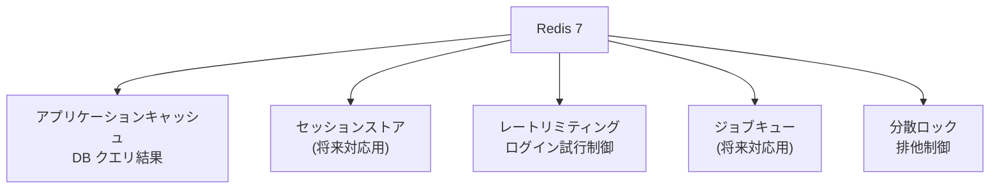
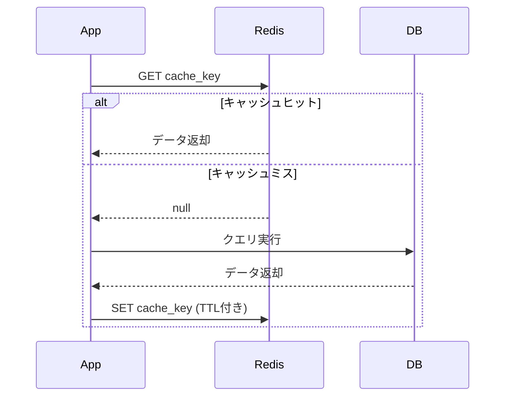
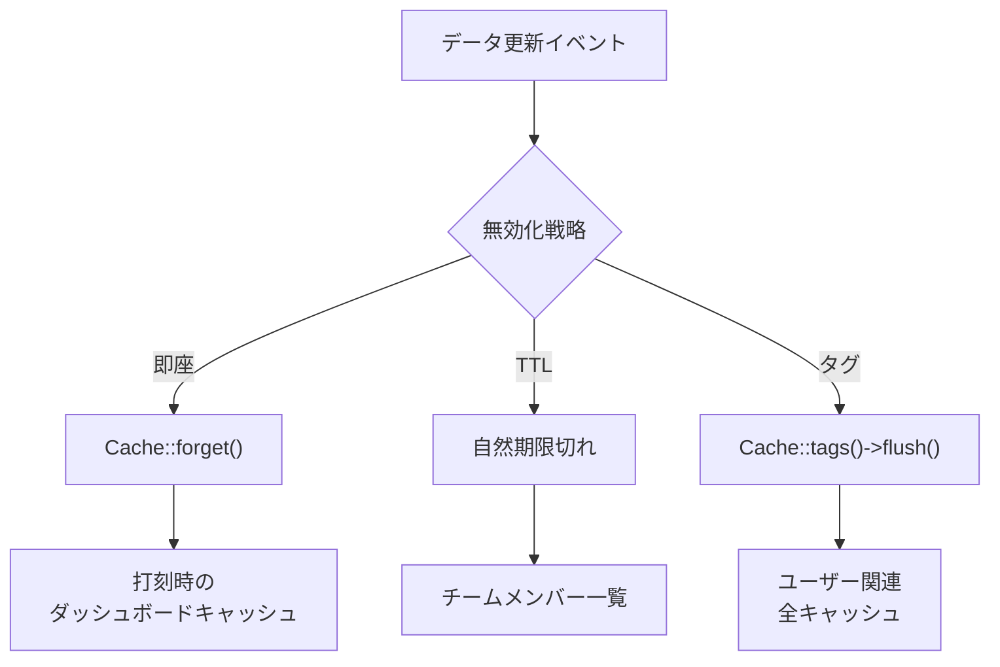

# Redis キャッシュ戦略

## 概要

Redis 7 によるキャッシュ戦略の設計。セッション管理、アプリケーションキャッシュ、レートリミティング、ジョブキューでの Redis の活用パターンを解説する。

## Redis の用途一覧



## 接続設定

```php
// config/database.php
'redis' => [
    'client' => 'phpredis',  // or predis

    'default' => [
        'host' => env('REDIS_HOST', '127.0.0.1'),
        'password' => env('REDIS_PASSWORD'),
        'port' => env('REDIS_PORT', '6379'),
        'database' => env('REDIS_DB', '0'),
    ],

    'cache' => [
        'host' => env('REDIS_HOST', '127.0.0.1'),
        'port' => env('REDIS_PORT', '6379'),
        'database' => env('REDIS_CACHE_DB', '1'),
    ],
],
```

## キャッシュパターン

### Cache-Aside パターン



### 実装例

```php
class DashboardService extends BaseService
{
    public function getMonthlySummary(User $user): array
    {
        $cacheKey = "dashboard:monthly:{$user->id}:" . now()->format('Y-m');

        return Cache::remember($cacheKey, 300, function () use ($user) {
            return $this->calculateMonthlySummary($user);
        });
    }

    // キャッシュ破棄（打刻時）
    public function invalidateDashboardCache(User $user): void
    {
        $cacheKey = "dashboard:monthly:{$user->id}:" . now()->format('Y-m');
        Cache::forget($cacheKey);
    }
}
```

## キャッシュキーの命名規約

| パターン | 例 | TTL |
|---|---|---|
| `{domain}:{resource}:{id}` | `dashboard:monthly:uuid123` | 5 分 |
| `{domain}:{resource}:{id}:{date}` | `attendance:daily:uuid123:2025-01-15` | 10 分 |
| `{domain}:list:{query_hash}` | `team:members:abc123` | 30 秒 |
| `config:{key}` | `config:company_settings` | 1 時間 |

## レートリミティング

```php
// Laravel の組み込みレートリミティング（Redis バックエンド）
// RouteServiceProvider
RateLimiter::for('login', function (Request $request) {
    return Limit::perMinute(5)->by($request->ip());
});

// ルート定義
Route::post('/login', [AuthController::class, 'login'])
    ->middleware('throttle:login');
```

## 分散ロック

```php
// 排他制御（二重打刻防止）
$lock = Cache::lock("attendance:clock:{$user->id}", 10);

if ($lock->get()) {
    try {
        $this->processClockAction($user);
    } finally {
        $lock->release();
    }
} else {
    throw new DomainException('処理中です。しばらくお待ちください。');
}
```

## Docker Compose での Redis 設定

```yaml
redis:
  image: redis:7
  command: redis-server --appendonly yes --maxmemory 256mb --maxmemory-policy allkeys-lru
  volumes:
    - redis_data:/data
  healthcheck:
    test: ["CMD", "redis-cli", "ping"]
    interval: 10s
    timeout: 5s
    retries: 5
```

## キャッシュ無効化戦略



## 注意: 設計レビュー指摘事項

| 問題 | 影響 | 改善案 |
|---|---|---|
| **キャッシュスタンピード** | TTL 切れ時に大量リクエストが DB に集中 | `Cache::flexible()` (Laravel 11) またはロック付きキャッシュ |
| **キャッシュ破棄の漏れ** | データ更新後にキャッシュが古いまま残る | Model Observer でキャッシュ破棄を自動化 |
| **Redis 障害時のフォールバック** | Redis ダウン時にアプリ全体が停止するリスク | `try-catch` で graceful degradation。キャッシュなしで DB 直接参照 |
| **メモリ制限の設定** | 無制限だとメモリ枯渇のリスク | `maxmemory 256mb` + `allkeys-lru` ポリシーを設定 |
| **キャッシュキーの衝突** | プレフィクスなしだと複数環境で衝突 | `config/cache.php` の `prefix` に環境名を含める |
