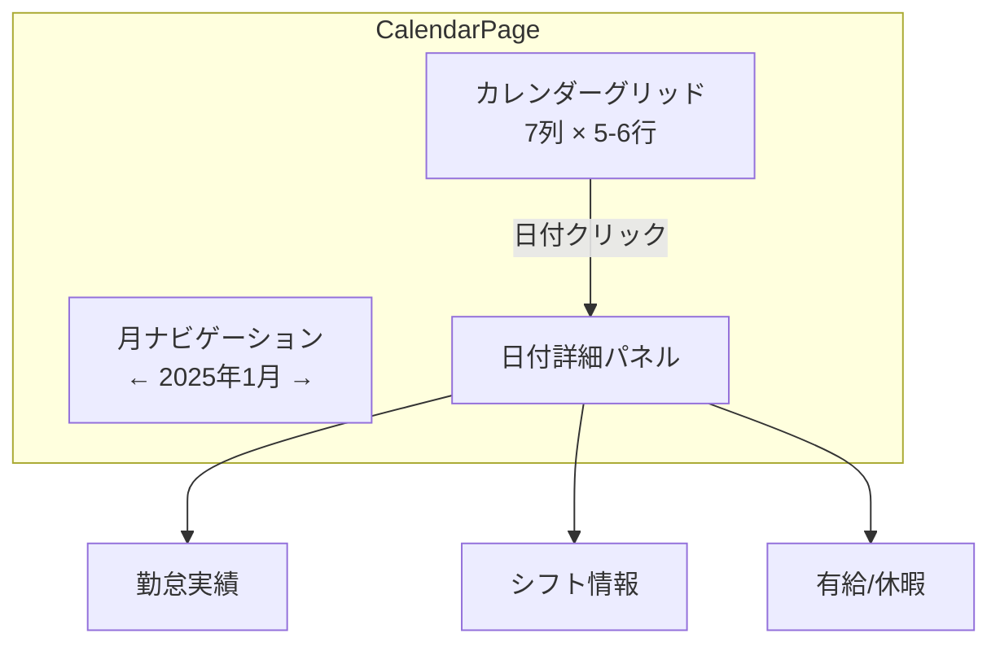
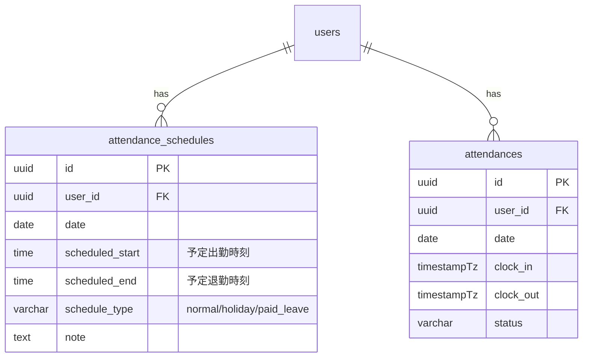
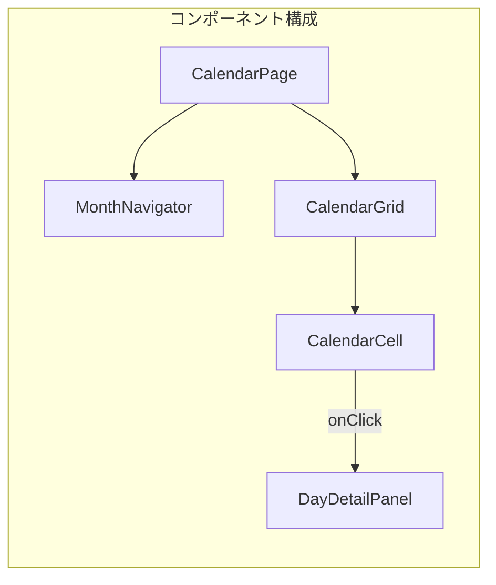

# カレンダー/スケジュール機能設計

## 概要

月間カレンダー表示とスケジュール（シフト）管理の設計。勤怠実績・有給・残業予定をカレンダービューで一覧表示し、シフト登録を行う。

## カレンダー画面構成



## データモデル



## API エンドポイント

| メソッド | パス | 説明 |
|---|---|---|
| `GET` | `/api/auth/calendar?month=2025-01` | 月間カレンダーデータ |
| `POST` | `/api/schedules` | シフト登録 |
| `PUT` | `/api/schedules/{id}` | シフト更新 |
| `DELETE` | `/api/schedules/{id}` | シフト削除 |

## カレンダーデータ構造

```typescript
interface CalendarDay {
  date: string;          // "2025-01-15"
  dayOfWeek: number;     // 0-6 (日-土)
  isToday: boolean;
  isHoliday: boolean;
  schedule: {
    scheduledStart: string | null;
    scheduledEnd: string | null;
    type: ScheduleType;
  } | null;
  attendance: {
    status: AttendanceStatus;
    clockIn: string | null;
    clockOut: string | null;
    workingMinutes: number;
  } | null;
  leave: {
    type: LeaveType;
    isHalfDay: boolean;
  } | null;
}

type CalendarResponse = {
  year: number;
  month: number;
  days: CalendarDay[];
};
```

## バックエンド集計

```php
class CalendarService extends BaseService
{
    public function getMonthlyCalendar(User $user, int $year, int $month): array
    {
        $startDate = Carbon::create($year, $month, 1);
        $endDate = $startDate->copy()->endOfMonth();

        // 月間データを一括取得（N+1 防止）
        $attendances = Attendance::where('user_id', $user->id)
            ->whereBetween('date', [$startDate, $endDate])
            ->get()
            ->keyBy('date');

        $schedules = AttendanceSchedule::where('user_id', $user->id)
            ->whereBetween('date', [$startDate, $endDate])
            ->get()
            ->keyBy('date');

        $days = [];
        for ($d = $startDate->copy(); $d->lte($endDate); $d->addDay()) {
            $dateStr = $d->format('Y-m-d');
            $days[] = [
                'date' => $dateStr,
                'day_of_week' => $d->dayOfWeek,
                'is_today' => $d->isToday(),
                'schedule' => $schedules->get($dateStr),
                'attendance' => $attendances->get($dateStr),
            ];
        }

        return ['year' => $year, 'month' => $month, 'days' => $days];
    }
}
```

## フロントエンド実装



```typescript
// front/src/features/schedule/pages/CalendarPage.tsx
export const CalendarPage = () => {
  const [currentMonth, setCurrentMonth] = useState(dayjs());
  const { data } = useCalendar(
    currentMonth.year(),
    currentMonth.month() + 1
  );

  return (
    <PageLayout title="カレンダー">
      <MonthNavigator
        current={currentMonth}
        onPrev={() => setCurrentMonth(m => m.subtract(1, 'month'))}
        onNext={() => setCurrentMonth(m => m.add(1, 'month'))}
      />
      <CalendarGrid days={data?.days ?? []} />
    </PageLayout>
  );
};
```

## セルの表示ルール

| 状態 | 背景色 | アイコン |
|---|---|---|
| 出勤済み（正常） | 白 | ✅ |
| 遅刻あり | 黄色 | ⚠️ |
| 有給休暇 | 青 | 🔵 |
| 欠勤 | 赤 | ❌ |
| 祝日 | グレー | — |
| 未来日（シフトあり） | 薄青 | 📅 |

## 注意: 設計レビュー指摘事項

| 問題 | 影響 | 改善案 |
|---|---|---|
| **祝日マスターがない** | 祝日の判定ができない | 祝日テーブルを作成するか、外部 API（holidays-jp）を使用 |
| **月の境界データ** | カレンダー表示で前月・翌月の日付も表示が必要 | API で `startOfWeek` ～ `endOfWeek` の範囲データを返す |
| **大量データの取得** | 管理者が全メンバーのカレンダーを閲覧する場合 | 月間データを集計済みテーブルに保存、ページングで制御 |
| **タイムゾーン** | UTC と JST の変換をどこで行うか | サーバー側で Asia/Tokyo に変換して返す |
| **シフトの一括登録** | 1 日ずつしか登録できない | 日付範囲指定の一括登録 API を追加 |
