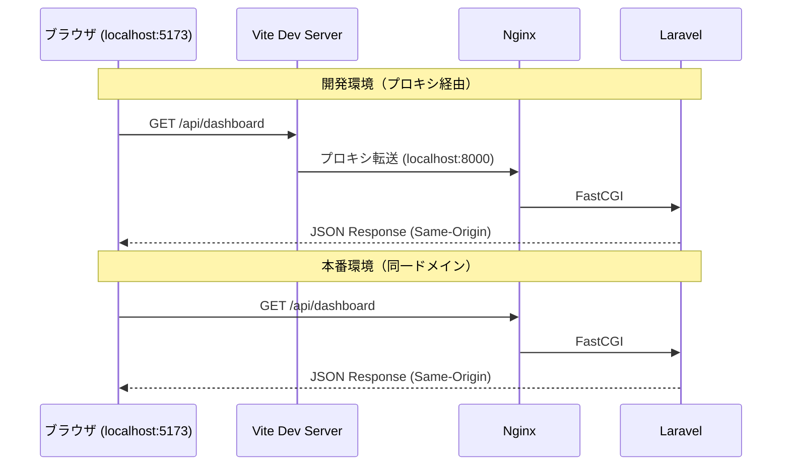

# CORS 設定

## 概要

Cross-Origin Resource Sharing (CORS) の設定。フロントエンド (Vite dev server) からバックエンド API への安全なクロスオリジンHTTPリクエストを実現する。

## CORS フロー



## Laravel CORS 設定

```php
// config/cors.php
return [
    'paths' => ['api/*'],

    'allowed_methods' => ['*'],

    'allowed_origins' => [
        env('FRONTEND_URL', 'http://localhost:5173'),
    ],

    'allowed_origins_patterns' => [],

    'allowed_headers' => ['*'],

    'exposed_headers' => [],

    'max_age' => 0,

    'supports_credentials' => true,  // Cookie / Authorization ヘッダー送信許可
];
```

## 設定項目の解説

| 項目 | 設定値 | 目的 |
|---|---|---|
| `paths` | `['api/*']` | CORS ヘッダーを付与する対象パス |
| `allowed_origins` | `FRONTEND_URL` env | 許可するオリジン |
| `allowed_methods` | `['*']` | 全 HTTP メソッド許可 |
| `allowed_headers` | `['*']` | 全ヘッダー許可（Authorization 含む） |
| `supports_credentials` | `true` | `withCredentials: true` を許可 |
| `max_age` | `0` | プリフライトキャッシュなし |

## Vite プロキシ設定

```typescript
// front/vite.config.ts
export default defineConfig({
    server: {
        proxy: {
            '/api': {
                target: env.VITE_API_PROXY_TARGET || 'http://localhost:8000',
                changeOrigin: true,
            },
        },
    },
});
```

## 環境別 CORS 動作

| 環境 | フロントURL | API URL | CORS 必要性 |
|---|---|---|---|
| 開発 (Docker) | `localhost:5173` | `localhost:8000` | Vite プロキシで回避 |
| 開発 (ホスト) | `localhost:5173` | `localhost:8000` | Vite プロキシで回避 |
| 本番 | `example.com` | `example.com/api` | 同一ドメイン → 不要 |

## Axios クライアント設定

```typescript
export const axiosInstance = axios.create({
    baseURL: API_CONFIG.baseUrl,   // '/api'（相対パス）
    withCredentials: true,          // CORS credentials 送信
    headers: {
        'Content-Type': 'application/json',
        Accept: 'application/json',
    },
});
```

## プリフライトHTTPリクエスト

```
# ブラウザが自動送信する OPTIONS HTTPリクエスト
OPTIONS /api/dashboard HTTP/1.1
Origin: http://localhost:5173
Access-Control-Request-Method: GET
Access-Control-Request-Headers: Authorization, Content-Type

# サーバーHTTPレスポンス
HTTP/1.1 204 No Content
Access-Control-Allow-Origin: http://localhost:5173
Access-Control-Allow-Methods: GET, POST, PUT, PATCH, DELETE, OPTIONS
Access-Control-Allow-Headers: Authorization, Content-Type
Access-Control-Allow-Credentials: true
```

## 注意: 設計レビュー指摘事項

| 問題 | 影響 | 改善案 |
|---|---|---|
| **`allowed_methods: ['*']` が広すぎる** | 不要な HTTP メソッド（DELETE 等）も許可される | 使用メソッドのみに制限：`['GET', 'POST', 'PUT', 'PATCH', 'DELETE', 'OPTIONS']` |
| **`allowed_headers: ['*']` が広すぎる** | 任意のカスタムヘッダーを受け入れる | 必要なヘッダーのみ：`['Authorization', 'Content-Type', 'Accept', 'X-Requested-With']` |
| **`max_age: 0`** | プリフライトHTTPリクエストがキャッシュされず、毎回 OPTIONS が飛ぶ | `max_age: 3600` (1時間) に設定してパフォーマンス改善 |
| **`FRONTEND_URL` が単一値** | ステージング環境など複数オリジンに対応できない | `allowed_origins` を env で複数指定可能にする、または `allowed_origins_patterns` を活用 |
| **Vite プロキシ使用時は CORS 不要** | 開発環境では Vite プロキシが Same-Origin にするため CORS 設定が使われない | 開発環境で CORS が正しく動作するかのテストが不足する可能性。CI で確認する |
