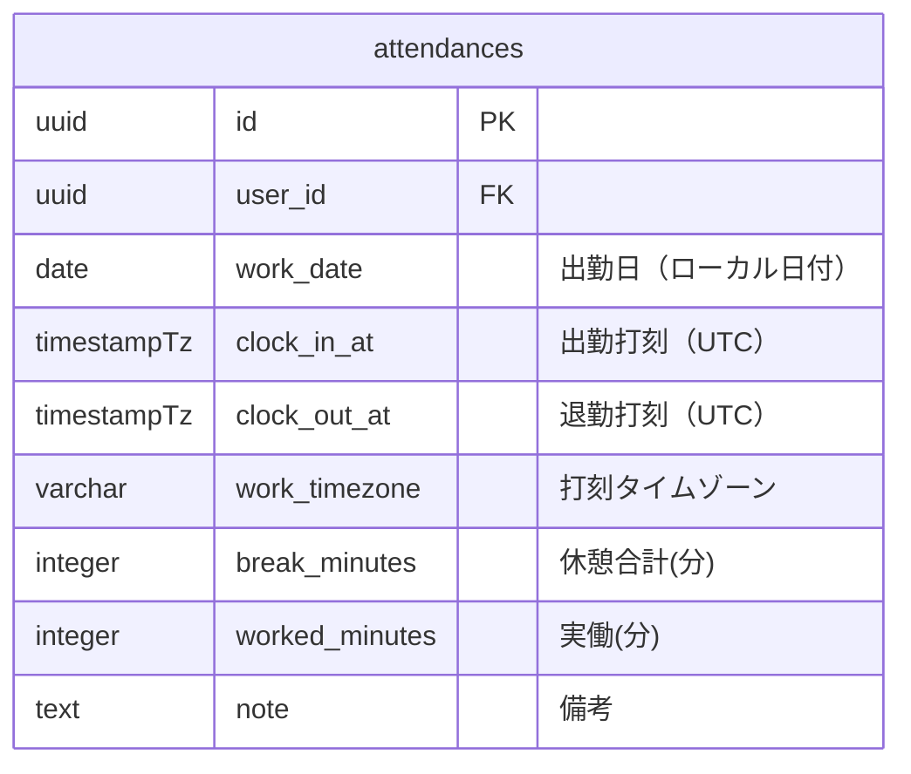
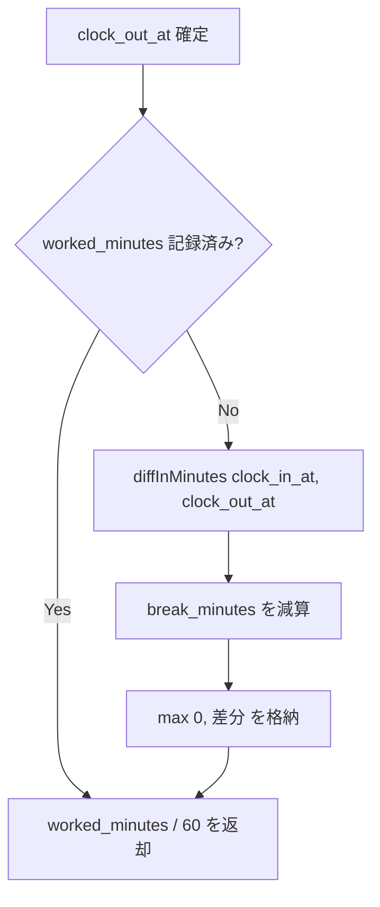

# 日跨ぎ勤務設計

## 概要

夜勤・深夜シフトなど、出勤日と退勤日が異なる「日跨ぎ勤務」を正確に扱うための設計ドキュメント。

## データモデル



## 設計原則

| 原則 | 説明 |
|---|---|
| **Source of Truth は UTC** | `clock_in_at` / `clock_out_at` は `timestampTz` で保存。DB 内部は UTC |
| **`work_date` はローカル日付** | 出勤時の `work_timezone` における日付を `work_date` に記録 |
| **タイムゾーンを永続化** | `work_timezone` を Attendance ごとに保存し、後からローカル時刻を再計算可能にする |
| **`worked_minutes` はキャッシュ** | `clock_out_at` 確定時に差分計算し、集計クエリのパフォーマンスを担保 |

## 日跨ぎ判定ロジック

```php
// Attendance モデル
public function isCrossDayShift(): bool
{
    if ($this->clock_in_at === null || $this->clock_out_at === null) {
        return false;
    }

    $timezone = $this->work_timezone ?? config('app.timezone', 'Asia/Tokyo');

    return !$this->clock_in_at->setTimezone($timezone)->isSameDay(
        $this->clock_out_at->setTimezone($timezone)
    );
}
```

## ローカル時刻変換

```php
// AttendanceService::buildAttendancePayload()
$clockInAt = CarbonImmutable::createFromFormat(
    'Y-m-d H:i',
    sprintf('%s %s', $workDate, $clockInLocal),
    $timezone           // ← work_timezone で解釈
);

// 日跨ぎ退勤
if ($clockOutNextDay) {
    $clockOutDate = $clockInAt->addDay()->toDateString();
}
$clockOutAt = CarbonImmutable::createFromFormat(
    'Y-m-d H:i',
    sprintf('%s %s', $clockOutDate, $clockOutLocal),
    $timezone
);
```

## API ペイロード

```json
{
    "work_date": "2026-03-21",
    "clock_in_local_time": "22:00",
    "clock_out_local_time": "06:30",
    "clock_out_next_day": true,
    "work_timezone": "Asia/Tokyo",
    "break_minutes": 60
}
```

## 勤務時間算出フロー



## DB 制約

```sql
-- 退勤は出勤以降
ALTER TABLE attendances
    ADD CONSTRAINT chk_attendances_clock_range
    CHECK (clock_out_at IS NULL OR clock_out_at >= clock_in_at);

-- 休憩は非負
ALTER TABLE attendances
    ADD CONSTRAINT chk_attendances_break_minutes_non_negative
    CHECK (break_minutes IS NULL OR break_minutes >= 0);
```

## 注意: 設計レビュー指摘事項

| 問題 | 影響 | 改善案 |
|---|---|---|
| **旧カラム `start_time` / `end_time` が残存** | 二重管理。`toLocalTimePayload()` で両方を参照するロジックが複雑化 | マイグレーションで旧カラムを DROP し、`clock_in_at` / `clock_out_at` に一本化する |
| **`clock_out_next_day` が DB に永続化されていない** | API レスポンス時に毎回 `isCrossDayShift()` で再計算が必要 | 頻度が低ければ許容。高頻度集計ならカラム追加を検討 |
| **`worked_minutes` のキャッシュ整合性** | `break_minutes` の後修正時に `worked_minutes` が連動しない可能性 | `update` 時に常に再計算するか、Observer パターンで同期する |
| **タイムゾーン変更への耐性** | ユーザーが `work_timezone` を変更しても過去データの `work_date` は更新されない | 設計として正しい（打刻時のローカル日付を記録する方針）。ドキュメントで明記する |
