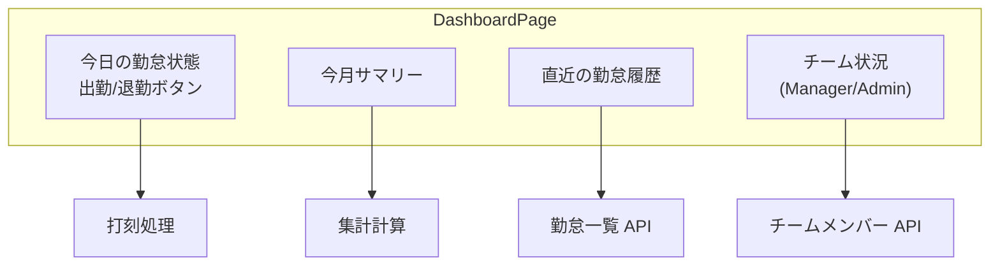
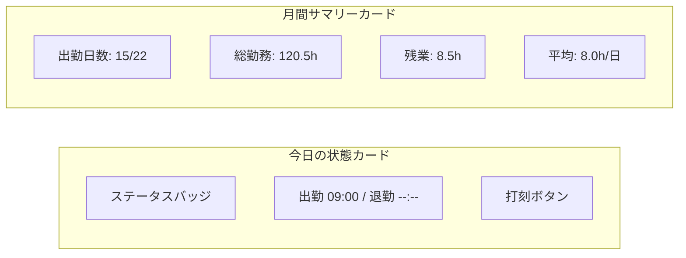

# ダッシュボード集計ロジック

## 概要

ダッシュボード画面に表示する勤怠サマリーの集計ロジック。当日の勤怠状態、今月の勤務統計、チーム概況の算出方法を解説する。

## ダッシュボード構成



## 集計データ構造

```typescript
interface DashboardSummary {
  today: {
    status: AttendanceStatus;
    clockIn: string | null;
    clockOut: string | null;
    workingMinutes: number;
    breakMinutes: number;
  };
  monthly: {
    totalWorkingDays: number;
    actualWorkingDays: number;
    totalWorkingHours: number;
    totalOvertimeHours: number;
    averageWorkingHours: number;
  };
  recent: Attendance[];
}
```

## 集計 SQL

```sql
-- 今月の勤務統計
SELECT
    COUNT(DISTINCT date) AS actual_working_days,
    COALESCE(SUM(working_minutes), 0) AS total_working_minutes,
    COALESCE(SUM(
        CASE WHEN working_minutes > 480
        THEN working_minutes - 480
        ELSE 0 END
    ), 0) AS total_overtime_minutes,
    ROUND(AVG(working_minutes), 0) AS avg_working_minutes
FROM attendances
WHERE user_id = :user_id
  AND date >= :month_start
  AND date <= :month_end
  AND status = 'clocked_out'
  AND deleted_at IS NULL;
```

## サービス層の実装

```php
class DashboardService extends BaseService
{
    public function getSummary(User $user): array
    {
        return [
            'today' => $this->getTodayStatus($user),
            'monthly' => $this->getMonthlySummary($user),
            'recent' => $this->getRecentAttendances($user),
        ];
    }

    private function getMonthlySummary(User $user): array
    {
        $monthStart = now()->startOfMonth();
        $monthEnd = now()->endOfMonth();

        $stats = Attendance::where('user_id', $user->id)
            ->whereBetween('date', [$monthStart, $monthEnd])
            ->where('status', AttendanceStatus::CLOCKED_OUT)
            ->selectRaw('
                COUNT(DISTINCT date) as working_days,
                COALESCE(SUM(working_minutes), 0) as total_minutes,
                COALESCE(AVG(working_minutes), 0) as avg_minutes
            ')
            ->first();

        // 営業日数の計算（土日祝除外）
        $businessDays = $this->calculateBusinessDays(
            $monthStart, $monthEnd
        );

        return [
            'total_working_days' => $businessDays,
            'actual_working_days' => $stats->working_days,
            'total_working_hours' => round($stats->total_minutes / 60, 1),
            'average_working_hours' => round($stats->avg_minutes / 60, 1),
        ];
    }
}
```

## フロントエンド表示



```typescript
// front/src/features/dashboard/components/MonthlySummaryCard.tsx
export const MonthlySummaryCard = ({ summary }: Props) => (
  <Card>
    <CardHeader>今月のサマリー</CardHeader>
    <CardContent>
      <StatGrid>
        <Stat
          label="出勤日数"
          value={`${summary.actual_working_days}/${summary.total_working_days}`}
        />
        <Stat
          label="総勤務時間"
          value={`${summary.total_working_hours}h`}
        />
        <Stat
          label="残業時間"
          value={`${summary.total_overtime_hours}h`}
          variant={summary.total_overtime_hours > 40 ? 'warning' : 'default'}
        />
      </StatGrid>
    </CardContent>
  </Card>
);
```

## 注意: 設計レビュー指摘事項

| 問題 | 影響 | 改善案 |
|---|---|---|
| **集計の計算コスト** | 毎回 DB 集計クエリを発行する | 月次集計テーブルまたは Redis キャッシュで高速化 |
| **営業日計算のハードコード** | 祝日が考慮されていない可能性 | 祝日マスターテーブルを作成し、営業日計算に反映 |
| **残業時間の基準** | `480分 (8h)` がハードコードされている | 会社/ユーザーの所定労働時間を `company_settings` で管理 |
| **リアルタイム更新がない** | 画面を開きっぱなしだと勤務時間が更新されない | フロントエンドの `setInterval` で勤務時間を秒単位表示 |
| **チーム概況のパフォーマンス** | 大量メンバーのチームで N+1 クエリの可能性 | `Eager Loading` + 集計ビューで最適化 |
