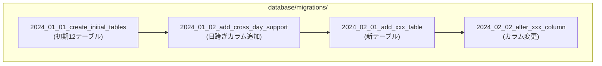
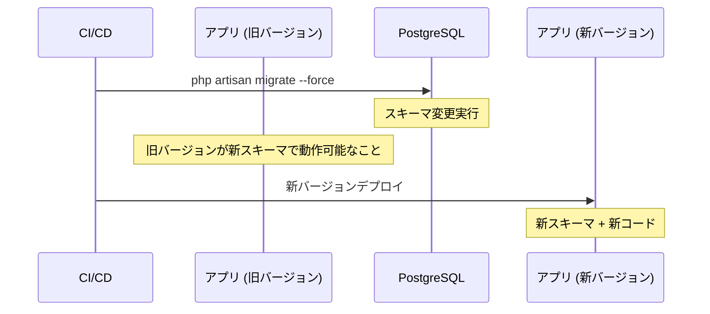
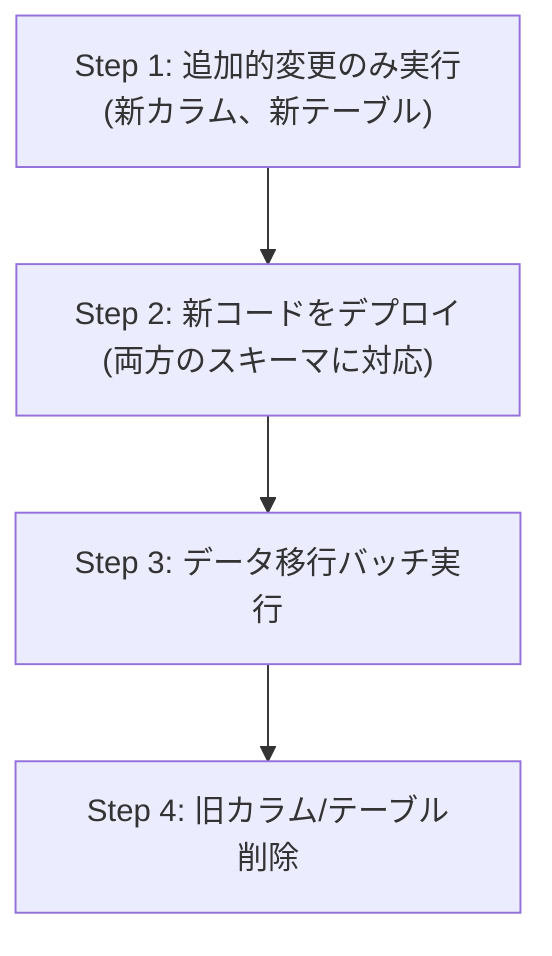

# データマイグレーション戦略

## 概要

Laravel Migration によるデータベーススキーマ変更の設計方針。安全なマイグレーション実行、ロールバック戦略、本番環境でのゼロダウンタイム適用を解説する。

## マイグレーション構成



## マイグレーション命名規約

```
{YYYY}_{MM}_{DD}_{HHMMSS}_{action}_{target}_table.php
```

| アクション | 例 |
|---|---|
| `create` | `create_attendances_table` |
| `add` | `add_note_to_attendances_table` |
| `modify` | `modify_status_in_attendances_table` |
| `drop` | `drop_legacy_table` |
| `rename` | `rename_old_column_to_new_column` |

## 安全なマイグレーションパターン

### カラム追加（安全）

```php
// ✅ NULL 許容 or デフォルト値付きカラム追加は安全
public function up(): void
{
    Schema::table('attendances', function (Blueprint $table) {
        $table->text('note')->nullable()->after('status');
    });
}

public function down(): void
{
    Schema::table('attendances', function (Blueprint $table) {
        $table->dropColumn('note');
    });
}
```

### カラム名変更（要注意）

```php
// ⚠️ リネームは即座に旧コードが壊れる
// 安全な手順: 新カラム追加 → データコピー → 旧カラム削除

// Step 1: 新カラム追加
public function up(): void
{
    Schema::table('users', function (Blueprint $table) {
        $table->string('full_name')->nullable();
    });

    // データコピー
    DB::statement("UPDATE users SET full_name = last_name || ' ' || first_name");
}
```

### テーブル削除（危険）

```php
// 🚨 テーブル削除は不可逆。down() で完全復元できるようにする
public function up(): void
{
    // バックアップテーブル作成
    DB::statement('CREATE TABLE legacy_table_backup AS SELECT * FROM legacy_table');

    Schema::dropIfExists('legacy_table');
}

public function down(): void
{
    DB::statement('CREATE TABLE legacy_table AS SELECT * FROM legacy_table_backup');
    Schema::dropIfExists('legacy_table_backup');
}
```

## 本番デプロイ時のフロー



## ゼロダウンタイムマイグレーション



## ロールバック戦略

| シナリオ | 対応 |
|---|---|
| マイグレーション失敗 | `php artisan migrate:rollback` で直前に戻す |
| デプロイ後にバグ発見 | 旧バージョン再デプロイ + `migrate:rollback` |
| データ不整合 | バックアップからリストア |

```bash
# 直前の1バッチをロールバック
php artisan migrate:rollback --step=1

# 特定時点までロールバック
php artisan migrate:rollback --batch=5
```

## マイグレーションテスト

```php
// tests/Feature/MigrationTest.php
class MigrationTest extends TestCase
{
    public function test_マイグレーションを実行してロールバックできる(): void
    {
        Artisan::call('migrate:fresh');
        $this->assertEquals(0, Artisan::output());

        Artisan::call('migrate:rollback');
        $this->assertEquals(0, Artisan::output());

        Artisan::call('migrate');
        $this->assertEquals(0, Artisan::output());
    }
}
```

## 注意: 設計レビュー指摘事項

| 問題 | 影響 | 改善案 |
|---|---|---|
| **初期マイグレーションが巨大** | 12 テーブルが 1 ファイルに定義されている | 可読性のため分割を推奨するが、初期構築後は変更不要 |
| **`down()` メソッドの信頼性** | 完全な `down()` が書かれていないマイグレーションがある可能性 | コードレビューで `down()` の実装を必須チェック |
| **大テーブルの ALTER** | 数百万行のテーブルへの ALTER TABLE はロック時間が長い | `pt-online-schema-change` 等のツールを使用 |
| **シーダーとの依存** | マイグレーション後にシーダーが必要だが順序が不明確 | `DatabaseSeeder` で依存順序を制御 |
| **マイグレーションの squash** | マイグレーションファイルが増え続ける | 定期的に `schema:dump` で SQL ダンプに集約 |
