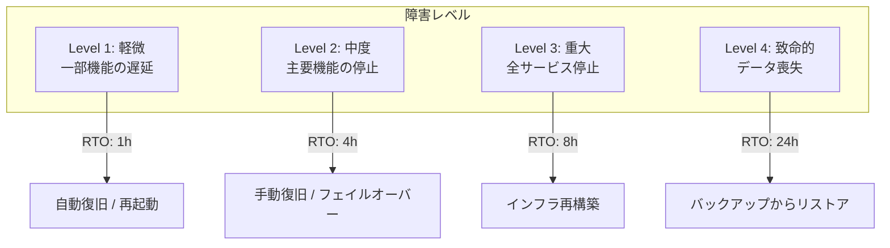
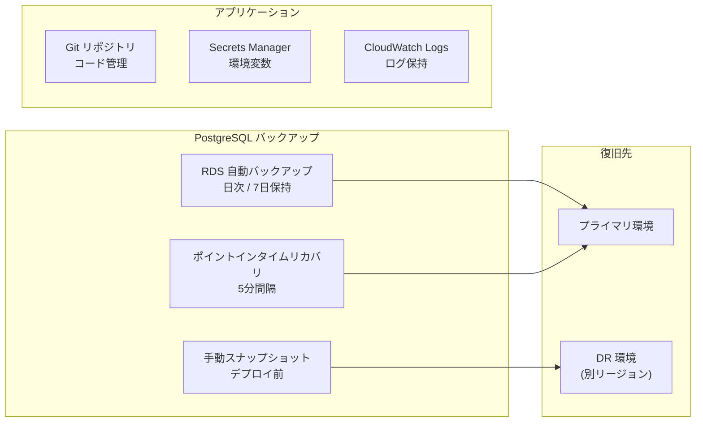
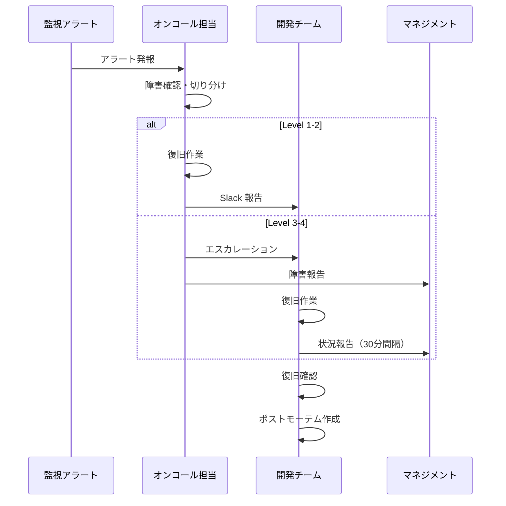

# 障害復旧設計

## 概要

システム障害発生時の復旧手順と事業継続計画（BCP）。障害分類、RTO/RPO 目標、バックアップ戦略、復旧手順書を整理する。

## 障害分類と復旧目標



## RTO / RPO 目標

| メトリクス | 定義 | 目標値 |
|---|---|---|
| **RTO** (Recovery Time Objective) | 復旧までの最大許容時間 | 4 時間 |
| **RPO** (Recovery Point Objective) | 許容されるデータ喪失期間 | 1 時間 |
| **MTTR** (Mean Time To Recovery) | 平均復旧時間 | 2 時間 |
| **MTBF** (Mean Time Between Failures) | 平均故障間隔 | 30 日以上 |

## バックアップ戦略



## データベースバックアップ

```bash
# 手動バックアップ（pg_dump）
pg_dump -h $DB_HOST -U $DB_USER -d $DB_NAME \
    --format=custom \
    --file=backup_$(date +%Y%m%d_%H%M%S).dump

# リストア
pg_restore -h $DB_HOST -U $DB_USER -d $DB_NAME \
    --clean --if-exists \
    backup_20250115_120000.dump
```

## 障害対応フロー



## 障害別復旧手順

### 1. アプリケーション障害

```bash
# Step 1: コンテナ状態確認
docker compose ps

# Step 2: ログ確認
docker compose logs --tail=100 app

# Step 3: コンテナ再起動
docker compose restart app

# Step 4: ヘルスチェック
curl -s http://localhost:8000/api/health | jq .
```

### 2. データベース障害

```bash
# Step 1: 接続確認
docker compose exec db pg_isready -U postgres

# Step 2: PostgreSQL 再起動
docker compose restart db

# Step 3: マイグレーション状態確認
docker compose exec app php artisan migrate:status

# Step 4: 必要に応じてリストア
docker compose exec db pg_restore ...
```

### 3. Redis 障害

```bash
# Step 1: Redis 接続確認
docker compose exec redis redis-cli ping

# Step 2: Redis 再起動
docker compose restart redis

# Step 3: キャッシュクリア
docker compose exec app php artisan cache:clear
```

## ポストモーテムテンプレート

```markdown
## 障害報告書

### 概要
- **発生日時**: YYYY-MM-DD HH:MM
- **復旧日時**: YYYY-MM-DD HH:MM
- **影響範囲**: 全ユーザー / 特定機能
- **障害レベル**: Level X

### タイムライン
| 時刻 | アクション |
|---|---|
| HH:MM | アラート発報 |
| HH:MM | 調査開始 |
| HH:MM | 原因特定 |
| HH:MM | 復旧完了 |

### 根本原因
(技術的な原因の詳細)

### 再発防止策
1. (対策1)
2. (対策2)
```

## 注意: 設計レビュー指摘事項

| 問題 | 影響 | 改善案 |
|---|---|---|
| **DR 環境が未構築** | 主要環境が壊れたら復旧に時間がかかる | 別リージョンに最小構成の DR 環境を準備 |
| **バックアップのテスト未実施** | バックアップが復元可能か検証されていない | 月次でバックアップからのリストアテストを実施 |
| **オンコールローテーションがない** | 障害時の連絡先が不明確 | PagerDuty 等でローテーションを設定 |
| **runbook が未整備** | 障害時に手順を調べる時間がかかる | 本ドキュメントをベースに runbook を作成 |
| **自動復旧の仕組みがない** | 毎回手動で復旧が必要 | ECS の自動復旧、DB フェイルオーバーの設定 |
