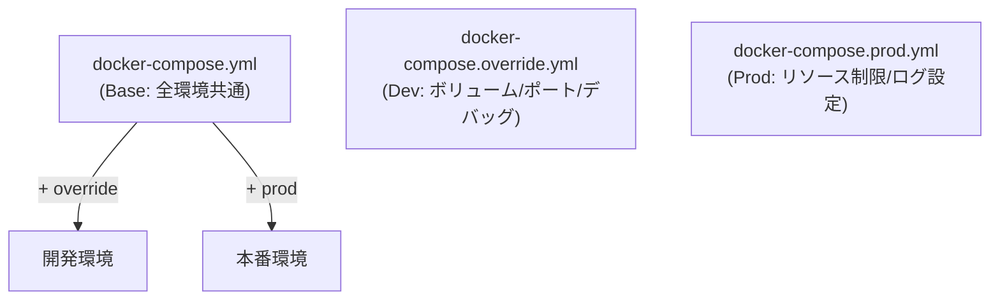
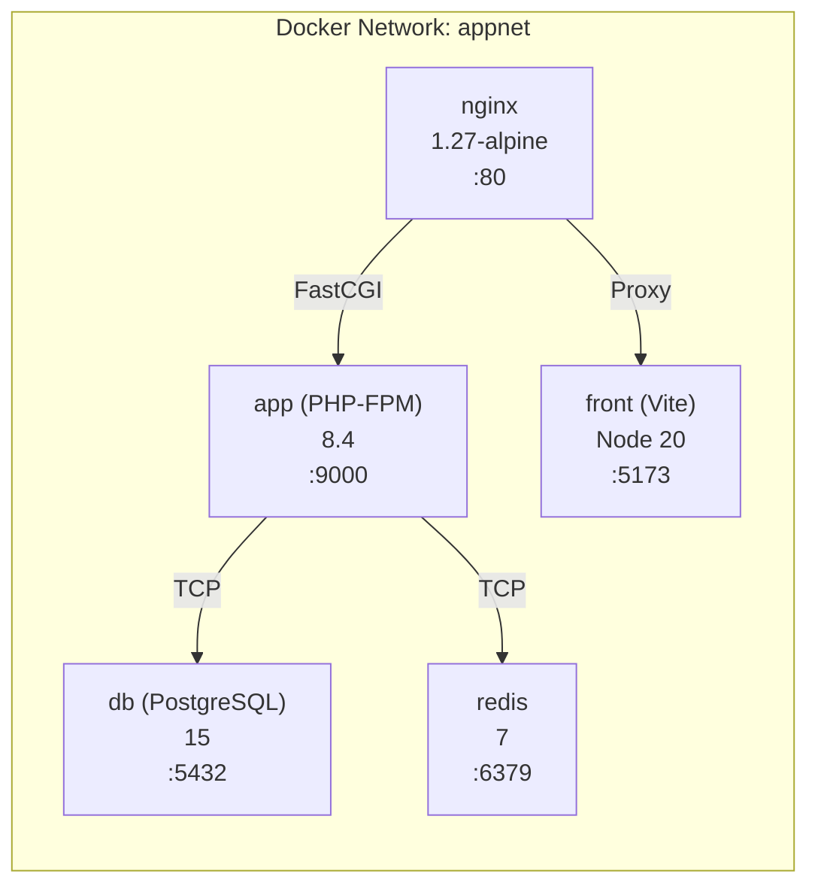

# Docker Compose 構成詳細

## 概要

マルチステージ Docker Compose による開発・本番環境の構成。Base / Override / Prod の 3 層構成で環境差分を管理する。

## Compose ファイル構成



## サービス一覧



## Base 構成 (docker-compose.yml)

```yaml
services:
  nginx:
    image: nginx:1.27-alpine
    volumes:
      - ./nginx/conf.d:/etc/nginx/conf.d
    depends_on:
      app:
        condition: service_healthy

  app:
    build:
      context: ../back
      dockerfile: ../infra/php/Dockerfile
      target: dev    # or prod
    healthcheck:
      test: ["CMD-SHELL", "php-fpm-healthcheck || exit 1"]
    depends_on:
      db:
        condition: service_healthy
      redis:
        condition: service_healthy

  front:
    build:
      context: ../front
      dockerfile: ../infra/node/Dockerfile
      target: dev    # or prod

  db:
    image: postgres:15
    volumes:
      - postgres_data:/var/lib/postgresql/data
      - ./postgres/init.sql:/docker-entrypoint-initdb.d/init.sql
    healthcheck:
      test: ["CMD-SHELL", "pg_isready -U $$POSTGRES_USER"]

  redis:
    image: redis:7
    command: redis-server --appendonly yes
    volumes:
      - redis_data:/data
    healthcheck:
      test: ["CMD", "redis-cli", "ping"]
```

## Override 構成 (開発環境)

```yaml
# docker-compose.override.yml
services:
  nginx:
    ports:
      - "${APP_PORT:-80}:80"

  app:
    volumes:
      - ../back:/var/www/html    # ホストコード同期
    environment:
      APP_ENV: local
      APP_DEBUG: "true"
      XDEBUG_MODE: develop,debug

  front:
    volumes:
      - ../front:/app            # ホストコード同期
    environment:
      CHOKIDAR_USEPOLLING: "true"

  db:
    ports:
      - "5432:5432"
    command: >
      postgres
        -c listen_addresses=*
        -c log_statement=all
        -c log_connections=on
        -c log_disconnections=on
```

## Prod 構成 (本番環境)

```yaml
# docker-compose.prod.yml
services:
  nginx:
    restart: always
    stop_grace_period: 10s

  app:
    restart: always
    mem_limit: 512m
    cpus: 1.0
    environment:
      APP_ENV: production
      APP_DEBUG: "false"
    logging:
      driver: json-file
      options:
        max-size: "10m"
        max-file: "3"
```

## 環境変数の階層

| 変数 | 定義場所 | 用途 |
|---|---|---|
| `APP_PORT` | `.env` (root) | Nginx 公開ポート |
| `POSTGRES_DB` | `.env` (root) | DB 名 |
| `POSTGRES_USER` | `.env` (root) | DB ユーザー |
| `POSTGRES_PASSWORD` | `.env` (root) | DB パスワード |
| `APP_ENV` | `override.yml` / `prod.yml` | Laravel 環境 |
| `JWT_SECRET` | `back/.env` | JWT 秘密鍵 |

## 注意: 設計レビュー指摘事項

| 問題 | 影響 | 改善案 |
|---|---|---|
| **`back/` 全体をボリュームマウント** | `vendor/` のホスト←→コンテナ同期で Linux/macOS 間のパフォーマンス問題 | `vendor/` を名前付きボリュームにして除外する |
| **`mem_limit` が本番のみ** | 開発環境でメモリリークを早期発見できない | 開発環境でも緩い制限（1GB 等）を設定 |
| **ヘルスチェックのリトライ設定がない** | DB 起動直後にリトライが足りず app が起動失敗する場合がある | `interval: 10s`, `retries: 5`, `start_period: 30s` を設定 |
| **Redis の永続化設定** | `appendonly yes` のみ。RDB/AOF の詳細設定が不足 | 本番用には `appendfsync everysec` の明示を推奨 |
| **`--env-file .env` の明示的指定が必要** | `docker compose -f infra/...` だと `.env` を `infra/` から探してしまう | Makefile で `--env-file .env` を指定済み（対応済み） |
