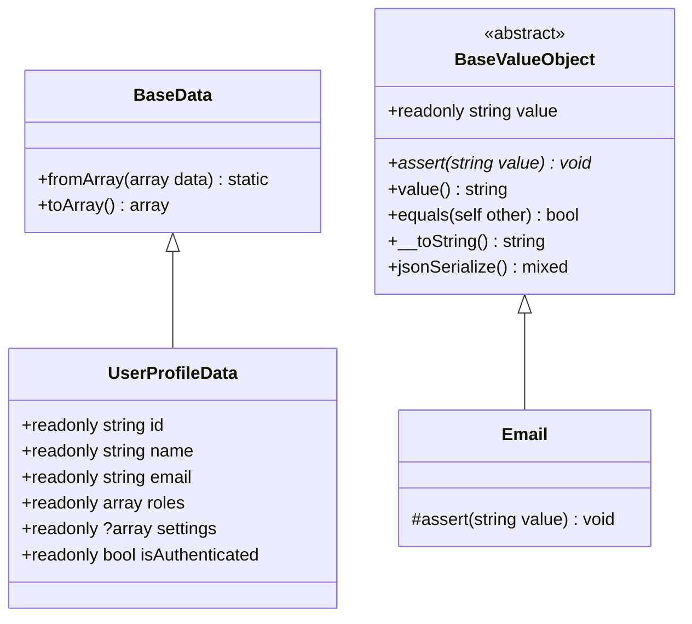

# Data / ValueObject パターン

## 概要

レイヤー間のデータ受け渡しに Data (Data Transfer Object)、ドメイン値の妥当性保証に ValueObject を使用する。いずれも不変 (`readonly`) で設計する。

## クラス階層



## BaseData

```php
abstract class BaseData
{
    /**
     * 配列からDataを生成する。
     * Enum / DateTimeImmutable / ValueObject のコンストラクタ引数を自動変換する。
     */
    public static function fromArray(array $data): static
    {
        $ref = new \ReflectionClass(static::class);
        $params = $ref->getConstructor()->getParameters();
        $args = [];

        foreach ($params as $param) {
            $name = $param->getName();
            $value = $data[$name] ?? ($param->isDefaultValueAvailable()
                ? $param->getDefaultValue()
                : null);
            $type = $param->getType();

            if ($type instanceof \ReflectionNamedType && !$type->isBuiltin() && $value !== null) {
                $typeName = $type->getName();

                if (enum_exists($typeName)) {
                    $value = $typeName::from($value);
                } elseif (is_a($typeName, \DateTimeImmutable::class, true)) {
                    $value = new \DateTimeImmutable($value);
                } elseif (is_a($typeName, BaseValueObject::class, true)) {
                    $value = new $typeName($value);
                }
            }
            $args[] = $value;
        }

        return new static(...$args);
    }

    /**
     * Dataを配列へ変換する。ValueObject / Enum は展開する。
     */
    public function toArray(): array
    {
        $result = [];
        $ref = new \ReflectionClass($this);

        foreach ($ref->getProperties() as $prop) {
            $value = $prop->getValue($this);

            if ($value instanceof BaseValueObject) {
                $value = $value->value();
            } elseif ($value instanceof \BackedEnum) {
                $value = $value->value;
            } elseif ($value instanceof \DateTimeInterface) {
                $value = $value->format(\DateTimeInterface::ATOM);
            }

            $result[$prop->getName()] = $value;
        }

        return $result;
    }
}
```

## Data 実装例

```php
final class UserProfileData extends BaseData
{
    public function __construct(
        public readonly string  $id,
        public readonly string  $name,
        public readonly string  $email,
        public readonly array   $roles,
        public readonly ?array  $settings,
        public readonly bool    $isAuthenticated = true,
    ) {}
}

// 使い方
$dto = new UserProfileData(
    id: $user->id,
    name: $user->name,
    email: $user->email,
    roles: $user->roles->pluck('name')->all(),
    settings: $user->userSetting?->toArray(),
);

return ApiResponse::success($dto->toArray(), 'ユーザー情報を取得しました');
```

## BaseValueObject

```php
abstract readonly class BaseValueObject implements Stringable, JsonSerializable
{
    public readonly string $value;

    final public function __construct(string $value)
    {
        $this->assert($value);
        $this->value = $value;
    }

    /** 子クラスで妥当性検証を実装する */
    abstract protected function assert(string $value): void;

    final public function value(): string     { return $this->value; }
    final public function equals(self $other): bool { return $this->value === $other->value; }
    final public function __toString(): string { return $this->value; }
    public function jsonSerialize(): mixed     { return $this->value; }
}
```

## ValueObject 実装例

```php
final readonly class Email extends BaseValueObject
{
    protected function assert(string $value): void
    {
        if (!filter_var($value, FILTER_VALIDATE_EMAIL)) {
            throw new DomainException("Invalid email format.");
        }
    }
}

// 使用
$email = new Email('user@example.com');
echo $email;           // 'user@example.com'
echo $email->value();  // 'user@example.com'
$email->equals(new Email('user@example.com')); // true
```

## Data vs ValueObject 使い分け

| 観点 | Data | ValueObject |
|---|---|---|
| **目的** | レイヤー間データ受け渡し | 値の妥当性保証 |
| **不変性** | `readonly` プロパティ | `readonly class` |
| **バリデーション** | なし（FormRequest が担当） | コンストラクタで `assert()` |
| **等価性** | 参照比較 | `equals()` による値比較 |
| **シリアライズ** | `toArray()` | `jsonSerialize()` / `__toString()` |
| **典型例** | `UserProfileData`, `DashboardPayload` | `Email`, `PhoneNumber`, `Money` |

## 注意: 設計レビュー指摘事項

| 問題 | 影響 | 改善案 |
|---|---|---|
| **Data が 2 クラスしかない** | Service が配列を直接返している箇所が多く、型安全性が低い | 主要HTTPレスポンスごとに Data を追加：`AttendancePayload`, `DashboardPayload` 等 |
| **ValueObject が Email のみ** | `work_timezone` や `work_date` がプリミティブのまま | `Timezone`, `WorkDate` ValueObject を検討 |
| **BaseData の fromArray() のリフレクション** | パフォーマンスへの影響（大量変換時） | キャッシュ機構を入れるか、頻度が低ければ許容 |
| **DomainException の import 漏れリスク** | `assert()` で PHP 標準 DomainException を使うと 500 になる | PHPStan ルールで `\DomainException` の使用を禁止する |
| **Eloquent Model → Data の変換が手動** | Model に `toData()` メソッドがなく、Service 内で個別に構築 | Model に `toUserProfileData(): UserProfileData` メソッドを追加する |
