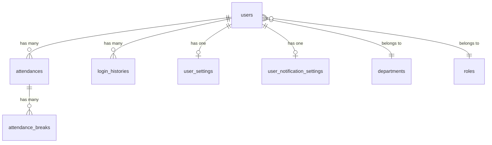

# Eloquent モデル設計

## 概要

本システムの Eloquent Model 設計規約。UUID 主キー、イミュータブルキャスト、スコープ、ドメインメソッドの実装パターンを解説する。

## モデル一覧



## モデルクラス一覧

| モデル | テーブル | SoftDeletes | 主な責務 |
|---|---|---|---|
| `User` | `users` | ✅ | ユーザー管理、JWT 認証 |
| `Attendance` | `attendances` | ✅ | 勤怠記録、打刻管理 |
| `AttendanceBreak` | `attendance_breaks` | ✅ | 休憩記録 |
| `Department` | `departments` | ❌ | 部署マスタ |
| `Role` | `roles` | ❌ | 役職マスタ |
| `Holiday` | `holidays` | ❌ | 祝日カレンダー |
| `LoginHistory` | `login_histories` | ❌ | ログイン監査 |
| `UserSetting` | `user_settings` | ❌ | テーマ/言語設定 |
| `UserNotificationSetting` | `user_notification_settings` | ❌ | 通知設定 |

## UUID 主キーパターン

```php
class Attendance extends BaseModel
{
    protected $keyType = 'string';
    public $incrementing = false;

    // UUID 自動生成（booted フック）
    protected static function booted(): void
    {
        static::creating(function (self $model) {
            if (!$model->id) {
                $model->id = (string) Str::uuid();
            }
        });
    }
}
```

## キャストパターン

```php
protected $casts = [
    // 日付系：immutable で副作用を防ぐ
    'work_date'    => 'immutable_date',
    'clock_in_at'  => 'immutable_datetime',
    'clock_out_at' => 'immutable_datetime',

    // 数値系
    'break_minutes'  => 'integer',
    'worked_minutes' => 'integer',
    'sort_order'     => 'integer',
    'status'         => 'integer',

    // タイムスタンプ系
    'created_at' => 'datetime',
    'updated_at' => 'datetime',
    'deleted_at' => 'datetime',
];
```

## スコープパターン

```php
// ユーザーフィルタ
public function scopeUser(Builder $query, string $userId): Builder
{
    return $query->where('user_id', $userId);
}

// 月フィルタ
public function scopeMonth(Builder $query, int $year, int $month): Builder
{
    return $query->whereYear('work_date', $year)
                 ->whereMonth('work_date', $month);
}

// アクティブフィルタ
public function scopeActive(Builder $query): Builder
{
    return $query->where('status', 1);
}

// 並び順
public function scopeOrdered(Builder $query): Builder
{
    return $query->orderBy('sort_order');
}
```

## ドメインメソッド

```php
// 状態判定
public function isClockedIn(): bool
{
    return $this->clock_in_at !== null || $this->extends BaseModel !== null;
}

public function isWorking(): bool
{
    return $this->isClockedIn() && !$this->isClockedOut();
}

public function isCrossDayShift(): bool { /* ... */ }

// 計算
public function calculateWorkedMinutes(?CarbonImmutable $now = null): ?int { /* ... */ }

// ペイロード変換
public function toLocalTimePayload(): array { /* ... */ }
```

## User モデルの特殊処理

```php
// booted() でパスワード自動ハッシュ
protected static function booted(): void
{
    static::creating(function (User $user) {
        if (!$user->id) {
            $user->id = (string) Str::uuid();
        }
        if ($user->password) {
            $user->password = Hash::make($user->password);
        }
    });

    static::updating(function (User $user) {
        if ($user->isDirty('password')) {
            $user->password = Hash::make($user->password);
        }
    });
}
```

## 注意: 設計レビュー指摘事項

| 問題 | 影響 | 改善案 |
|---|---|---|
| **`booted()` でのパスワード自動ハッシュ** | Seeder で `Hash::make()` を呼ぶと二重ハッシュ → ログイン不可 | ドキュメントに明記。Seeder には平文パスワードを渡す |
| **リレーションの戻り値型が未宣言** | `$user->department()` が `BelongsTo` 型かどうか IDE が推論できない | `public function department(): BelongsTo` のように戻り値型を明記 |
| **`$hidden` の不統一** | `User` のみ `$hidden` あり。他モデルは機密データがないが一貫性に欠ける | 全モデルで `$hidden` を明示する方針にする |
| **`created_at` / `updated_at` を `datetime` でキャスト** | `immutable_datetime` ではないため、意図しない変更が可能 | 読み取り専用なら `immutable_datetime` に統一 |
| **旧カラム `extends BaseModel` / `end_time` が `$fillable` に残存** | 新旧カラムの二重管理 | マイグレーションで旧カラムを DROP し、`$fillable` / `$casts` から削除 |
| **`AttendanceBreak` に UUID 自動生成の `booted()` がない** | `$keyType = 'string'` なのに `booted()` フックがなく、ID が null になる | `booted()` を追加するか、Factory/Seeder で明示的に ID を指定する |
