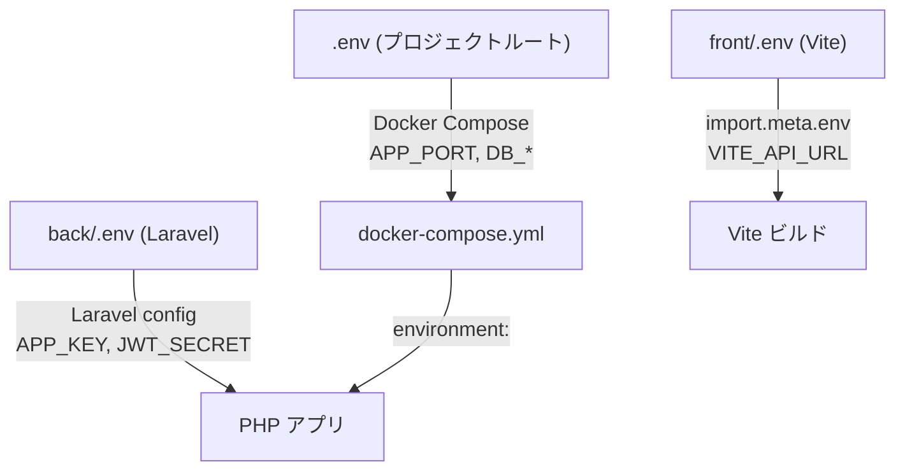
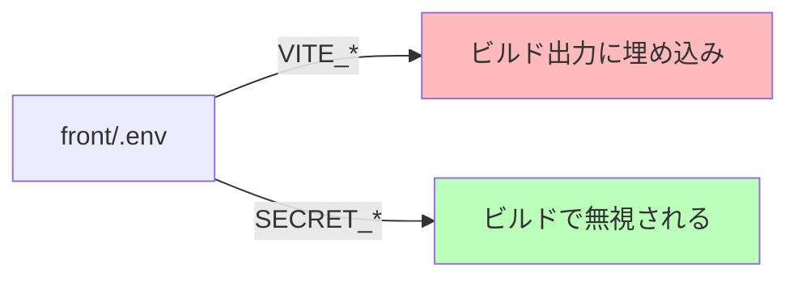

# 環境変数管理

## 概要

3 層の `.env` ファイルによる環境変数管理。Docker Compose、Laravel、Vite それぞれの環境変数の定義場所と参照関係を整理する。

## 環境変数の階層



## .env ファイル一覧

| ファイル | 用途 | 読み込み元 |
|---|---|---|
| `.env` | Docker Compose 変数 | `docker compose --env-file .env` |
| `back/.env` | Laravel アプリ変数 | `Dotenv` (Laravel 起動時) |
| `front/.env` | Vite フロントエンド変数 | `import.meta.env` (ビルド時) |
| `.env.example` | テンプレート | 手動コピー |

## プロジェクトルート .env

```bash
# Docker Compose
COMPOSE_PROJECT_NAME=time-attendance
APP_PORT=8000

# PostgreSQL
POSTGRES_DB=time_attendance
POSTGRES_USER=postgres
POSTGRES_PASSWORD=postgres

# Redis
REDIS_PORT=6379
```

## back/.env (Laravel)

```bash
APP_NAME=TimeAttendance
APP_ENV=local
APP_KEY=base64:xxxxx
APP_DEBUG=true
APP_URL=http://localhost:8000

# Database
DB_CONNECTION=pgsql
DB_HOST=db
DB_PORT=5432
DB_DATABASE=time_attendance
DB_USERNAME=postgres
DB_PASSWORD=postgres

# JWT
JWT_SECRET=xxxxx
JWT_TTL=60

# Redis
REDIS_HOST=redis
REDIS_PORT=6379

# CORS
FRONTEND_URL=http://localhost:5173

# Logging
LOG_CHANNEL=stack
LOG_LEVEL=debug
```

## front/.env (Vite)

```bash
VITE_API_URL=/api
VITE_API_PROXY_TARGET=http://localhost:8000
VITE_API_TIMEOUT=30000
VITE_NODE_ENV=development
```

## 環境別設定マトリクス

| 変数 | 開発 | ステージング | 本番 |
|---|---|---|---|
| `APP_ENV` | `local` | `staging` | `production` |
| `APP_DEBUG` | `true` | `false` | `false` |
| `APP_PORT` | `8000` | `80` | `80` |
| `DB_HOST` | `db` | RDS エンドポイント | RDS エンドポイント |
| `LOG_LEVEL` | `debug` | `info` | `warning` |
| `FRONTEND_URL` | `http://localhost:5173` | ステージング URL | 本番 URL |

## Vite 環境変数のセキュリティ

```
⚠️ VITE_ プレフィクスの変数はクライアントバンドルに含まれる
   → 秘密情報は絶対に VITE_ プレフィクスを付けない

✅ OK: VITE_API_URL=/api        (公開情報)
❌ NG: VITE_JWT_SECRET=xxxxx    (秘密情報)
```



## 注意: 設計レビュー指摘事項

| 問題 | 影響 | 改善案 |
|---|---|---|
| **`.env.example` の同期漏れ** | 新規変数追加時に `.env.example` が更新されない | CI で `.env` と `.env.example` のキー差分チェックを追加 |
| **Docker Compose と Laravel で DB 変数が二重管理** | `POSTGRES_*` (Compose) と `DB_*` (Laravel) の不整合リスク | Docker Compose の `environment:` で Laravel 変数を直接注入する |
| **`JWT_SECRET` がプレーンテキスト** | `.env` が Git にコミットされると漏洩 | `.gitignore` に `.env` が含まれていることを確認。本番は AWS Secrets Manager 等を使用 |
| **`front/.env` が Git にコミットされている可能性** | API URL 等が公開される（公開情報なら問題ないが） | `.gitignore` 対象を確認。テンプレート `.env.example` のみコミット |
| **環境変数の型変換が手動** | `VITE_API_TIMEOUT` は文字列として取得される | `env.ts` で `parseInt()` 等の型変換を行っている（対応済み） |
