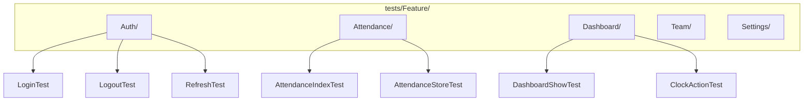

# Feature テストパターン

## 概要

Laravel Feature テストの設計パターン。HTTP リクエストのエンドツーエンドテスト、認証テスト、バリデーションテスト、レスポンス検証の実装方法を解説する。

## テスト構成



## テスト基底クラス

```php
// tests/TestCase.php
abstract class TestCase extends BaseTestCase
{
    use CreatesApplication;
    use RefreshDatabase;

    protected function actingAsUser(array $attrs = []): User
    {
        $user = User::factory()->create($attrs);
        $this->actingAs($user);
        return $user;
    }

    protected function actingAsAdmin(): User
    {
        return $this->actingAsUser(['role' => UserRole::ADMIN]);
    }

    protected function actingAsManager(): User
    {
        return $this->actingAsUser(['role' => UserRole::MANAGER]);
    }
}
```

## 認証テストパターン

```php
class LoginTest extends TestCase
{
    public function test_正しい認証情報でログインできる(): void
    {
        $user = User::factory()->create([
            'email' => 'test@example.com',
            'password' => Hash::make('password123'),
        ]);

        $response = $this->postJson('/api/login', [
            'email' => 'test@example.com',
            'password' => 'password123',
        ]);

        $response->assertOk()
            ->assertJsonStructure([
                'data' => [
                    'access_token',
                    'token_type',
                    'expires_in',
                ],
            ]);
    }

    public function test_不正なパスワードでログイン失敗(): void
    {
        User::factory()->create(['email' => 'test@example.com']);

        $response = $this->postJson('/api/login', [
            'email' => 'test@example.com',
            'password' => 'wrong',
        ]);

        $response->assertUnauthorized();
    }

    public function test_レートリミットが適用される(): void
    {
        User::factory()->create(['email' => 'test@example.com']);

        // 5回連続失敗
        for ($i = 0; $i < 5; $i++) {
            $this->postJson('/api/login', [
                'email' => 'test@example.com',
                'password' => 'wrong',
            ]);
        }

        // 6回目は 429
        $this->postJson('/api/login', [
            'email' => 'test@example.com',
            'password' => 'wrong',
        ])->assertStatus(429);
    }
}
```

## CRUD テストパターン

```php
class AttendanceTest extends TestCase
{
    // 一覧取得
    public function test_勤怠一覧を取得できる(): void
    {
        $user = $this->actingAsUser();
        Attendance::factory()->count(3)->for($user)->create();

        $response = $this->getJson('/api/attendances');

        $response->assertOk()
            ->assertJsonCount(3, 'data')
            ->assertJsonStructure([
                'data' => [['id', 'date', 'clock_in', 'clock_out', 'status']],
            ]);
    }

    // 作成
    public function test_勤怠を手動登録できる(): void
    {
        $user = $this->actingAsUser();

        $response = $this->postJson('/api/attendances', [
            'date' => '2025-01-15',
            'clock_in' => '2025-01-15T09:00:00+09:00',
            'clock_out' => '2025-01-15T18:00:00+09:00',
        ]);

        $response->assertCreated();
        $this->assertDatabaseHas('attendances', [
            'user_id' => $user->id,
            'date' => '2025-01-15',
        ]);
    }

    // バリデーションエラー
    public function test_日付なしで登録するとバリデーションエラー(): void
    {
        $this->actingAsUser();

        $response = $this->postJson('/api/attendances', [
            'clock_in' => '2025-01-15T09:00:00+09:00',
        ]);

        $response->assertUnprocessable()
            ->assertJsonValidationErrors(['date']);
    }

    // 認可
    public function test_他人の勤怠は参照できない(): void
    {
        $user = $this->actingAsUser();
        $otherUser = User::factory()->create();
        $attendance = Attendance::factory()->for($otherUser)->create();

        $response = $this->patchJson("/api/attendances/{$attendance->id}", [
            'note' => 'test',
        ]);

        $response->assertForbidden();
    }
}
```

## テストデータマトリクス

| テストケース | 入力条件 | 期待結果 |
|---|---|---|
| 正常な出勤打刻 | 未出勤状態 | 201, `status: clocked_in` |
| 二重出勤 | 出勤済み状態 | 422, エラーメッセージ |
| 退勤打刻 | 出勤中状態 | 200, `status: clocked_out` |
| 休憩中の退勤 | 休憩中状態 | 422, エラーメッセージ |
| 未認証アクセス | JWT なし | 401, Unauthorized |
| 権限不足 | employee が team 参照 | 403, Forbidden |

## テスト実行コマンド

```bash
# 全テスト実行
make test

# 特定テスト
docker compose exec app php artisan test --filter=LoginTest

# 並列実行
docker compose exec app php artisan test --parallel

# カバレッジ
docker compose exec app php artisan test --coverage --min=80
```

## 注意: 設計レビュー指摘事項

| 問題 | 影響 | 改善案 |
|---|---|---|
| **テスト名が英語混在** | 一覧性が低い | 日本語テスト名 `test_日本語説明()` で統一 |
| **テストデータの暗黙的依存** | Seeder データに依存するテストがある可能性 | 全テストで Factory を使い、自己完結させる |
| **トランザクションロールバック** | `RefreshDatabase` は遅い場合がある | `DatabaseTransactions` トレイトの検討 |
| **API バージョンのテスト** | バージョニング導入時にテスト対象が倍増 | ベーステストクラスでバージョン別にテストを生成 |
| **レスポンス構造の検証が甘い** | `assertOk()` のみで中身を検証していないテスト | `assertJsonStructure()` と `assertJson()` を必ず含める |
