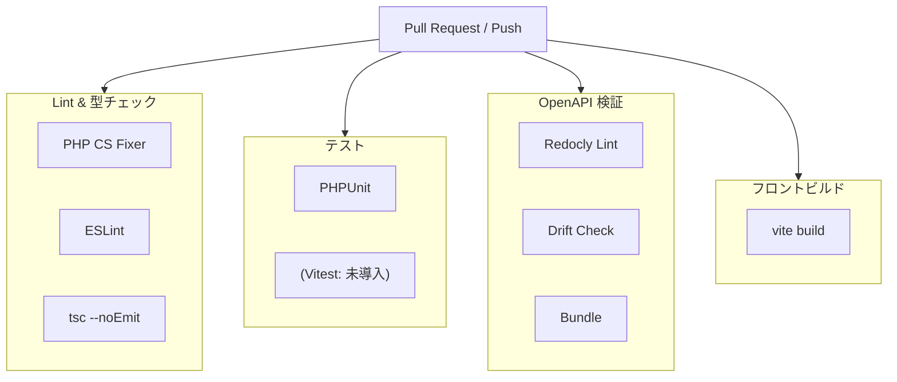

# GitHub Actions パイプライン

## 概要

GitHub Actions による CI/CD パイプライン設計。OpenAPI スキーマ整合性チェック、PHPUnit、ESLint、TypeScript 型チェック、ビルド検証を自動化する。

## パイプライン全体像



## openapi-check.yml

OpenAPI 定義の整合性チェック。コード自動生成後のドリフトを検出する。

```yaml
name: OpenAPI Check
on:
  pull_request:
    paths:
      - 'openapi/**'
      - 'back/app/__Generated__/**'
      - 'front/src/__generated__/**'

jobs:
  openapi-check:
    runs-on: ubuntu-latest
    steps:
      - uses: actions/checkout@v4

      - uses: pnpm/action-setup@v2
        with:
          version: 9

      - uses: actions/setup-node@v4
        with:
          node-version: 20
          cache: pnpm

      - run: pnpm install --frozen-lockfile

      # OpenAPI バンドル
      - run: pnpm exec redocly bundle openapi/openapi.yaml -o /tmp/bundle.yaml

      # コード再生成
      - run: pnpm exec orval
      - run: pnpm exec openapi-zod-client openapi/build/bundle.yaml -o /tmp/zod.ts

      # ドリフト検出
      - run: git diff --exit-code -- 'front/src/__generated__/'
        name: "Check for uncommitted generated code"
```

## CI マトリクス構成

```yaml
name: CI
on:
  pull_request:
  push:
    branches: [main, develop]

jobs:
  backend:
    runs-on: ubuntu-latest
    services:
      postgres:
        image: postgres:15
        env:
          POSTGRES_DB: testing
          POSTGRES_USER: postgres
          POSTGRES_PASSWORD: postgres
        ports: ['5432:5432']
        options: >-
          --health-cmd pg_isready
          --health-interval 10s
          --health-timeout 5s
          --health-retries 5

    steps:
      - uses: actions/checkout@v4
      - uses: shivammathur/setup-php@v2
        with:
          php-version: '8.4'
          extensions: pdo_pgsql, zip, bcmath
          coverage: xdebug

      - run: composer install --no-interaction --prefer-dist
        working-directory: back

      - run: php artisan test --parallel
        working-directory: back
        env:
          DB_CONNECTION: pgsql
          DB_HOST: localhost
          DB_DATABASE: testing
          DB_USERNAME: postgres
          DB_PASSWORD: postgres

  frontend:
    runs-on: ubuntu-latest
    steps:
      - uses: actions/checkout@v4
      - uses: pnpm/action-setup@v2
        with:
          version: 9
      - uses: actions/setup-node@v4
        with:
          node-version: 20
          cache: pnpm
          cache-dependency-path: front/pnpm-lock.yaml

      - run: pnpm install --frozen-lockfile
        working-directory: front

      - run: pnpm typecheck
        working-directory: front

      - run: pnpm lint
        working-directory: front

      - run: pnpm build
        working-directory: front
```

## ジョブ一覧

| ジョブ | トリガー | 成果 |
|---|---|---|
| `backend` | PR / push | PHPUnit テスト、PHP CS |
| `frontend` | PR / push | 型チェック、ESLint、ビルド |
| `openapi-check` | openapi/* 変更時 | ドリフト検出 |

## キャッシュ戦略

| 対象 | キーパターン | 効果 |
|---|---|---|
| Composer | `composer-${{ hashFiles('back/composer.lock') }}` | 依存解決を高速化 |
| pnpm | `pnpm-${{ hashFiles('front/pnpm-lock.yaml') }}` | node_modules を高速化 |
| PHP 拡張 | `setup-php` アクション内蔵 | 拡張インストールを高速化 |

## 注意: 設計レビュー指摘事項

| 問題 | 影響 | 改善案 |
|---|---|---|
| **フロントエンドテスト (Vitest) が未導入** | フロントエンドのロジックが CI で検証されない | Vitest を導入し、hooks/utils のユニットテストを追加 |
| **カバレッジレポートの欠如** | テストカバレッジの推移が追跡できない | Codecov / Coveralls との連携を追加 |
| **デプロイパイプラインが未構築** | 手動デプロイが必要 | `main` ブランチマージ時に自動デプロイする CD ジョブを追加 |
| **セキュリティスキャンが未導入** | 依存パッケージの脆弱性が検出されない | `composer audit` / `pnpm audit` のジョブを追加 |
| **並列実行の最適化** | バックエンドとフロントエンドのジョブは並列実行可能 | 対応済み（別ジョブとして定義） |
