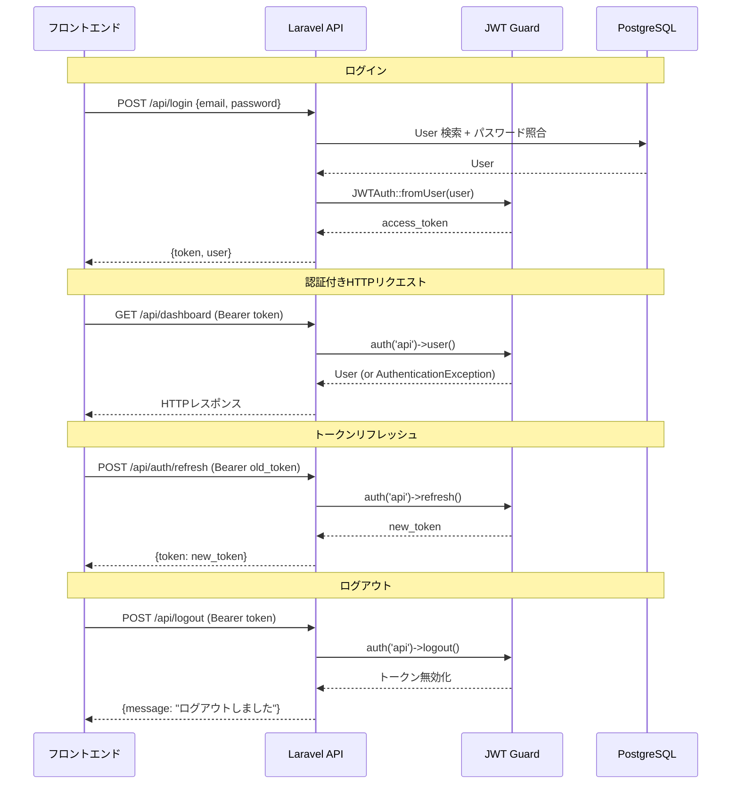
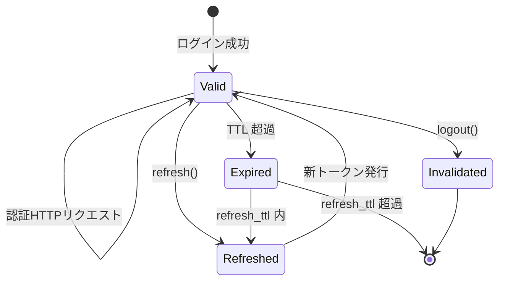

# JWT トークンライフサイクル

## 概要

`tymon/jwt-auth` パッケージによる JWT ベースの認証フロー。トークン発行・検証・リフレッシュ・失効の全ライフサイクルを解説する。

## トークンフロー全体図



## フロントエンド側のトークン管理

```typescript
// localStorage に保存
export const StorageKey = {
    AuthToken: 'time-attendance.auth-token',
} as const;

export const setAuthToken = (token: string): void => {
    localStorage.setItem(StorageKey.AuthToken, token);
};

export const clearAuthToken = (): void => {
    localStorage.removeItem(StorageKey.AuthToken);
};

// Axios インターセプタで自動付与
axiosInstance.interceptors.request.use((config) => {
    const token = getAuthToken();
    if (token) {
        config.headers.Authorization = `Bearer ${token}`;
    }
    return config;
});

// 401 HTTPレスポンスでトークン削除
axiosInstance.interceptors.response.use(
    (response) => response,
    async (error) => {
        if (error.response?.status === 401) {
            clearAuthToken();
        }
        return Promise.reject(error);
    }
);
```

## JWT 設定

```php
// config/jwt.php
'secret'    => env('JWT_SECRET'),  // HMAC 秘密鍵
'algo'      => 'HS256',           // アルゴリズム
'ttl'       => 60,                // 有効期限（分）
'refresh_ttl' => 20160,           // リフレッシュ期限（分 = 14日）
```

## Auth Guard 設定

```php
// config/auth.php
'guards' => [
    'api' => [
        'driver'   => 'jwt',
        'provider' => 'users',
    ],
],
'providers' => [
    'users' => [
        'driver' => 'eloquent',
        'model'  => App\Models\User::class,
    ],
],
```

## トークンライフサイクル状態遷移



## 認証エラーハンドリング

| シナリオ | HTTP | エラーコード | フロント動作 |
|---|---|---|---|
| トークンなし | 401 | `AUTH_ERROR` | ログイン画面へリダイレクト |
| トークン期限切れ | 401 | `AUTH_ERROR` | トークンクリア → ログイン画面 |
| 不正なトークン | 401 | `AUTH_ERROR` | トークンクリア → ログイン画面 |
| ユーザー無効化 | 401 | `AUTH_ERROR` | トークンクリア → ログイン画面 |

## 注意: 設計レビュー指摘事項

| 問題 | 影響 | 改善案 |
|---|---|---|
| **localStorage にトークン保存** | XSS 攻撃でトークン窃取の可能性 | HttpOnly Cookie に変更するか、CSP ヘッダーで XSS リスクを軽減 |
| **トークンブラックリスト未実装** | `logout()` 後もトークンが有効期限まで使える可能性 | `jwt.php` の `blacklist_enabled: true` を確認。Redis でブラックリスト管理 |
| **リフレッシュトークンが同一トークン** | アクセストークンとリフレッシュトークンが分離されていない | 現状の `refresh()` は JWT のクレーム更新のみ。セキュリティ要件に応じて分離を検討 |
| **自動リフレッシュ機構がない** | トークン期限切れ時にユーザーが再ログイン必要 | Axios インターセプタで 401 受信時に自動 `/auth/refresh` → リトライするロジック追加 |
| **パスワード変更時のトークン無効化** | パスワード変更後も旧トークンが有効 | パスワード変更時に全トークンを無効化する（`JWTAuth::invalidate()` + ブラックリスト） |
