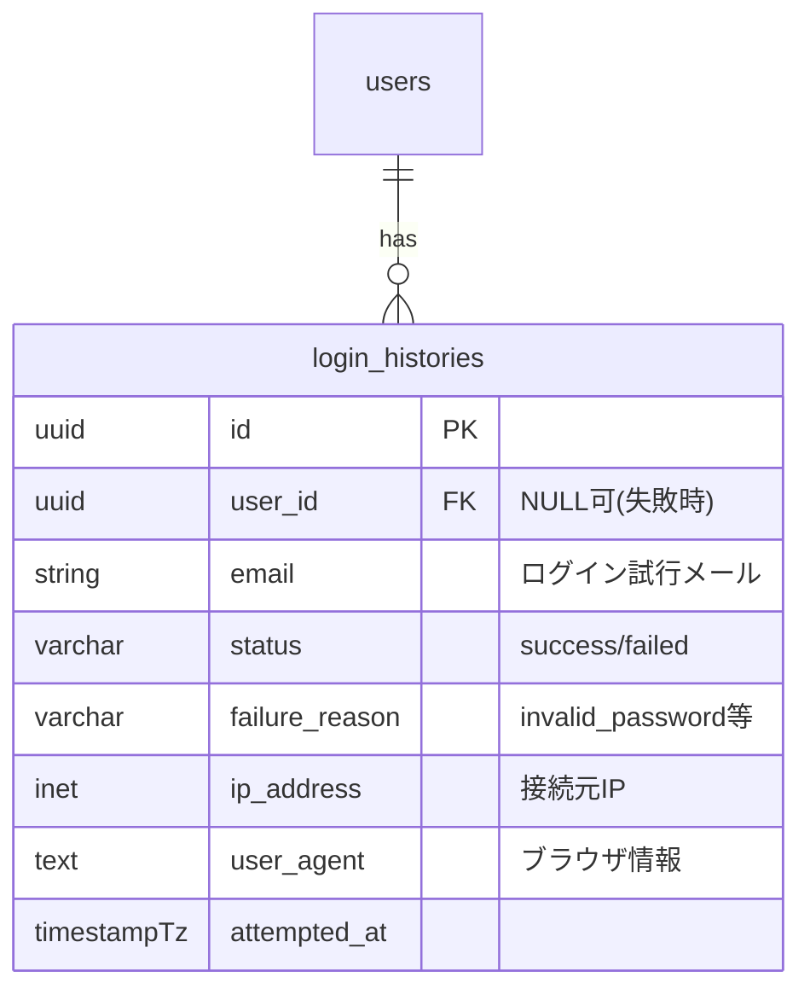
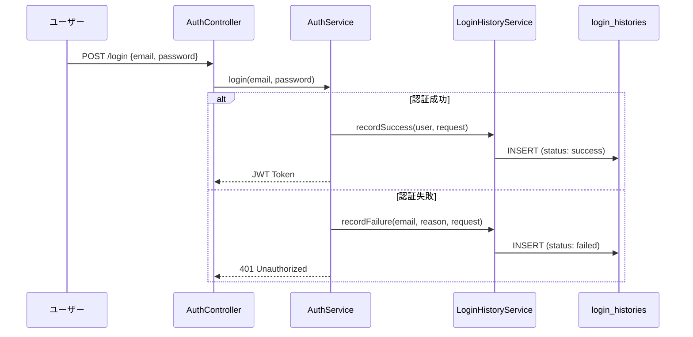
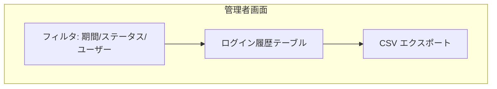

# ログイン監査設計

## 概要

ユーザーのログイン履歴を記録し、不正アクセスの検出やセキュリティ監査に活用する設計。IP アドレス、User-Agent、成功/失敗の記録を行う。

## データモデル



## 記録フロー



## 実装

```php
class LoginHistoryService
{
    public function recordSuccess(User $user, Request $request): void
    {
        LoginHistory::create([
            'user_id' => $user->id,
            'email' => $user->email,
            'status' => 'success',
            'ip_address' => $request->ip(),
            'user_agent' => $request->userAgent(),
            'attempted_at' => now(),
        ]);
    }

    public function recordFailure(
        string $email,
        string $reason,
        Request $request
    ): void {
        LoginHistory::create([
            'email' => $email,
            'status' => 'failed',
            'failure_reason' => $reason,
            'ip_address' => $request->ip(),
            'user_agent' => $request->userAgent(),
            'attempted_at' => now(),
        ]);
    }
}
```

## 不正アクセス検出

```php
class BruteForceDetectionService
{
    private const MAX_ATTEMPTS = 5;
    private const WINDOW_MINUTES = 15;

    public function isBlocked(string $email, string $ip): bool
    {
        $recentFailures = LoginHistory::where(function ($query) use ($email, $ip) {
                $query->where('email', $email)
                      ->orWhere('ip_address', $ip);
            })
            ->where('status', 'failed')
            ->where('attempted_at', '>=', now()->subMinutes(self::WINDOW_MINUTES))
            ->count();

        return $recentFailures >= self::MAX_ATTEMPTS;
    }
}
```

## アラート条件

| 条件 | アクション |
|---|---|
| 5 回連続ログイン失敗 | アカウント一時ロック（15 分） |
| 異なる IP から短時間にログイン | 管理者に通知 |
| 深夜時間帯（23:00-05:00）のログイン | ログに警告レベルで記録 |
| 過去にない地理的位置からのアクセス | ユーザーにメール通知 |

## ログイン履歴の閲覧



| 列 | 説明 |
|---|---|
| 日時 | ログイン試行日時 |
| ユーザー | メールアドレス |
| ステータス | 成功/失敗 |
| 失敗理由 | パスワード不正、アカウントロック等 |
| IP アドレス | 接続元 |
| User-Agent | ブラウザ/OS |

## データ保持ポリシー

```php
// 90日以上前の履歴を自動削除
class PurgeOldLoginHistories extends Command
{
    protected $signature = 'audit:purge-logins {--days=90}';

    public function handle(): void
    {
        $deleted = LoginHistory::where(
            'attempted_at', '<', now()->subDays($this->option('days'))
        )->delete();

        $this->info("Deleted {$deleted} old login history records.");
    }
}
```

## 注意: 設計レビュー指摘事項

| 問題 | 影響 | 改善案 |
|---|---|---|
| **ログイン履歴テーブルの肥大化** | 大量のログイン試行でテーブルが肥大化 | パーティショニングまたは定期パージを実装 |
| **レートリミティングとの二重チェック** | Laravel のスロットリングと独自ブルートフォース検出が重複 | Laravel の `ThrottlesLogins` と統合し、一元管理 |
| **IP アドレスの信頼性** | プロキシ/CDN 背後では `X-Forwarded-For` の確認が必要 | `TrustProxies` ミドルウェアの設定を確認 |
| **GDPR コンプライアンス** | IP アドレスは個人情報に該当する可能性 | 保持期間の厳格な管理と、ユーザーからの削除要求への対応 |
| **非同期記録の検討** | 同期的な記録がログイン応答時間に影響 | Queue ジョブで非同期記録するか、検討する |
