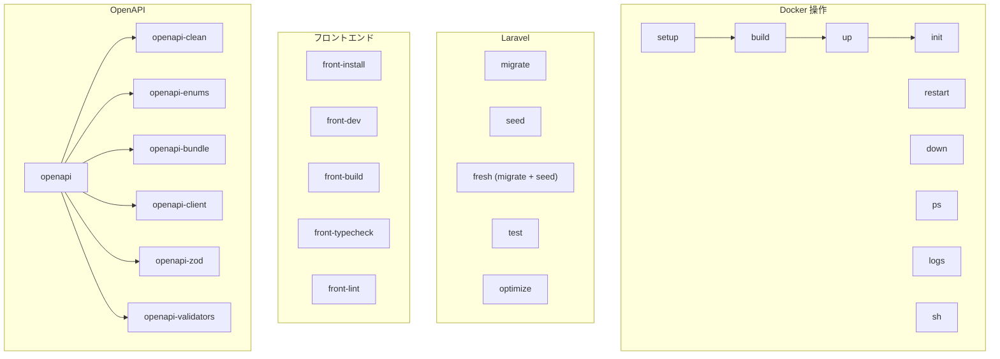

# Makefile オートメーション

## 概要

プロジェクトルートの Makefile による開発ワークフロー自動化。Docker Compose 操作、Laravel コマンド、OpenAPI コード生成、フロントエンドタスクを統一する。

## Makefile 構成

```makefile
# Docker Compose ベースコマンド
DC := docker compose --env-file .env \
    -f infra/docker-compose.yml \
    -f infra/docker-compose.override.yml
```

## コマンドカテゴリ



## 主要コマンド一覧

### Docker 操作

| コマンド | 説明 |
|---|---|
| `make setup` | 初回セットアップ（build + up + init） |
| `make build` | Docker イメージビルド |
| `make up` | コンテナ起動 |
| `make down` | コンテナ停止・削除 |
| `make restart` | 再起動 |
| `make ps` | コンテナ状態確認 |
| `make logs` | ログ表示 |
| `make sh` | app コンテナに bash 接続 |

### Laravel 操作

| コマンド | 説明 |
|---|---|
| `make init` | key:generate + jwt:secret + migrate + seed |
| `make migrate` | マイグレーション実行 |
| `make seed` | シーダー実行 |
| `make fresh` | DB リフレッシュ（migrate:fresh + seed） |
| `make test` | PHPUnit テスト実行 |
| `make optimize` | 設定/ルート/ビューキャッシュ |

### フロントエンド

| コマンド | 説明 |
|---|---|
| `make front-install` | pnpm install |
| `make front-dev` | Vite 開発サーバー起動 |
| `make front-build` | 本番ビルド |
| `make front-typecheck` | TypeScript 型チェック |
| `make front-lint` | ESLint 実行 |

### OpenAPI

| コマンド | 説明 |
|---|---|
| `make openapi` | 全パイプライン実行 |
| `make openapi-lint` | OpenAPI リント |
| `make openapi-bundle` | バンドル生成 |
| `make openapi-client` | Orval クライアント生成 |
| `make openapi-zod` | Zod スキーマ生成 |
| `make openapi-enums` | Enum 生成（PHP + TS） |

## 実装パターン

```makefile
# コンテナ内コマンド実行のパターン
migrate:
	$(DC) exec app php artisan migrate

# ホスト側 Node.js コマンド
openapi-bundle:
	npx @redocly/cli bundle openapi/openapi.yaml \
	  -o openapi/build/bundle.yaml

# 複合タスク
fresh:
	$(DC) exec app php artisan migrate:fresh --seed

# ヘルスチェック
health:
	curl -s http://localhost:$${APP_PORT:-8000}/api/health | jq .
```

## 使い方

```bash
# 初回セットアップ
make setup

# 日常開発
make up          # コンテナ起動
make fresh       # DB リセット
make test        # テスト実行
make openapi     # API 定義からコード再生成

# トラブルシュート
make logs        # ログ確認
make sh          # コンテナに入る
make health      # ヘルスチェック
```

## 注意: 設計レビュー指摘事項

| 問題 | 影響 | 改善案 |
|---|---|---|
| **`make fresh` が確認なしで実行** | 誤って本番相当の DB をリセットする可能性 | `@read -p "Are you sure? [y/N] " ans; [ "$$ans" = "y" ]` を追加 |
| **`--env-file .env` の明示的指定** | 忘れると `infra/.env` を参照してしまう | 対応済み。README にも記載する |
| **`make test` が全テストのみ** | 特定テストだけ回したい場合に不便 | `make test FILTER=LoginTest` のようなオプション引数対応 |
| **OpenAPI タスクがホスト側依存** | Node.js がホストに必要 | Docker コンテナ内で実行するか、CI のみで実行する方針にする |
| **タスク依存関係が不明確** | `setup` の内部で何が実行されるか Makefile を読まないとわからない | `.PHONY` とコメントで依存グラフを明記する |
