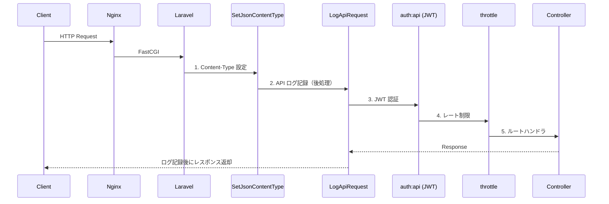
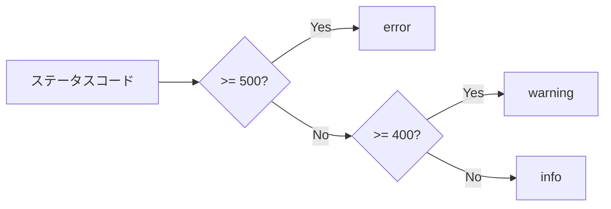

# ミドルウェアパイプライン

## 概要

Laravel のミドルウェアパイプラインによるリクエスト/レスポンスの前処理・後処理の設計。カスタムミドルウェアの実装と適用範囲を解説する。

## リクエストフロー



## カスタムミドルウェア一覧

| ミドルウェア | 位置 | 役割 |
|---|---|---|
| `SetJsonContentType` | 前処理 | `Content-Type: application/json` ヘッダー付与 |
| `LogApiRequest` | 後処理 | API 入出力を構造化ログに記録 |

## SetJsonContentType

```php
class SetJsonContentType
{
    public function handle(Request $request, Closure $next): Response
    {
        $response = $next($request);

        if ($response instanceof JsonResponse ||
            $request->wantsJson() ||
            $request->is('api/*')) {
            $response->header('Content-Type', 'application/json');
        }

        return $response;
    }
}
```

## LogApiRequest

```php
class LogApiRequest
{
    public function handle(Request $request, Closure $next): SymfonyResponse
    {
        $response = $next($request);

        $statusCode = $response->getStatusCode();
        $level = $this->resolveLogLevel($statusCode);

        Log::channel('api')->log(
            level: $level,
            message: 'API request completed',
            context: [
                'method'      => $request->method(),
                'endpoint'    => $request->path(),
                'status_code' => $statusCode,
                'request'     => [
                    'query' => $request->query(),
                    'body'  => $request->except(['password', 'password_confirmation']),
                ],
                'response'    => $this->extractResponseBody($response),
            ],
        );

        return $response;
    }

    private function resolveLogLevel(int $statusCode): string
    {
        return match (true) {
            $statusCode >= 500 => 'error',
            $statusCode >= 400 => 'warning',
            default            => 'info',
        };
    }
}
```

## ルート定義とミドルウェア適用

```php
// routes/api.php
Route::middleware(['api'])->group(function () {
    // 認証不要
    Route::post('/login', [AuthController::class, 'login'])
        ->middleware('throttle:5,1');  // 5回/分

    // 認証必須
    Route::middleware(['auth:api'])->group(function () {
        Route::post('/logout', ...);
        Route::get('/dashboard', ...);
        Route::post('/attendances/clock-in', ...);
        // ...
    });
});
```

## ログレベルマッピング



## 注意: 設計レビュー指摘事項

| 問題 | 影響 | 改善案 |
|---|---|---|
| **LogApiRequest がレスポンスボディ全体を記録** | 大量データのレスポンスでログが肥大化。個人情報がログに残る | レスポンスサイズ上限を設定し、超過時は省略。PII マスキングを追加 |
| **`password_confirmation` のみマスク** | `password` は除外されるが、他の機密フィールド（`token` 等）は記録される | マスク対象フィールドをコンフィグ化して拡張可能にする |
| **SetJsonContentType の型チェック不足** | `$response` が `Response` 型以外（`StreamedResponse` 等）の場合に `header()` が呼べない | `SymfonyResponse` 型を使い、`headers->set()` に統一する |
| **CORS ミドルウェアが明示されていない** | `fruitcake/laravel-cors` パッケージに暗黙的に依存 | CORS 処理フローをドキュメント化し、設定ファイルとの対応を明記する |
| **認証ミドルウェアのエラーレスポンス** | JWT 期限切れ時のレスポンス形式が統一 `ApiResponse` と異なる場合がある | `Handler.php` の `AuthenticationException` ハンドラで対応済みだが、テストで確認すべき |
