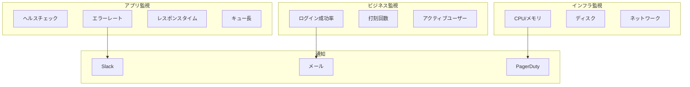
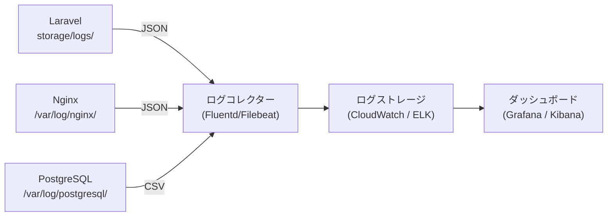
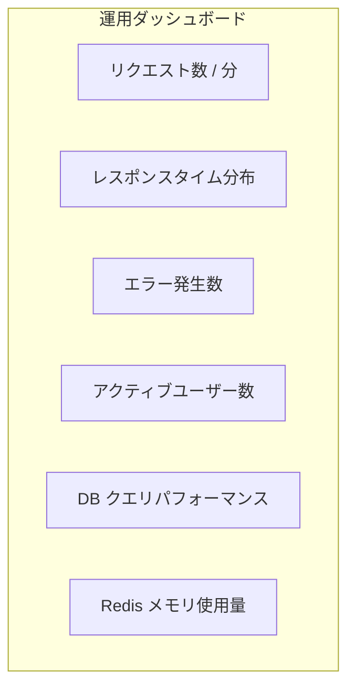

# 監視・アラート設計

## 概要

アプリケーション監視とアラート設計。ヘルスチェック、ログ集約、メトリクス収集、アラート通知の仕組みを解説する。

## 監視レイヤー



## ヘルスチェック

```php
// routes/api.php
Route::get('/health', function () {
    $checks = [
        'app' => true,
        'database' => false,
        'redis' => false,
    ];

    try {
        DB::connection()->getPdo();
        $checks['database'] = true;
    } catch (\Exception $e) {
        // DB接続失敗
    }

    try {
        Redis::ping();
        $checks['redis'] = true;
    } catch (\Exception $e) {
        // Redis接続失敗
    }

    $healthy = !in_array(false, $checks, true);

    return response()->json([
        'status' => $healthy ? 'healthy' : 'unhealthy',
        'checks' => $checks,
        'timestamp' => now()->toISOString(),
    ], $healthy ? 200 : 503);
});
```

## ログ集約



## ログレベル設計

| レベル | 用途 | 例 |
|---|---|---|
| `emergency` | システム停止 | DB 接続不能 |
| `critical` | 重大エラー | 決済処理失敗 |
| `error` | エラー | 例外発生 |
| `warning` | 警告 | 非推奨 API 使用 |
| `info` | 情報 | ログイン成功 |
| `debug` | デバッグ | SQL クエリ |

## 構造化ログ

```php
// config/logging.php
'channels' => [
    'stack' => [
        'driver' => 'stack',
        'channels' => ['daily', 'stderr'],
    ],

    'daily' => [
        'driver' => 'daily',
        'path' => storage_path('logs/laravel.log'),
        'level' => env('LOG_LEVEL', 'debug'),
        'days' => 14,
        'formatter' => JsonFormatter::class,
    ],
],
```

```php
// 構造化ログの出力例
Log::info('attendance.clock_in', [
    'user_id' => $user->id,
    'attendance_id' => $attendance->id,
    'clock_in' => $attendance->clock_in->toISOString(),
    'ip_address' => request()->ip(),
]);
```

## アラートルール

| メトリクス | 閾値 | 重要度 | 通知先 |
|---|---|---|---|
| エラーレート | > 5% / 5分 | Critical | PagerDuty |
| レスポンスタイム p95 | > 3秒 | Warning | Slack |
| ヘルスチェック失敗 | 3 回連続 | Critical | PagerDuty + Slack |
| ディスク使用率 | > 80% | Warning | Slack |
| DB コネクション数 | > 80% of max | Warning | Slack |
| ログイン失敗率 | > 30% / 15分 | Warning | メール |

## ダッシュボード構成



## 注意: 設計レビュー指摘事項

| 問題 | 影響 | 改善案 |
|---|---|---|
| **監視ツールが未導入** | 障害発生時に気づけない | CloudWatch, Datadog, New Relic 等の導入 |
| **ヘルスチェックの認証** | `/health` エンドポイントが認証なし | IP ホワイトリストまたは簡易トークン認証を追加 |
| **ログのローテーション** | Docker コンテナ内のログが肥大化 | Docker の `json-file` ログドライバーで `max-size`, `max-file` 設定 |
| **アプリケーション APM がない** | ボトルネックの特定が困難 | Laravel Telescope（開発）+ APM ツール（本番）を導入 |
| **カスタムメトリクスの定義** | ビジネスメトリクスが計測されていない | Prometheus エクスポーターで打刻数等のメトリクスを公開 |
