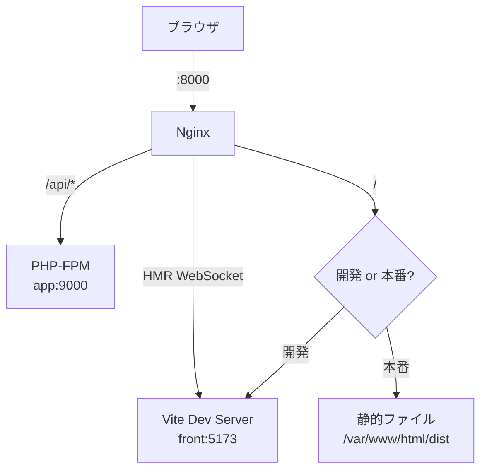

# Nginx リバースプロキシ設計

## 概要

Nginx 1.27 によるリバースプロキシ構成。フロントエンド（Vite / 静的ファイル）と バックエンド（PHP-FPM）のルーティング、HMR 対応、本番 SPA 配信を解説する。

## HTTPリクエストルーティング



## Nginx 設定 (開発環境)

```nginx
# infra/nginx/conf.d/default.conf
upstream php-fpm {
    server app:9000;
}

upstream vite {
    server front:5173;
}

server {
    listen 80;
    server_name localhost;

    # API HTTPリクエスト → PHP-FPM
    location /api {
        try_files $uri $uri/ /index.php?$query_string;
    }

    location ~ \.php$ {
        fastcgi_pass php-fpm;
        fastcgi_param SCRIPT_FILENAME /var/www/html/public$fastcgi_script_name;
        include fastcgi_params;
    }

    # Vite HMR WebSocket
    location /@vite/ {
        proxy_pass http://vite;
        proxy_http_version 1.1;
        proxy_set_header Upgrade $http_upgrade;
        proxy_set_header Connection "upgrade";
    }

    # フロントエンド → Vite Dev Server
    location / {
        proxy_pass http://vite;
        proxy_set_header Host $host;
        proxy_set_header X-Real-IP $remote_addr;
    }
}
```

## 本番環境の SPA 配信

```nginx
server {
    listen 80;
    server_name example.com;
    root /var/www/html/dist;

    # API → PHP-FPM
    location /api {
        try_files $uri $uri/ /index.php?$query_string;
    }

    # SPA フォールバック
    location / {
        try_files $uri $uri/ /index.html;
    }

    # 静的アセットキャッシュ
    location ~* \.(js|css|png|jpg|jpeg|gif|ico|svg|woff2?)$ {
        expires 1y;
        add_header Cache-Control "public, immutable";
    }
}
```

## セキュリティヘッダー

```nginx
# 推奨設定
add_header X-Frame-Options "SAMEORIGIN" always;
add_header X-Content-Type-Options "nosniff" always;
add_header X-XSS-Protection "1; mode=block" always;
add_header Referrer-Policy "strict-origin-when-cross-origin" always;
add_header Content-Security-Policy "default-src 'self'; script-src 'self'; style-src 'self' 'unsafe-inline';" always;
```

## ログ設定

```nginx
access_log /var/log/nginx/access.log combined;
error_log /var/log/nginx/error.log warn;

# JSON フォーマット（構造化ログ）
log_format json_combined escape=json
    '{'
        '"time": "$time_iso8601",'
        '"remote_addr": "$remote_addr",'
        '"method": "$request_method",'
        '"uri": "$request_uri",'
        '"status": $status,'
        '"body_bytes_sent": $body_bytes_sent,'
        '"request_time": $request_time,'
        '"upstream_response_time": "$upstream_response_time"'
    '}';
```

## 注意: 設計レビュー指摘事項

| 問題 | 影響 | 改善案 |
|---|---|---|
| **セキュリティヘッダーが未設定** | XSS、クリックジャッキング等の攻撃リスク | 上記のセキュリティヘッダーを Nginx 設定に追加 |
| **HTTPリクエストサイズ制限が未設定** | 大容量ファイルアップロードで DoS 攻撃の可能性 | `client_max_body_size 10m;` を設定 |
| **SSL/TLS 設定がない** | 開発環境は HTTP で問題ないが、本番用の TLS 設定テンプレートがない | 本番用に Let's Encrypt + certbot の設定テンプレートを用意 |
| **gzip 圧縮が未設定** | HTTPレスポンスサイズが最適化されない | `gzip on; gzip_types text/css application/json application/javascript;` を追加 |
| **アップストリーム接続タイムアウト** | デフォルト 60 秒。長時間処理で 504 エラー | `fastcgi_read_timeout 300;` を設定（長時間処理がある場合） |
| **レートリミティングの二重化** | Laravel と Nginx の両方でレート制限が可能 | Nginx では L7 DDoS 対策、Laravel ではアプリレベル制限と役割分担 |
