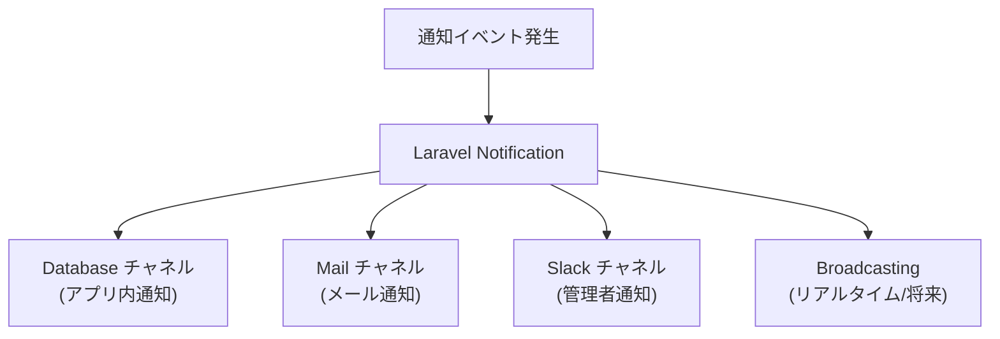
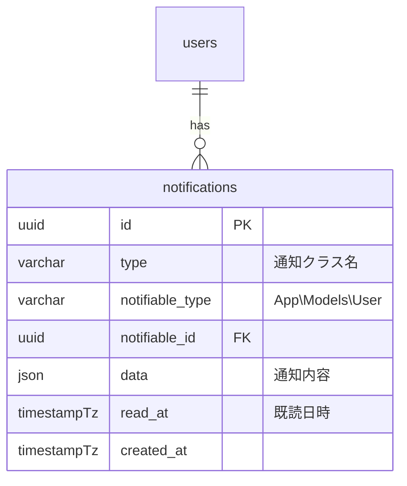
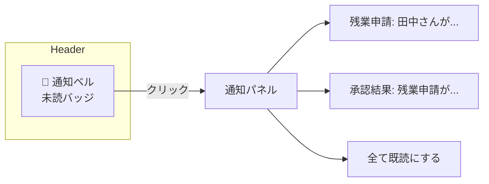

# リアルタイム通知設計

## 概要

アプリケーション内通知の設計。承認依頼、打刻リマインダー、システムアラート等の通知を配信する仕組みを解説する。Laravel Notification と WebSocket（将来対応）の活用方針を示す。

## 通知チャネル



## 通知種別一覧

| 通知種別 | チャネル | 対象 | トリガー |
|---|---|---|---|
| 残業申請通知 | DB + Mail | マネージャー | 社員が残業申請 |
| 承認結果通知 | DB + Mail | 申請者 | マネージャーが承認/却下 |
| 打刻リマインダー | DB | 全社員 | 予定出勤時刻に打刻なし |
| 有給残日数アラート | DB + Mail | 社員 | 残日数 ≤ 3 |
| システムアラート | Slack | 管理者 | エラーレート超過 |
| パスワード変更通知 | Mail | 本人 | パスワード変更時 |

## データモデル



## Laravel Notification 実装

```php
// app/Notifications/OvertimeRequestNotification.php
class OvertimeRequestNotification extends Notification
{
    public function __construct(
        private OvertimeRequest $request
    ) {}

    public function via(object $notifiable): array
    {
        return ['database', 'mail'];
    }

    public function toDatabase(object $notifiable): array
    {
        return [
            'title' => '残業申請',
            'message' => sprintf(
                '%s さんが %s の残業を申請しました（%d分）',
                $this->request->user->fullName,
                $this->request->overtime_date->format('Y/m/d'),
                $this->request->expected_minutes
            ),
            'action_url' => "/overtime-requests/{$this->request->id}",
            'type' => 'overtime_request',
        ];
    }

    public function toMail(object $notifiable): MailMessage
    {
        return (new MailMessage)
            ->subject('【勤怠管理】残業申請')
            ->line($this->toDatabase($notifiable)['message'])
            ->action('申請を確認', url("/overtime-requests/{$this->request->id}"));
    }
}
```

## 通知の送信

```php
// OvertimeService
public function createRequest(User $user, array $data): OvertimeRequest
{
    $request = OvertimeRequest::create([...$data, 'user_id' => $user->id]);

    // マネージャーに通知
    $managers = $user->team->managers;
    Notification::send(
        $managers,
        new OvertimeRequestNotification($request)
    );

    return $request;
}
```

## フロントエンド通知 UI



```typescript
// front/src/features/notifications/hooks/useNotifications.ts
export const useNotifications = () => {
  return useQuery({
    queryKey: ['notifications'],
    queryFn: () => getNotifications(),
    refetchInterval: 30_000, // 30秒ポーリング
  });
};

export const useUnreadCount = () => {
  const { data } = useNotifications();
  return data?.filter(n => !n.readAt).length ?? 0;
};
```

## ポーリング vs WebSocket

| 方式 | メリット | デメリット |
|---|---|---|
| ポーリング（現在） | 実装が簡単、インフラ不要 | サーバー負荷、遅延あり |
| WebSocket（将来） | リアルタイム、サーバー負荷低 | インフラ（Pusher/soketi）が必要 |

## 注意: 設計レビュー指摘事項

| 問題 | 影響 | 改善案 |
|---|---|---|
| **通知の大量発生** | 一斉配信で DB 書き込みが集中 | Queue ジョブで非同期送信 (`ShouldQueue` implements) |
| **ポーリング頻度** | 30 秒間隔は API 負荷が高い可能性 | ユーザー数に応じて 60 秒に緩和。または WebSocket 導入 |
| **通知のアーカイブ/削除** | 古い通知がテーブルに蓄積 | 90 日以上前の通知を定期パージ |
| **メール送信の失敗ハンドリング** | メール送信失敗時にリトライがない | `ShouldQueue` + `failed()` メソッドで 3 回リトライ |
| **通知設定の反映** | ユーザーがメール通知を OFF にしても送信される可能性 | `via()` メソッド内で `notifiable->settings->email_notification` をチェック |
