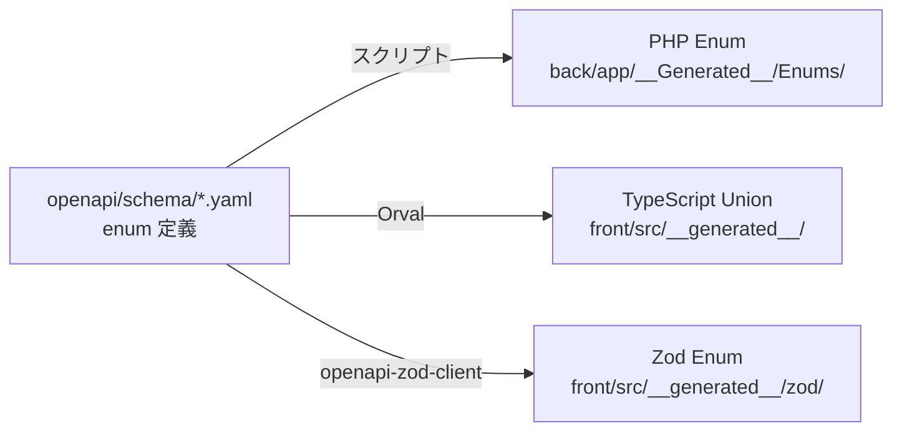
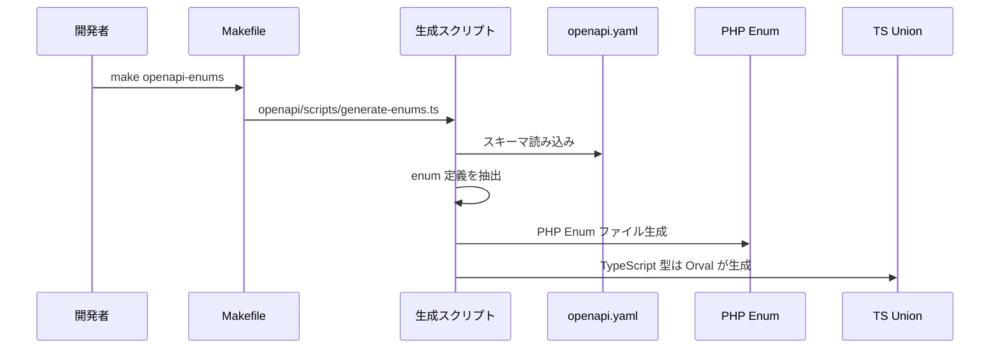

# OpenAPI Enum 生成

## 概要

OpenAPI スキーマに定義された `enum` 型から PHP Enum と TypeScript Union 型を自動生成する仕組み。Single Source of Truth（SSOT）として OpenAPI の Enum 定義を活用し、バックエンドとフロントエンドの型安全性を確保する。

## 生成フロー



## OpenAPI での Enum 定義

```yaml
# openapi/schema/enums.yaml
components:
  schemas:
    AttendanceStatus:
      type: string
      enum:
        - not_clocked_in
        - clocked_in
        - on_break
        - clocked_out
      description: 勤怠ステータス

    UserRole:
      type: string
      enum:
        - admin
        - manager
        - employee
      description: ユーザーロール

    LeaveType:
      type: string
      enum:
        - paid
        - unpaid
        - sick
        - special
      description: 休暇種別
```

## 生成される PHP Enum

```php
// back/app/__Generated__/Enums/AttendanceStatus.php
namespace App\__Generated__\Enums;

enum AttendanceStatus: string
{
    case NOT_CLOCKED_IN = 'not_clocked_in';
    case CLOCKED_IN = 'clocked_in';
    case ON_BREAK = 'on_break';
    case CLOCKED_OUT = 'clocked_out';
}
```

## 生成される TypeScript 型

```typescript
// front/src/__generated__/model/attendanceStatus.ts
export type AttendanceStatus =
  | 'not_clocked_in'
  | 'clocked_in'
  | 'on_break'
  | 'clocked_out';
```

## 生成される Zod スキーマ

```typescript
// front/src/__generated__/zod/schemas.ts
export const AttendanceStatusSchema = z.enum([
  'not_clocked_in',
  'clocked_in',
  'on_break',
  'clocked_out',
]);
```

## 生成スクリプト



## コード生成パイプライン

| ステップ | コマンド | 入力 | 出力 |
|---|---|---|---|
| 1. バンドル | `redocly bundle` | `openapi/*.yaml` | `build/bundle.yaml` |
| 2. PHP Enum | `generate-enums` | `bundle.yaml` | `__Generated__/Enums/*.php` |
| 3. TS 型 | `orval` | `bundle.yaml` | `__generated__/model/*.ts` |
| 4. Zod | `openapi-zod-client` | `bundle.yaml` | `__generated__/zod/*.ts` |
| 5. PHP バリデーション | `generate-validators` | `bundle.yaml` | `__Generated__/Rules/*.php` |

## Enum の使用パターン

### バックエンド（PHP）

```php
// Model のキャスト
protected $casts = [
    'status' => AttendanceStatus::class,
];

// バリデーション
'status' => ['required', new EnumRule(AttendanceStatus::class)],

// 条件分岐
match ($attendance->status) {
    AttendanceStatus::CLOCKED_IN => $this->clockOut(),
    AttendanceStatus::ON_BREAK => $this->endBreak(),
    default => throw new DomainException('Invalid state'),
};
```

### フロントエンド（TypeScript）

```typescript
const statusLabel: Record<AttendanceStatus, string> = {
  not_clocked_in: '未出勤',
  clocked_in: '出勤中',
  on_break: '休憩中',
  clocked_out: '退勤済',
};
```

## 注意: 設計レビュー指摘事項

| 問題 | 影響 | 改善案 |
|---|---|---|
| **Enum 値変更時の DB マイグレーション** | OpenAPI の enum 値を変更しても DB の CHECK 制約は自動更新されない | マイグレーションファイルで `ALTER TYPE` を合わせて実行 |
| **`__Generated__` の手動編集リスク** | 自動生成ファイルに手動で変更を加えると再生成で上書きされる | ファイルヘッダーに `@generated - DO NOT EDIT` コメントを自動付与 |
| **Enum 追加時の全層更新が必要** | OpenAPI → PHP → TS → Zod の全ステップを実行する必要がある | `make openapi` で全パイプラインを一括実行（対応済み） |
| **Enum の日本語ラベルの管理場所** | PHP / TS それぞれで個別にラベルを定義している | OpenAPI の `x-labels` 拡張仕様でラベルも定義し、コード生成に含める |
