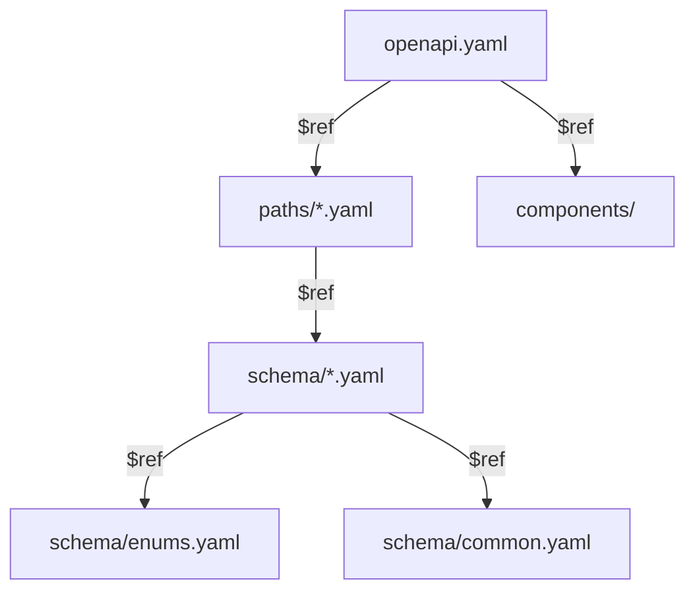

# OpenAPI スキーマ設計パターン

## 概要

OpenAPI 3.0.3 のスキーマ設計における命名規約、`$ref` 分離、リクエスト/レスポンス型の構造パターン。本プロジェクトの Single Source of Truth（SSOT）としての設計原則を解説する。

## ディレクトリ構造

```
openapi/
├── openapi.yaml              # エントリーポイント
├── paths/
│   ├── auth.yaml             # /login, /logout, /auth/refresh
│   ├── attendance.yaml       # /attendances
│   └── dashboard.yaml        # /dashboard
├── schema/
│   ├── auth.yaml             # 認証関連スキーマ
│   ├── attendance.yaml       # 勤怠関連スキーマ
│   ├── common.yaml           # 共通レスポンス
│   └── enums.yaml            # Enum 定義
├── components/
│   ├── parameters.yaml       # 共通パラメータ
│   ├── responses.yaml        # 共通レスポンス
│   └── securitySchemes.yaml  # JWT Bearer
├── examples/
│   └── *.yaml                # リクエスト/レスポンス例
├── scripts/
│   └── generate-*.ts         # コード生成スクリプト
└── build/
    └── bundle.yaml           # Redocly バンドル出力
```

## Entrypoint 構成

```yaml
# openapi/openapi.yaml
openapi: 3.0.3
info:
  title: Time Attendance API
  version: 1.0.0

servers:
  - url: /api
    description: API サーバー

paths:
  /login:
    $ref: './paths/auth.yaml#/login'
  /logout:
    $ref: './paths/auth.yaml#/logout'
  /attendances:
    $ref: './paths/attendance.yaml#/attendances'

components:
  securitySchemes:
    Bearer:
      type: http
      scheme: bearer
      bearerFormat: JWT
```

## リクエスト/レスポンス命名規約

| 種別 | パターン | 例 |
|---|---|---|
| リクエスト Body | `{Resource}{Action}Request` | `AttendanceCreateRequest` |
| レスポンス | `{Resource}{Action}Response` | `AttendanceListResponse` |
| 単体リソース | `{Resource}` | `Attendance` |
| 一覧レスポンス | `{Resource}ListResponse` | `AttendanceListResponse` |
| Enum | `{Resource}{Field}` | `AttendanceStatus` |

## スキーマ設計パターン

### リソーススキーマ

```yaml
# openapi/schema/attendance.yaml
Attendance:
  type: object
  required:
    - id
    - user_id
    - date
    - status
  properties:
    id:
      type: string
      format: uuid
    user_id:
      type: string
      format: uuid
    date:
      type: string
      format: date
    status:
      $ref: './enums.yaml#/AttendanceStatus'
    clock_in:
      type: string
      format: date-time
      nullable: true
    clock_out:
      type: string
      format: date-time
      nullable: true
```

### 一覧レスポンスパターン

```yaml
AttendanceListResponse:
  type: object
  required:
    - data
  properties:
    data:
      type: array
      items:
        $ref: '#/Attendance'
    meta:
      $ref: './common.yaml#/PaginationMeta'
```

### ページネーションメタ

```yaml
# openapi/schema/common.yaml
PaginationMeta:
  type: object
  properties:
    current_page:
      type: integer
    per_page:
      type: integer
    total:
      type: integer
    last_page:
      type: integer
```

## `$ref` 分離戦略



**分離ルール:**
- 2 箇所以上で参照されるスキーマは `schema/` に分離
- Enum は `schema/enums.yaml` に集約
- パスは `paths/{resource}.yaml` に 1 ファイル 1 リソース
- 共通パラメータ・レスポンスは `components/` に配置

## バンドルと検証

```bash
# リント
npx @redocly/cli lint openapi/openapi.yaml

# バンドル（単一ファイル化）
npx @redocly/cli bundle openapi/openapi.yaml -o openapi/build/bundle.yaml

# プレビュー
npx @redocly/cli preview-docs openapi/openapi.yaml
```

## 注意: 設計レビュー指摘事項

| 問題 | 影響 | 改善案 |
|---|---|---|
| **`nullable` の使い方** | OpenAPI 3.0 では `nullable: true` だが 3.1 では `type: ['string', 'null']` に変わる | 現在 3.0.3 なので `nullable: true` で正しい。アップグレード時に注意 |
| **`format: date-time` の TZ 指定** | ISO 8601 形式だが TZ 付きかどうかが曖昧 | `description` で `UTC (ISO 8601)` を明記する |
| **列挙値の追加が Breaking Change** | Enum に値を追加するとクライアント側のコードが壊れる可能性 | API バージョニングまたは `x-extensible-enum` 拡張を使用 |
| **`examples/` の網羅性** | 全エンドポイントのリクエスト/レスポンス例があるか不明 | エンドポイントごとに `example` を必ず定義するルール化 |
| **`$ref` の循環参照リスク** | 相互参照するとバンドルで無限ループになる | Redocly lint の `no-unresolved-refs` ルールで検出 |
