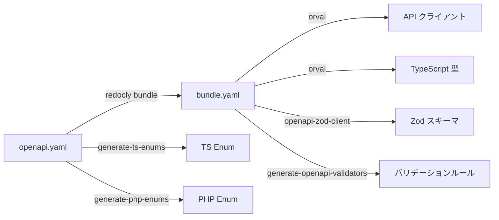

# Orval API クライアント自動生成

## 概要

OpenAPI 定義から TypeScript API クライアント・型定義・React Query フックを自動生成するパイプライン。Orval を使用し、手動コーディングを最小化する。

## 生成パイプライン



## Orval 設定

```typescript
// orval.config.ts
export default defineConfig({
    api: {
        input: {
            target: './openapi/build/bundle.yaml',
        },
        output: {
            mode: 'tags-split',                          // タグ別ファイル分割
            target: './front/src/__generated__/index.ts',
            schemas: './front/src/__generated__/model',   // 型定義
            client: 'axios',
            override: {
                mutator: {
                    path: 'front/src/lib/http/client.ts',
                    name: 'customInstance',               // カスタム Axios
                },
                query: {
                    useQuery: true,
                    useMutation: true,
                },
            },
        },
        hooks: {
            afterAllFilesWrite: [
                'npm run openapi:validators',
                'prettier --write',
            ],
        },
    },
});
```

## 生成されるファイル構成

```
front/src/__generated__/
├── enums.ts              # TypeScript Enum 定義
├── zod.ts                # Zod スキーマ
├── zod.validation.ts     # バリデーションルール
├── field-labels.json     # フィールド日本語ラベル
├── attendance/
│   └── attendance.ts     # Attendance API クライアント
├── auth/
│   └── auth.ts           # Auth API クライアント
├── dashboard/
│   └── dashboard.ts      # Dashboard API クライアント
├── schedule/
│   └── schedule.ts       # Schedule API クライアント
├── settings/
│   └── settings.ts       # Settings API クライアント
├── team/
│   └── team.ts           # Team API クライアント
└── model/                # 型定義（60+ ファイル）
    ├── attendanceResponse.ts
    ├── loginResponse.ts
    ├── dashboardResponse.ts
    └── ...
```

## カスタム Axios インスタンス (Mutator)

```typescript
// front/src/lib/http/client.ts
export const customInstance = <T>(
    config: AxiosRequestConfig
): Promise<T> => {
    return axiosInstance(config).then((res) => res.data);
};
```

## 生成コマンド

```bash
# 全パイプライン実行
make openapi

# 個別実行
make openapi-bundle      # OpenAPI バンドル
make openapi-client      # Orval クライアント生成
make openapi-zod         # Zod スキーマ生成
make openapi-validators  # バリデーションルール生成
make openapi-enums       # Enum 生成（PHP + TS）
```

## Makefile タスク

```makefile
openapi-client:
	npx orval --config orval.config.ts

openapi-zod:
	npx openapi-zod-client ./openapi/build/bundle.yaml \
	    -o front/src/__generated__/zod.ts

openapi: openapi-clean openapi-enums openapi-bundle openapi-client openapi-zod
```

## 使用例

```typescript
// 自動生成された API クライアントを利用
import { getAttendance } from '@/__generated__/attendance/attendance';

const client = getAttendance();
const response = await client.todayAttendanceApi();
// response は自動的に AttendanceResponse 型
```

## 注意: 設計レビュー指摘事項

| 問題 | 影響 | 改善案 |
|---|---|---|
| **`__generated__/` 内のファイルが 60+ 個** | ファイル数が多く、IDE のインデックスが遅い | `barrel` エクスポートの最適化、不要な型生成を除外 |
| **Orval v6 → v8 の互換性** | `package.json` で `orval: ^6.0.0` と `@orval/core: ^8.5.1` が混在 | バージョンを統一する |
| **生成コードの ESLint 除外** | `eslint.config.js` で `__generated__/` を除外済みだが、型安全性チェックも緩い | 生成コードは ESLint 除外で OK。型チェックのみ tsconfig で有効にする |
| **CI での再生成チェック** | `openapi-check.yml` で drift 検出済み | 既に対応済み（`git diff --exit-code` で検出） |
| **手動ラッパー API (`api/`) の重複** | `__generated__/` と `api/attendance.api.ts` が並存 | `call()` による Envelope unwrap が必要なので、手動ラッパーは必要。役割を明確にドキュメント化 |
