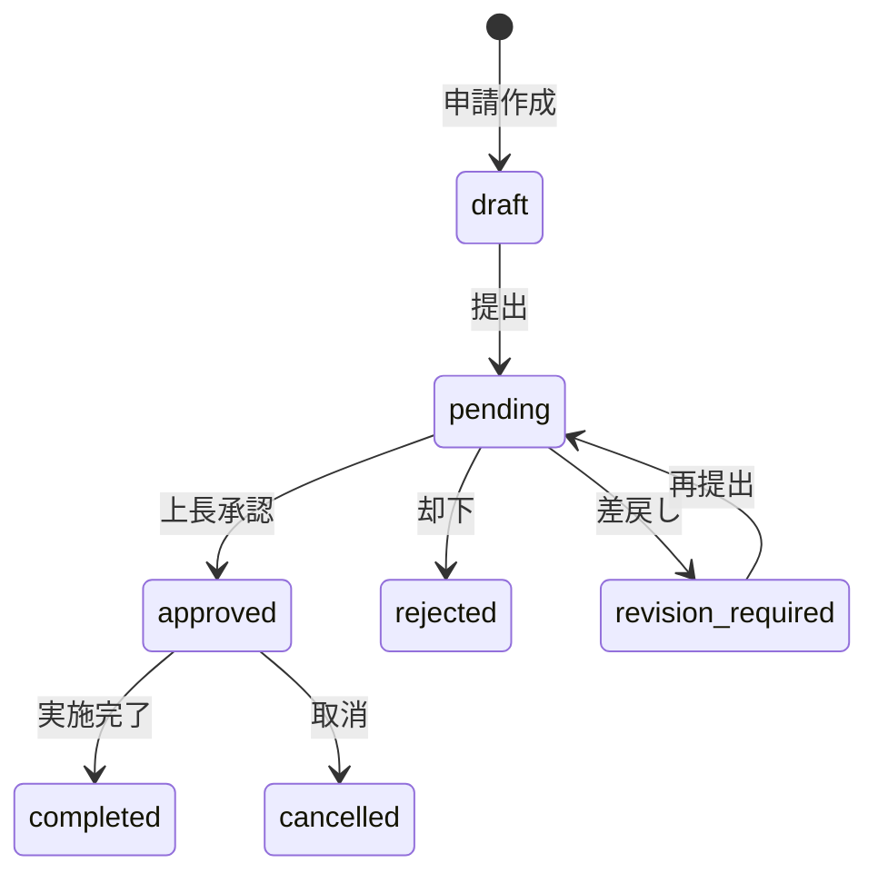
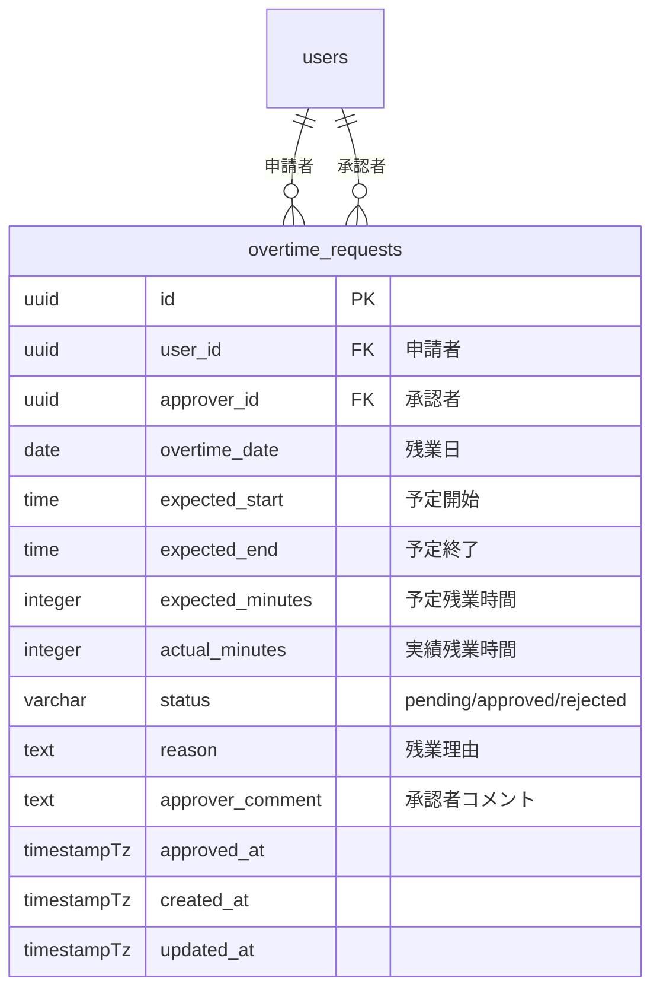
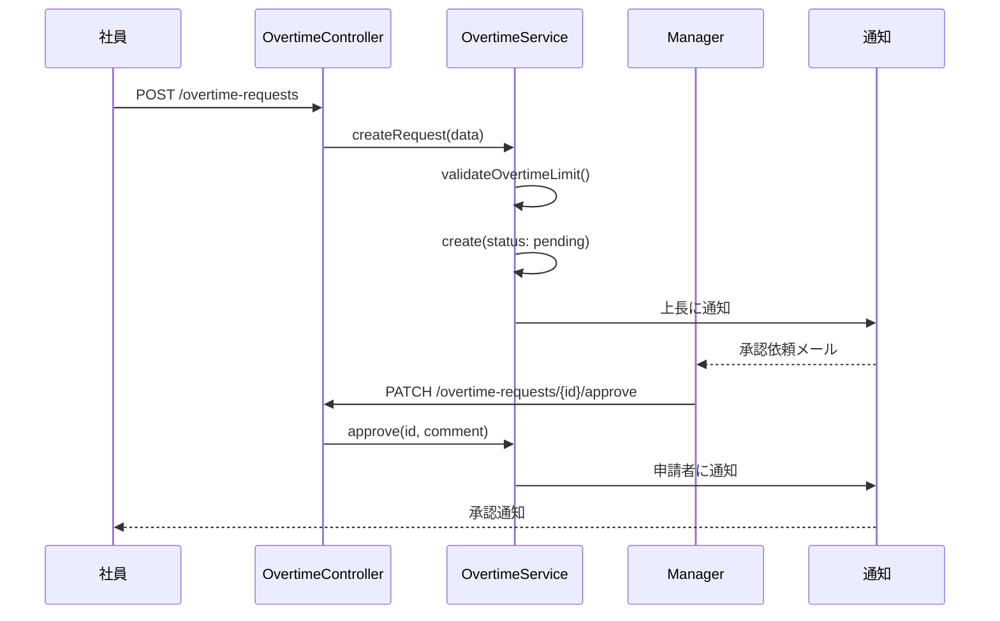
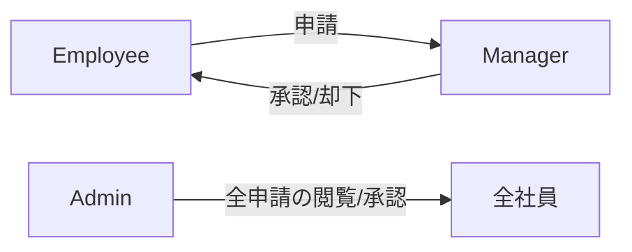

# 残業申請ワークフロー

## 概要

残業申請・承認のワークフロー設計。申請→承認→実施の流れ、承認権限の管理、残業時間の上限チェックを解説する。

## ワークフロー全体像



## データモデル



## 申請フロー



## 残業時間の上限チェック

| チェック項目 | 上限 | 根拠 |
|---|---|---|
| 1 日の残業 | 4 時間 | 社内規定 |
| 月間残業 | 45 時間 | 36 協定 |
| 年間残業 | 360 時間 | 36 協定 |
| 月間残業（特別条項） | 80 時間 | 36 協定特別条項 |

```php
class OvertimeValidationService
{
    public function validateMonthlyLimit(User $user, int $requestMinutes): void
    {
        $monthlyTotal = OvertimeRequest::where('user_id', $user->id)
            ->where('status', RequestStatus::APPROVED)
            ->whereMonth('overtime_date', now()->month)
            ->whereYear('overtime_date', now()->year)
            ->sum('expected_minutes');

        if (($monthlyTotal + $requestMinutes) > 45 * 60) {
            throw new DomainException(
                '月間残業時間が 45 時間を超えます（現在: ' .
                floor($monthlyTotal / 60) . '時間）'
            );
        }
    }
}
```

## 承認権限



| ロール | 権限 |
|---|---|
| `employee` | 自分の申請の作成・取消 |
| `manager` | 配下メンバーの申請の承認・却下・差戻し |
| `admin` | 全社員の申請の閲覧・承認・却下 |

## 勤怠との連動

```php
// 残業実績を勤怠レコードに反映
public function recordActualOvertime(Attendance $attendance): void
{
    $scheduledEnd = $attendance->user->schedule($attendance->date)?->scheduled_end;

    if (!$scheduledEnd || !$attendance->clock_out) {
        return;
    }

    $overtimeMinutes = max(0,
        Carbon::parse($attendance->clock_out)
            ->diffInMinutes(Carbon::parse($scheduledEnd))
    );

    // 承認済み申請があれば実績を記録
    $request = OvertimeRequest::where('user_id', $attendance->user_id)
        ->where('overtime_date', $attendance->date)
        ->where('status', RequestStatus::APPROVED)
        ->first();

    if ($request) {
        $request->update(['actual_minutes' => $overtimeMinutes]);
    }
}
```

## 注意: 設計レビュー指摘事項

| 問題 | 影響 | 改善案 |
|---|---|---|
| **事前申請のみ対応** | 突発的な残業に対応できない | 事後申請フローを追加し、承認期限を設ける |
| **承認者不在時のエスカレーション** | 承認者が休暇中に申請が滞留する | 代理承認者の設定、または N 日未承認で自動エスカレーション |
| **実績との乖離チェック** | 申請時間と実際の残業時間の乖離が検出されない | 退勤時に `expected_minutes` と `actual_minutes` を比較しアラート |
| **36 協定チェックのリアルタイム性** | 申請時点の集計が古い可能性 | キャッシュではなく毎回 DB から集計する |
| **通知機能が未実装** | メール/Slack 通知の仕組みがない | Laravel Notification を使った通知機能を追加 |
