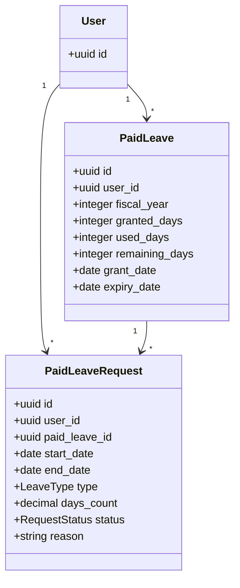
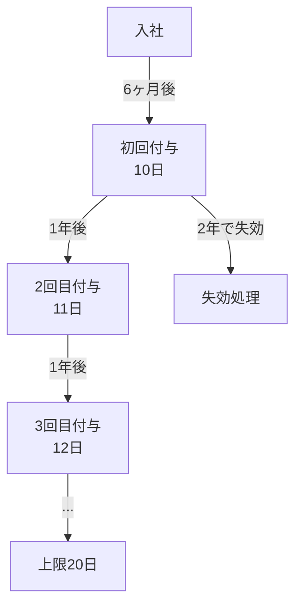
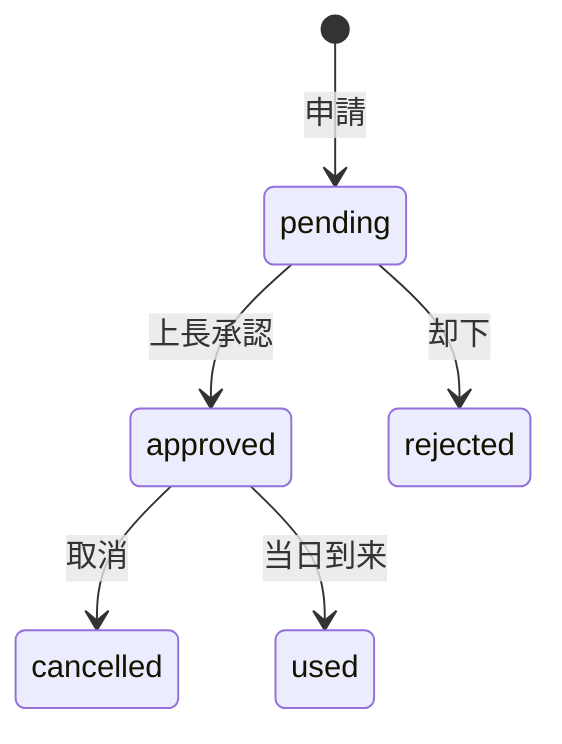

# 有給休暇管理設計

## 概要

有給休暇の付与・消化・残日数管理の設計。年次有給休暇の自動付与ロジック、半日単位の取得、残日数の整合性担保を解説する。

## ドメインモデル



## 有給休暇付与フロー



## 付与日数テーブル（労働基準法準拠）

| 勤続年数 | 付与日数 |
|---|---|
| 0.5 年（6 ヶ月） | 10 日 |
| 1.5 年 | 11 日 |
| 2.5 年 | 12 日 |
| 3.5 年 | 14 日 |
| 4.5 年 | 16 日 |
| 5.5 年 | 18 日 |
| 6.5 年以上 | 20 日（上限） |

## 付与ロジック

```php
class PaidLeaveGrantService
{
    private const GRANT_TABLE = [
        0 => 10,  // 0.5年
        1 => 11,  // 1.5年
        2 => 12,  // 2.5年
        3 => 14,  // 3.5年
        4 => 16,  // 4.5年
        5 => 18,  // 5.5年
        6 => 20,  // 6.5年～
    ];

    public function calculateGrantDays(User $user): int
    {
        $yearsOfService = $user->hire_date
            ->diffInYears(now());

        // 6ヶ月未満は付与なし
        if ($user->hire_date->diffInMonths(now()) < 6) {
            return 0;
        }

        $index = min($yearsOfService, 6);
        return self::GRANT_TABLE[$index];
    }
}
```

## 申請ステータス遷移



## 残日数の整合性

```php
// トランザクションで残日数を更新
DB::transaction(function () use ($request) {
    $paidLeave = PaidLeave::where('user_id', $request->user_id)
        ->where('remaining_days', '>=', $request->days_count)
        ->lockForUpdate()
        ->firstOrFail();

    $paidLeave->decrement('remaining_days', $request->days_count);
    $paidLeave->increment('used_days', $request->days_count);

    $request->update(['status' => RequestStatus::APPROVED]);
});
```

## 半日有給の対応

| 種別 | `days_count` | 説明 |
|---|---|---|
| 全日 | `1.0` | 終日休暇 |
| 午前半休 | `0.5` | 午前のみ休暇、午後出勤 |
| 午後半休 | `0.5` | 午前出勤、午後のみ休暇 |

## 注意: 設計レビュー指摘事項

| 問題 | 影響 | 改善案 |
|---|---|---|
| **有給失効処理の自動化** | 2 年経過した有給が自動で失効しない | 日次バッチで `expiry_date < today` のレコードを失効処理 |
| **半日有給と勤怠の連動** | 半日有給の日は勤務時間計算が変わる | `AttendanceSchedule` と連動して想定勤務時間を調整 |
| **残日数のマイナス防止** | 同時申請で残日数がマイナスになるリスク | `lockForUpdate()` + `remaining_days >= days_count` チェック |
| **年度跨ぎの繰越処理** | 前年度の残日数を新年度に繰り越すロジックが必要 | 繰越上限を設定し、年度開始バッチで処理 |
| **取消時の残日数復元** | 承認済み申請の取消時に残日数を戻す必要がある | `cancelled` ステータス変更時に `increment` で復元 |
