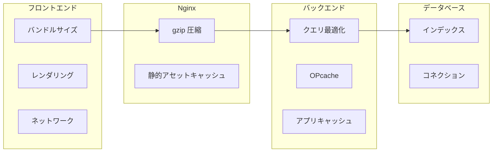

# パフォーマンスチューニング

## 概要

Laravel + React アプリケーションのパフォーマンス最適化指針。バックエンド（クエリ、キャッシュ、PHP 設定）とフロントエンド（バンドル、レンダリング）の両面からチューニングポイントを解説する。

## パフォーマンスレイヤー



## バックエンド最適化

### 1. Laravel 最適化コマンド

```bash
# 本番環境で実行
php artisan optimize       # config + route + view キャッシュ
php artisan event:cache    # イベントキャッシュ
php artisan icons:cache    # Blade アイコンキャッシュ
```

### 2. Eager Loading（N+1 防止）

```php
// ❌ N+1 問題
$attendances = Attendance::all();
foreach ($attendances as $a) {
    echo $a->user->name;  // ユーザー数分のクエリ発行
}

// ✅ Eager Loading
$attendances = Attendance::with('user', 'breaks')->get();
```

### 3. クエリ最適化

```php
// ❌ 全カラム取得
User::all();

// ✅ 必要カラムのみ
User::select(['id', 'last_name', 'first_name', 'email'])->get();

// ❌ PHP でフィルタリング
User::all()->where('role', 'admin');

// ✅ DB でフィルタリング
User::where('role', 'admin')->get();
```

### 4. インデックス設計

| テーブル | インデックス | 用途 |
|---|---|---|
| `attendances` | `(user_id, date)` UNIQUE | ユーザー×日付の一意制約 + 検索 |
| `attendances` | `(date)` | 日付範囲検索 |
| `attendance_breaks` | `(attendance_id)` | リレーション検索 |
| `login_histories` | `(email, attempted_at)` | ログイン履歴検索 |
| `users` | `(company_id, role)` | チームメンバー検索 |

### 5. OPcache 設定

```ini
opcache.enable = 1
opcache.memory_consumption = 128
opcache.max_accelerated_files = 10000
opcache.validate_timestamps = 0  # 本番: 0, 開発: 1
opcache.jit_buffer_size = 64M
opcache.jit = 1255
```

## フロントエンド最適化

### 1. コード分割

```typescript
// React.lazy による動的インポート
const DashboardPage = lazy(() => import('./features/dashboard/pages/DashboardPage'));
const AttendancePage = lazy(() => import('./features/attendance/pages/AttendancePage'));
const SettingsPage = lazy(() => import('./features/settings/pages/SettingsPage'));
```

### 2. React Query のキャッシュ

```typescript
const queryClient = new QueryClient({
  defaultOptions: {
    queries: {
      staleTime: 5 * 60 * 1000,     // 5分
      gcTime: 10 * 60 * 1000,        // 10分
      refetchOnWindowFocus: false,
      retry: 1,
    },
  },
});
```

### 3. メモ化

```typescript
// 高コストな計算のメモ化
const totalHours = useMemo(() =>
  attendances.reduce((sum, a) => sum + a.workingMinutes, 0) / 60,
  [attendances]
);

// コールバックのメモ化
const handleSubmit = useCallback((data: FormValues) => {
  mutate(data);
}, [mutate]);
```

## パフォーマンス計測

| ツール | 計測対象 | 目標値 |
|---|---|---|
| Laravel Debugbar | クエリ数・実行時間 | 1 HTTPリクエスト 10 クエリ以下 |
| Chrome DevTools | LCP / FID / CLS | LCP < 2.5s |
| `EXPLAIN ANALYZE` | SQLクエリプラン | Seq Scan の排除 |
| `vite-plugin-inspect` | バンドルサイズ | JS < 200KB (gzip) |
| Lighthouse |総合スコア | 90+ |

## 注意: 設計レビュー指摘事項

| 問題 | 影響 | 改善案 |
|---|---|---|
| **Debugbar が開発環境で常時有効** | HTTPレスポンスに Debugbar HTML が付加されパフォーマンス低下 | `APP_DEBUG=true` の時のみ有効化（対応済み） |
| **React Query の `staleTime` 設定** | データの鮮度とキャッシュ効率のトレードオフ | ダッシュボードは短め（30秒）、マスタデータは長め（10分） |
| **バンドルサイズの監視がない** | 知らないうちにバンドルが肥大化 | `rollup-plugin-visualizer` で定期的に分析 |
| **DB コネクションプール** | デフォルトのコネクション数で足りない可能性 | `DB_POOL_SIZE` を設定し、pgbouncer の導入を検討 |
| **静的アセットの CDN 配信がない** | 本番環境でフロントエンドアセットが遅い | CloudFront 等の CDN を導入 |
