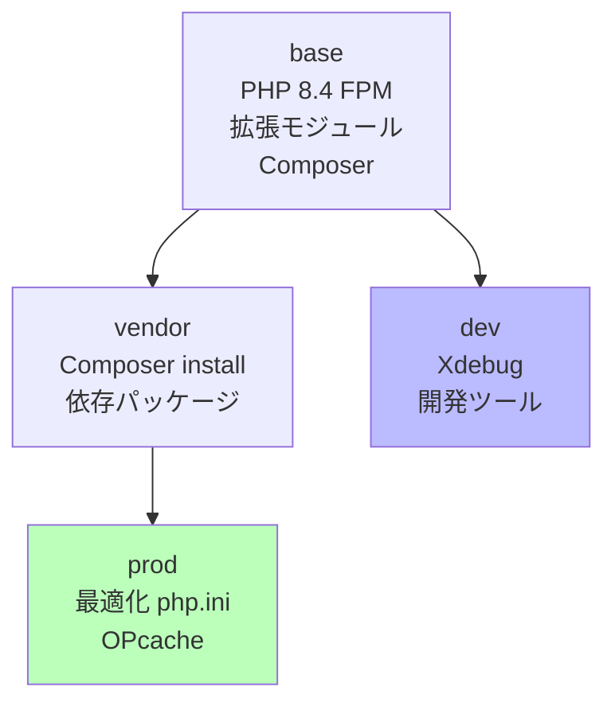

# PHP Dockerfile マルチステージ設計

## 概要

PHP 8.4 FPM のマルチステージビルド。`base` → `vendor` → `dev` → `prod` の 4 ステージで開発/本番のイメージを共通基盤から構築する。

## ステージ構成図



## Dockerfile 概要

```dockerfile
# ── Stage 1: base ──
FROM php:8.4-fpm AS base

# システム依存パッケージ
RUN apt-get update && apt-get install -y \
    libpq-dev libzip-dev unzip git \
    && docker-php-ext-install pdo_pgsql zip opcache bcmath \
    && rm -rf /var/lib/apt/lists/*

# Composer
COPY --from=composer:latest /usr/bin/composer /usr/bin/composer

WORKDIR /var/www/html

# ── Stage 2: vendor ──
FROM base AS vendor
COPY composer.json composer.lock ./
RUN composer install --no-dev --no-scripts --prefer-dist

# ── Stage 3: dev ──
FROM base AS dev
RUN pecl install xdebug && docker-php-ext-enable xdebug
COPY docker/entrypoint.sh /entrypoint.sh
RUN chmod +x /entrypoint.sh
ENTRYPOINT ["/entrypoint.sh"]
CMD ["php-fpm"]

# ── Stage 4: prod ──
FROM base AS prod
COPY --from=vendor /var/www/html/vendor ./vendor
COPY . .
RUN php artisan optimize
COPY docker/php.ini /usr/local/etc/php/conf.d/99-app.ini
CMD ["php-fpm"]
```

## 各ステージの役割

| ステージ | 用途 | 含まれるもの |
|---|---|---|
| `base` | 共通基盤 | PHP 拡張、Composer、システムライブラリ |
| `vendor` | 依存解決 | `composer install --no-dev` の結果 |
| `dev` | 開発環境 | Xdebug、entrypoint.sh |
| `prod` | 本番環境 | アプリコード + vendor + 最適化 php.ini |

## entrypoint.sh

```bash
#!/bin/bash
set -e

# マイグレーション自動実行
php artisan migrate --force

# キャッシュクリア（開発時）
if [ "$APP_ENV" = "local" ]; then
    php artisan config:clear
    php artisan cache:clear
    php artisan route:clear
fi

exec "$@"
```

## Xdebug 設定 (開発環境)

```ini
[xdebug]
xdebug.mode=develop,debug
xdebug.start_with_request=yes
xdebug.client_host=host.docker.internal
xdebug.client_port=9003
xdebug.discover_client_host=true
```

## 本番用 php.ini

```ini
[PHP]
expose_php = Off
memory_limit = 256M
max_execution_time = 30
upload_max_filesize = 10M
post_max_size = 10M

[opcache]
opcache.enable = 1
opcache.memory_consumption = 128
opcache.interned_strings_buffer = 16
opcache.max_accelerated_files = 10000
opcache.validate_timestamps = 0
opcache.jit_buffer_size = 64M
```

## ビルドとタグ付け

```bash
# 開発ビルド
docker compose build --target dev app

# 本番ビルド
docker compose -f docker-compose.yml -f docker-compose.prod.yml build app
```

## 注意: 設計レビュー指摘事項

| 問題 | 影響 | 改善案 |
|---|---|---|
| **`vendor` ステージが `--no-scripts`** | `post-autoload-dump` 等のスクリプトが未実行 | `prod` ステージで `composer dump-autoload --optimize` を追加 |
| **PHP 8.4 が最新すぎる可能性** | 一部パッケージが PHP 8.4 未対応の場合がある | `composer.json` の `require.php` を確認。CI で互換性テスト |
| **`entrypoint.sh` で `migrate --force`** | コンテナ再起動のたびにマイグレーション実行 | 初回のみ実行する仕組み（ロックファイル等）を導入 |
| **`.dockerignore` の確認が必要** | `vendor/`, `node_modules/`, `.env` がビルドコンテキストに含まれるとイメージ肥大化 | `.dockerignore` を確認し、不要ファイルを除外 |
| **ヘルスチェック用コマンドが不明確** | `php-fpm-healthcheck` がインストールされているか | ヘルスチェックスクリプトの存在と設定を確認 |
