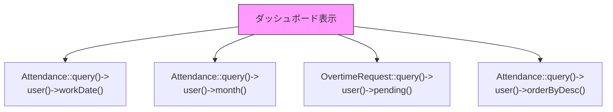

# クエリ最適化

## 概要

Eloquent ORM 利用時のクエリ最適化ガイド。N+1 問題、インデックス設計、クエリパフォーマンスの測定方法を解説する。

## 現在のインデックス設計

```sql
-- attendances テーブル
CREATE INDEX idx_attendances_user_clock_in_at
    ON attendances(user_id, clock_in_at);

CREATE INDEX idx_attendances_clock_out_at
    ON attendances(clock_out_at);

-- unique active email (ソフトデリート考慮)
CREATE UNIQUE INDEX users_email_unique_active
    ON users(email) WHERE deleted_at IS NULL;
```

## N+1 問題の検出と対策

### 問題パターン

```php
// NG: N+1 クエリ発生
$attendances = Attendance::all();
foreach ($attendances as $attendance) {
    echo $attendance->user->name;  // 各ループで SELECT users
}
```

### 解決策

```php
// OK: Eager Loading
$attendances = Attendance::with('user')->get();
foreach ($attendances as $attendance) {
    echo $attendance->user->name;  // キャッシュ済み
}

// OK: スコープ付き Eager Loading
$attendances = Attendance::with(['user' => function ($query) {
    $query->select('id', 'name', 'email');
}])->get();
```

## 現在のクエリパターン分析



| クエリ | 呼び出し元 | N+1 リスク | インデックス |
|---|---|---|---|
| `Attendance::where('user_id', ?)->where('work_date', ?)` | `getToday()` | なし | `idx_attendances_user_clock_in_at` |
| `Attendance::where('user_id', ?)->whereYear/Month()` | `buildStats()` | なし | カバリングインデックス要検討 |
| `Attendance::orderByDesc('work_date')->limit(6)` | `buildRecentRecords()` | なし | `work_date` インデックス要検討 |
| `OvertimeRequest::where('user_id', ?)->pending()` | `getDashboard()` | なし | 複合インデックス推奨 |

## パフォーマンス計測

```php
// 開発環境でクエリログ有効化
DB::enableQueryLog();

$result = $dashboardService->getDashboard($user);

$queries = DB::getQueryLog();
// 'query', 'bindings', 'time' を確認
```

```sql
-- PostgreSQL: EXPLAIN ANALYZE
EXPLAIN ANALYZE
SELECT * FROM attendances
WHERE user_id = '...'
  AND work_date = '2026-03-21';
```

## 推奨インデックス追加

```sql
-- ダッシュボード集計の高速化
CREATE INDEX idx_attendances_user_work_date
    ON attendances(user_id, work_date);

-- 残業申請の集計
CREATE INDEX idx_overtime_requests_user_status
    ON overtime_requests(user_id, status);

-- ログイン履歴の検索
CREATE INDEX idx_login_histories_user_logged_in
    ON login_histories(user_id, logged_in_at DESC);
```

## Eloquent パフォーマンス Tips

```php
// SELECT カラムを限定
Attendance::query()
    ->select('id', 'work_date', 'clock_in_at', 'clock_out_at')
    ->where('user_id', $userId)
    ->get();

// チャンク処理（大量データ）
Attendance::query()
    ->where('user_id', $userId)
    ->chunk(100, function ($attendances) {
        // バッチ処理
    });

// カウントだけなら count()
$count = Attendance::query()
    ->where('user_id', $userId)
    ->whereNull('clock_out_at')
    ->count();
// exists() の方が高速
$exists = Attendance::query()
    ->where('user_id', $userId)
    ->whereNull('clock_out_at')
    ->exists();
```

## 注意: 設計レビュー指摘事項

| 問題 | 影響 | 改善案 |
|---|---|---|
| **`work_date` の単独インデックスがない** | 日付範囲検索（全ユーザー集計）が遅い | `CREATE INDEX idx_attendances_work_date ON attendances(work_date)` |
| **`DashboardService::getDashboard()` が 5+ クエリ** | ダッシュボード表示のたびに複数クエリ | キャッシュ（Redis）を導入するか、サブクエリで集約 |
| **`buildRecentRecords()` で全カラム取得** | 不要なカラムも取得している | `select()` で必要カラムのみ指定 |
| **ソフトデリートのクエリコスト** | 毎クエリに `WHERE deleted_at IS NULL` が自動付加 | Partial Index（`WHERE deleted_at IS NULL`）で対応 |
| **Laravel Debugbar / Telescope 未導入** | 開発時にクエリ数・実行時間を視覚的に確認できない | `barryvdh/laravel-debugbar` または `laravel/telescope` を導入 |
