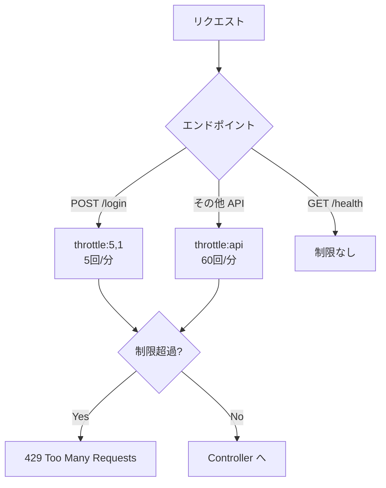

# レートリミティング設計

## 概要

API エンドポイントへの過剰リクエストを防ぐレートリミティング設計。DDoS 対策、ブルートフォース攻撃防止、公平なリソース分配を目的とする。

## レートリミッター定義

```php
// RouteServiceProvider::boot()
RateLimiter::for('api', function (Request $request) {
    if (app()->environment('local')) {
        return Limit::none();  // 開発環境では制限なし
    }
    return Limit::perMinute(60)->by($request->ip());
});
```

## エンドポイント別制限



## ルート定義

```php
// routes/api.php

// ログインは厳格に制限（ブルートフォース対策）
Route::post('/login', [AuthController::class, 'login'])
    ->middleware('throttle:5,1');

// ヘルスチェックは制限なし
Route::get('/health', fn() => response()->json([
    'status' => 'ok',
    'api' => true,
]));

// 認証必須エンドポイントは標準レート
Route::middleware(['auth:api'])->group(function () {
    // throttle:api は RouteServiceProvider で定義
    Route::get('/dashboard', ...);
    Route::post('/attendances/clock-in', ...);
});
```

## レスポンスヘッダー

```
X-RateLimit-Limit: 60
X-RateLimit-Remaining: 57
Retry-After: 30  (429 の場合)
```

## 429 エラーレスポンス

```json
{
    "success": false,
    "message": "Too Many Attempts.",
    "code": "INTERNAL_ERROR"
}
```

## 環境別設定

| 環境 | API レート | ログイン | 備考 |
|---|---|---|---|
| `local` | 無制限 | 5回/分 | 開発時は API 制限なし |
| `staging` | 60回/分 | 5回/分 | 本番同等 |
| `production` | 60回/分 | 5回/分 | IP ベース制限 |

## 注意: 設計レビュー指摘事項

| 問題 | 影響 | 改善案 |
|---|---|---|
| **429 のエラーコードが `INTERNAL_ERROR`** | フロントエンドが 429 をサーバーエラーとして扱う可能性 | `Handler.php` で `ThrottleRequestsException` を捕捉し、`RATE_LIMIT_EXCEEDED` コードを返す |
| **IP ベースのみの制限** | NAT 環境で同一 IP の正当ユーザーが影響を受ける | 認証済みユーザーは `$request->user()?->id` ベースに変更 |
| **ログインの制限が IP 単位** | 分散攻撃には無力 | アカウントベースのロックアウト（5回失敗で15分ロック）を追加 |
| **打刻 API に個別制限がない** | 打刻ボタン連打で大量リクエスト | `throttle:2,1` などで打刻系は個別に厳格化 |
| **開発環境で `api` レートが無制限** | 本番で初めて制限に引っかかるバグが発見される | 開発環境でも `Limit::perMinute(300)` 程度にする |
| **Redis ベースのレートリミッター未設定** | デフォルトは `cache` ドライバ。複数ワーカー間で正確に機能しない場合がある | `CACHE_DRIVER=redis` を確認し、Redis ベースで共有する |
