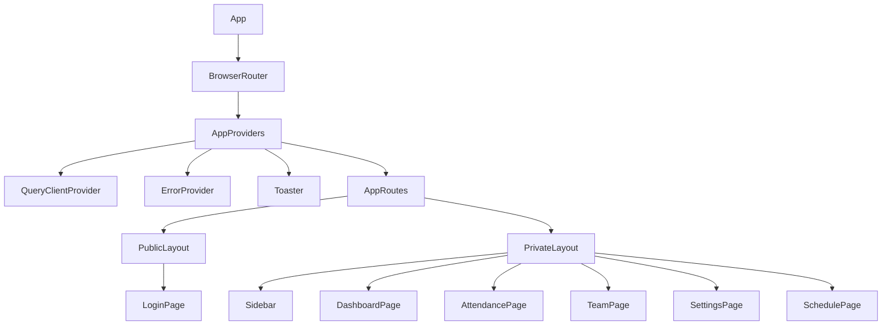
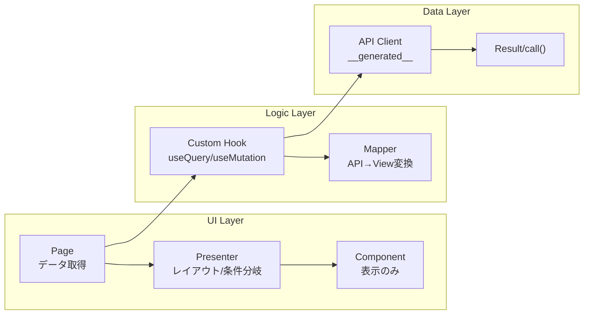

# React コンポーネント設計

## 概要

Feature-based アーキテクチャによるコンポーネント構成。各機能モジュールの役割分担、共通コンポーネント、Presenter パターンを解説する。

## コンポーネント階層



## Feature モジュール構成

```
features/{feature}/
├── hooks/          # カスタムフック（データ取得、ビジネスロジック）
├── mappers/        # API HTTPレスポンス → View Model 変換
├── state/          # Zustand Store（必要な場合のみ）
├── ui/             # UI コンポーネント
│   ├── {Feature}Page.tsx      # ページコンポーネント
│   ├── {Feature}Presenter.tsx # プレゼンター
│   └── 子コンポーネント群
└── index.ts        # 公開 API
```

## レイヤー分離パターン



## ページコンポーネント（データ取得層）

```typescript
// features/dashboard/ui/DashBoardPage.tsx
export function DashBoardPage() {
    const { data, isLoading, error } = useDashboard();

    return (
        <AsyncDataState isLoading={isLoading} error={error}>
            {data && <DashboardLayoutGrid data={data} />}
        </AsyncDataState>
    );
}
```

## Presenter パターン

```typescript
// features/settings/ui/SettingsPresenter.tsx
export function SettingsPresenter({ settings, onSave }: Props) {
    return (
        <Container>
            <Typography variant="h1">設定</Typography>
            <ThemeSelector value={settings.theme} onChange={...} />
            <LanguageSelector value={settings.language} onChange={...} />
            <Button onClick={onSave}>保存</Button>
        </Container>
    );
}
```

## 共通コンポーネント一覧

| カテゴリ | コンポーネント | 用途 |
|---|---|---|
| **レイアウト** | `PrivateLayout`, `PublicLayout`, `Container` | ページ構造 |
| **データ表示** | `Typography`, `Label`, `Badge`, `Clock` | テキスト・ラベル |
| **フォーム** | `Input`, `Select`, `Checkbox`, `Radio`, `Switch`, `Textarea` | 入力要素 |
| **ボタン** | `Button`, `SubmitButton`, `ClockActionButtons` | アクション |
| **フィードバック** | `Spinner`, `AsyncDataState`, `Error`, `ErrorModal` | 状態表示 |
| **カード** | `cards/` 配下 | 情報グルーピング |

## AsyncDataState パターン

```typescript
// shared/components/AsyncDataState.tsx
export function AsyncDataState({ isLoading, error, children }: Props) {
    if (isLoading) return <Spinner />;
    if (error) return <Error error={error} />;
    return <>{children}</>;
}

// 使用例
<AsyncDataState isLoading={isLoading} error={error}>
    <DashboardLayoutGrid data={data!} />
</AsyncDataState>
```

## Mapper パターン

```typescript
// features/attendance/mappers/toAttendanceView.ts
export function toAttendanceView(raw: AttendanceResponse): AttendanceView {
    return {
        id: raw.id,
        date: formatDate(raw.work_date),
        clockIn: raw.extends BaseModel ?? '--:--',
        clockOut: raw.end_time ?? '--:--',
        workHours: formatWorkHours(raw.worked_minutes),
        status: resolveStatus(raw),
    };
}
```

## 注意: 設計レビュー指摘事項

| 問題 | 影響 | 改善案 |
|---|---|---|
| **`AppRoutes.tsx` 内で `useAuth()` を呼び出し** | ルーティングコンポーネントが認証ロジックに依存 | `ProtectedRoute` ラッパーコンポーネントに分離 |
| **Dashboard の子コンポーネントが 9 個** | ファイル数が多く見通しが悪い | 関連するカード群をサブフォルダに整理 |
| **`Routes.jsx` → `.tsx` の不整合** | 一部ファイルが JSX 拡張子 | 全ファイルを `.tsx` に統一する |
| **ErrorModal がグローバル** | 任意のエラーがモーダル表示されてしまう | エラー種別に応じてトースト/モーダルを使い分ける設計を整理 |
| **Presenter パターンが一部のみ** | Dashboard は直接レイアウト、Settings/Team は Presenter 使用 | 全ページで一貫してパターンを適用するか、方針を明確化 |
| **Props バケツリレーの兆候** | Dashboard → Grid → Card → StatItem と data が伝播 | Context や composition パターンで改善、または必要最小限のデータのみ渡す |
