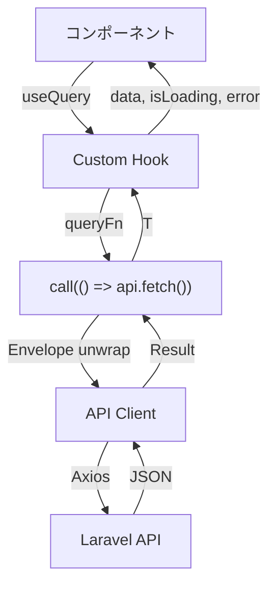

# React Query パターン

## 概要

`@tanstack/react-query` v5 によるサーバーステート管理。データ取得・キャッシュ・リトライ・楽観的更新のパターンを解説する。

## QueryClient 設定

```typescript
export function createQueryClient(): QueryClient {
    return new QueryClient({
        defaultOptions: {
            queries: {
                staleTime: 5 * 60 * 1000,        // 5分
                retry: (failureCount, error) => {
                    if (!isAxiosError(error)) return failureCount < 3;
                    if (!error.response) return failureCount < 3;  // ネットワークエラー
                    if (error.response.status >= 400 &&
                        error.response.status <= 499) return false; // 4xx はリトライなし
                    return failureCount < 3;                        // 5xx は3回まで
                },
                retryDelay: (attempt) => Math.min(1000 * 2 ** attempt, 30000),
                refetchOnWindowFocus: false,
                refetchOnReconnect: true,
                refetchOnMount: false,
            },
            mutations: {
                retry: 0,  // mutation はリトライなし
            },
        },
    });
}
```

## Query Key 管理

```typescript
// lib/query/keys.ts
export const makeScopedKeys = <S extends string>(scope: S) => ({
    scope: scope as S,
    all: () => key(scope),
    nest: <T extends readonly unknown[]>(...parts: T) => key(scope, ...parts),
});

// 使用例
const attendanceKeys = makeScopedKeys('attendance');
attendanceKeys.all();                    // ['attendance']
attendanceKeys.nest('today');            // ['attendance', 'today']
attendanceKeys.nest('list', { from, to }); // ['attendance', 'list', {from, to}]
```

## Query パターン



### 読み取り (useQuery)

```typescript
// features/dashboard/hooks/useDashboardQueries.ts
export function useDashboard() {
    return useQuery({
        queryKey: dashboardKeys.all(),
        queryFn: () => call(() => getDashboardApi()),
    });
}

// コンポーネントで使用
function DashboardPage() {
    const { data, isLoading, error } = useDashboard();
    if (isLoading) return <Spinner />;
    if (error) return <Error error={error} />;
    return <DashboardLayout data={data} />;
}
```

### 書き込み (useMutation)

```typescript
// features/attendance/hooks/useAttendanceClock.ts
export function useClockIn() {
    const queryClient = useQueryClient();

    return useMutation({
        mutationFn: (payload: ClockInRequest) =>
            call(() => clockInApi(payload)),
        onSuccess: () => {
            // 関連キャッシュを無効化
            queryClient.invalidateQueries({
                queryKey: attendanceKeys.all(),
            });
            queryClient.invalidateQueries({
                queryKey: dashboardKeys.all(),
            });
        },
    });
}
```

## `call()` / `callResult()` ヘルパー

```typescript
// call: queryFn 向け（例外を投げる）
export const call = async <T>(fn: AsyncFn<T>): Promise<T> => {
    const res = await fn();
    return unwrapApiEnvelope<T>(res as ApiPayload<T>);
};

// callResult: mutation・手動処理向け（Result<T> を返す）
export const callResult = async <T>(fn: AsyncFn<T>): Promise<Result<T>> => {
    try {
        const res = await fn();
        return ok(unwrapApiEnvelope<T>(res as ApiPayload<T>));
    } catch (e) {
        return err(e);
    }
};
```

## リトライ戦略

| 状況 | リトライ | 理由 |
|---|---|---|
| ネットワークエラー | 最大 3 回 | 一時的な接続断 |
| 4xx エラー | なし | クライアント起因。リトライしても同じ結果 |
| 5xx エラー | 最大 3 回 | サーバー一時障害 |
| Mutation | なし | 副作用が重複するリスク |

## キャッシュ無効化パターン

```typescript
// 打刻成功後
onSuccess: () => {
    queryClient.invalidateQueries({ queryKey: attendanceKeys.all() });
    queryClient.invalidateQueries({ queryKey: dashboardKeys.all() });
};

// 設定変更後
onSuccess: () => {
    queryClient.invalidateQueries({ queryKey: settingsKeys.all() });
};
```

## 注意: 設計レビュー指摘事項

| 問題 | 影響 | 改善案 |
|---|---|---|
| **`refetchOnMount: false`** | コンポーネントの再マウント時にデータが更新されない | `staleTime` でカバーされるが、ナビゲーションで古いデータが表示される場合がある |
| **`refetchOnWindowFocus: false`** | タブ切り替え時にデータが更新されない | 勤怠システムではリアルタイム性が重要。`true` に変更を検討 |
| **楽観的更新が未実装** | 打刻ボタン押下後、API 完了まで UI が更新されない | `onMutate` で楽観的に状態更新し、`onError` でロールバック |
| **Query Key の型安全性** | `makeScopedKeys` の `nest()` は任意の引数を受けるため型推論が弱い | Query Key Factory パターンで型付きキーを生成 |
| **エラー表示がグローバルのみ** | コンポーネント単位のエラー表示が不十分 | `useQuery` の `error` を各コンポーネントでハンドリング |
