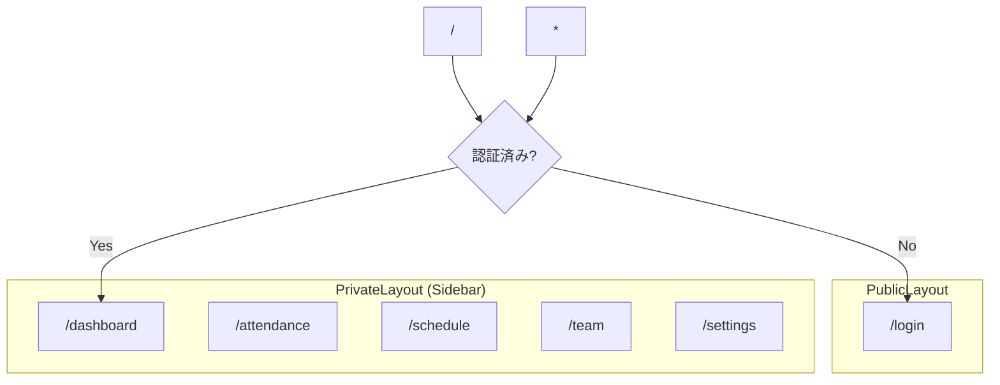
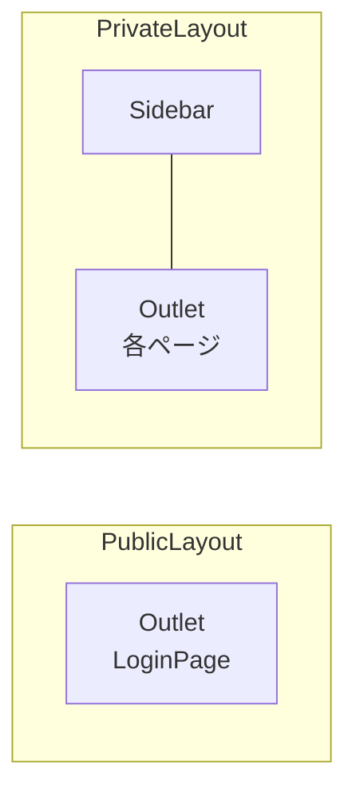

# React ルーティング設計

## 概要

React Router v7 + TypeScript によるクライアントサイドルーティング設計。認証ガード、レイアウト切り替え、ルート定義の管理を解説する。

## ルート構成図



## ルートパス定義

```typescript
// config/routes.ts
export enum AppRoutePath {
    Root       = '/',
    Login      = '/login',
    Dashboard  = '/dashboard',
    Attendance = '/attendance',
    Schedule   = '/schedule',
    Approval   = '/approval',    // 将来機能
    Team       = '/team',
    Settings   = '/settings',
    Wildcard   = '*',
}
```

## AppRoutes 実装

```typescript
export const AppRoutes = () => {
    const { isAuthenticated } = useAuth();

    return (
        <Routes>
            {/* ルート → 認証状態で振り分け */}
            <Route
                path={AppRoutePath.Root}
                element={
                    <Navigate
                        to={isAuthenticated ? AppRoutePath.Dashboard : AppRoutePath.Login}
                        replace
                    />
                }
            />

            {/* 公開ページ */}
            <Route element={<PublicLayout />}>
                <Route path={AppRoutePath.Login} element={<LoginPage />} />
            </Route>

            {/* 認証必須ページ */}
            <Route
                element={
                    isAuthenticated
                        ? <PrivateLayout />
                        : <Navigate to={AppRoutePath.Login} replace />
                }
            >
                <Route path={AppRoutePath.Dashboard} element={<DashBoardPage />} />
                <Route path={AppRoutePath.Attendance} element={<AttendancePage />} />
                <Route path={AppRoutePath.Team} element={<TeamPage />} />
                <Route path={AppRoutePath.Settings} element={<SettingsPage />} />
                <Route path={AppRoutePath.Schedule} element={<SchedulePage />} />
            </Route>

            {/* 404 → ルートへリダイレクト */}
            <Route
                path={AppRoutePath.Wildcard}
                element={
                    <Navigate
                        to={isAuthenticated ? AppRoutePath.Dashboard : AppRoutePath.Login}
                        replace
                    />
                }
            />
        </Routes>
    );
};
```

## レイアウト構成



## ルーティングフロー

| パス | 未認証 | 認証済み |
|---|---|---|
| `/` | → `/login` | → `/dashboard` |
| `/login` | ログインページ表示 | → `/dashboard` (要実装) |
| `/dashboard` | → `/login` | ダッシュボード表示 |
| `/attendance` | → `/login` | 勤怠一覧表示 |
| `/unknown-path` | → `/login` | → `/dashboard` |

## サイドバーナビゲーション

```typescript
const navigationItems = [
    { path: AppRoutePath.Dashboard,  label: 'ダッシュボード', icon: LayoutDashboard },
    { path: AppRoutePath.Attendance, label: '勤怠',           icon: Clock },
    { path: AppRoutePath.Schedule,   label: 'スケジュール',   icon: Calendar },
    { path: AppRoutePath.Team,       label: 'チーム',         icon: Users },
    { path: AppRoutePath.Settings,   label: '設定',           icon: Settings },
];
```

## 注意: 設計レビュー指摘事項

| 問題 | 影響 | 改善案 |
|---|---|---|
| **認証済みユーザーが `/login` にアクセスできる** | ログイン画面が無意味に表示される | `PublicLayout` 内で `isAuthenticated` をチェックし、Dashboard へリダイレクト |
| **認証ガードが `AppRoutes` に直書き** | ルート追加のたびにガード設定を忘れるリスク | `ProtectedRoute` コンポーネントに分離 |
| **`Approval` パスが定義済みだが未使用** | 存在しないページへのリンクがある可能性 | 未実装ページは enum から削除するか、Coming Soon ページを用意 |
| **遅延ローディング (lazy) 未実装** | 全ページを初期バンドルに含む。バンドルサイズ増大 | `React.lazy()` + `Suspense` でコード分割 |
| **ルート遷移時のローディング表示がない** | ページ切り替え時に白画面が見える | `Suspense` の `fallback` にスケルトン UI を設定 |
| **パンくずリスト未実装** | ユーザーが現在位置を把握しにくい | ルート定義にメタデータ（タイトル等）を追加 |
