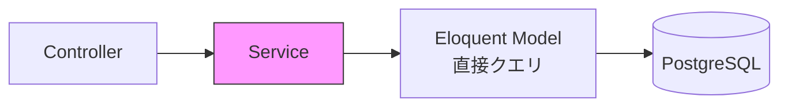
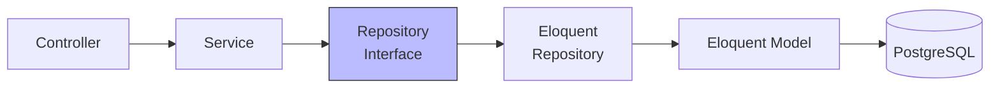

# リポジトリパターン

## 概要

`BaseRepository` が定義されているが、現状のサービス層では直接 Eloquent Model を操作している。本ドキュメントでは現状の設計と、リポジトリパターン導入の是非を分析する。

## 現在の BaseRepository

```php
abstract class BaseRepository
{
    protected Model $model;

    abstract public function getModel(): string;

    public function __construct()
    {
        $this->model = app($this->getModel());
    }

    public function all(): Collection              { return $this->model->all(); }
    public function findById(string|int $id): ?Model { return $this->model->find($id); }
    public function query(): Builder               { return $this->model->query(); }
    public function create(array $data): Model     { return $this->model->create($data); }
    public function update(string|int $id, array $data): bool { ... }
    public function delete(string|int $id): bool   { ... }
    public function paginate(int $page, int $perPage): LengthAwarePaginator { ... }
    public function count(array $conditions): int  { ... }
    public function exists(array $conditions): bool { ... }
}
```

## 現状のアーキテクチャ（Repository 未使用）



## 理想のアーキテクチャ（Repository 使用）



## 現在の Service 内クエリ例

```php
// AttendanceService::clockIn()
$openAttendance = Attendance::query()
    ->where('user_id', $user->id)
    ->whereNotNull('clock_in_at')
    ->whereNull('clock_out_at')
    ->latest('clock_in_at')
    ->first();
```

## Repository を導入した場合

```php
// AttendanceRepository
final class AttendanceRepository extends BaseRepository
{
    public function getModel(): string
    {
        return Attendance::class;
    }

    public function findWorkingAttendance(string $userId): ?Attendance
    {
        return $this->query()
            ->where('user_id', $userId)
            ->whereNotNull('clock_in_at')
            ->whereNull('clock_out_at')
            ->latest('clock_in_at')
            ->first();
    }
}

// AttendanceService
public function __construct(
    private readonly AttendanceRepository $repo,
) {}

public function clockIn(User $user): array
{
    return $this->transaction(function () use ($user): array {
        if ($this->repo->findWorkingAttendance($user->id) !== null) {
            throw new DomainException('未退勤の勤務が存在します');
        }
        // ...
    });
}
```

## Repository 導入の判断基準

| 基準 | 現状 | 判断 |
|---|---|---|
| DB エンジン変更の可能性 | PostgreSQL で固定 | 不要 |
| テストでモック差し替え | `Attendance::query()` を直接使用 | Model スコープで代替可能 |
| クエリの再利用性 | スコープで充分 | 不要 |
| チーム規模 | 小〜中規模 | 過剰設計のリスク |
| CQRS 導入予定 | なし | 不要 |

## 推奨方針

```
現在の規模では Repository パターンは過剰設計。
以下の方式で統一する：

1. BaseRepository は削除するか、将来拡張用に残す
2. Service 内で Eloquent Model + スコープ を直接使用
3. 複雑なクエリは Model スコープに集約
4. テストは RefreshDatabase + Factory で実 DB テスト
```

## 注意: 設計レビュー指摘事項

| 問題 | 影響 | 改善案 |
|---|---|---|
| **BaseRepository が存在するが未使用** | 新規メンバーが「使うべきか」混乱する | 削除するか、README に「現在未使用」と明記する |
| **BaseRepository の `create()` が `array` を受ける** | 型安全性が低い。Data を受けるべき | Repository を使う場合は `createFromData(BaseData $dto)` に変更 |
| **BaseRepository のコンストラクタで `app()` を使用** | テスト時のモック差し替えが困難 | コンストラクタインジェクションに変更 |
| **`query()` メソッドが公開されている** | Repository の抽象化が漏洩する（呼び出し側が自由にクエリを組める） | `query()` を protected にし、具体メソッドのみ公開する |
