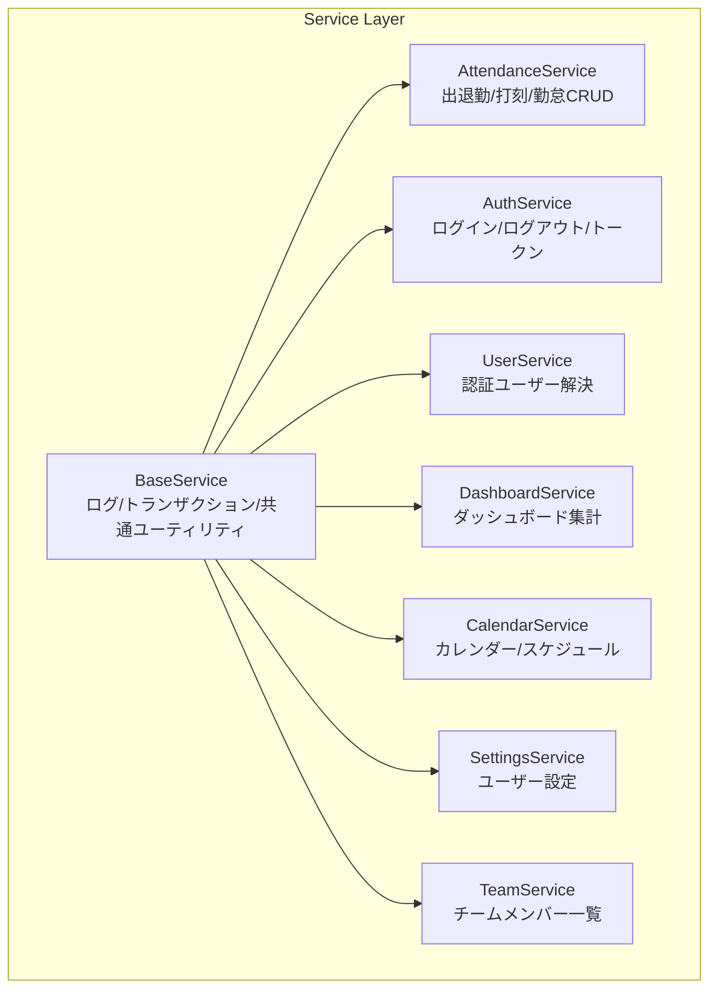
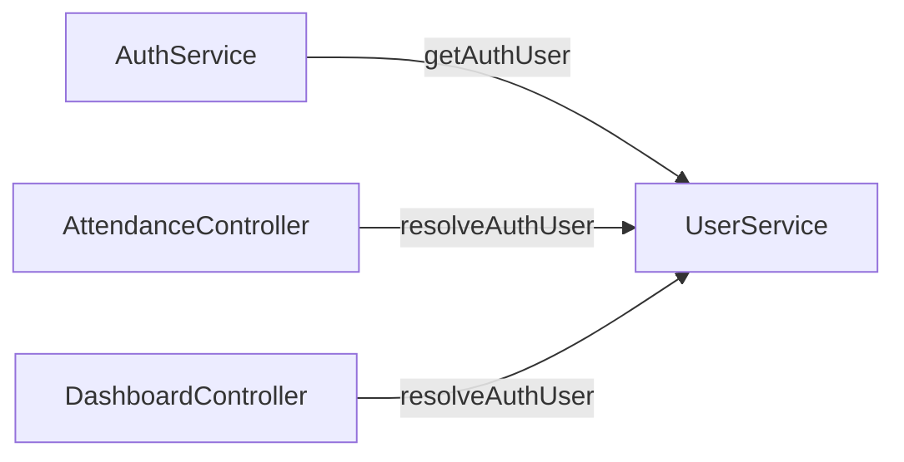

# サービス層設計パターン

## 概要

ビジネスロジックはすべて Service 層に集約する。Controller は Service を呼び出すだけのシンハンドラーとする。

## サービス一覧と責務



## BaseService が提供する共通機能

| メソッド | シグネチャ | 用途 |
|---|---|---|
| `log()` | `(string $message, array $context = [])` | INFO ログ記録 |
| `logWarning()` | `(string $message, array $context = [])` | WARNING ログ記録 |
| `logError()` | `(string $message, array $context = [])` | ERROR ログ記録 |
| `transaction()` | `(callable $callback): mixed` | トランザクション + ログ |
| `resolveTimezone()` | `(?string $timezone): string` | タイムゾーン解決 |
| `weekdayJa()` | `(Carbon $date): string` | 曜日（日本語1文字） |
| `calculateWorkHours()` | `(mixed, mixed, ?int, ?Carbon): ?float` | 勤務時間(h)計算 |

## Service の設計ルール

```
✅ DO
├── BaseService を継承する
├── メソッド名は動詞始まり（clockIn, getUser, updateSettings）
├── DomainException でビジネスエラーを投げる
├── $this->transaction() で副作用をラップ
├── $this->resolveTimezone() でタイムゾーン解決
└── コンストラクタインジェクションで依存を注入

❌ DON'T
├── Request / Response オブジェクトに依存する
├── DB::transaction() を直接呼ぶ
├── Controller のロジックを持ち込む
├── 他の Service を直接 new する（DI を使う）
└── PHP 標準の \DomainException を使う
```

## Service 呼び出しパターン

```php
// Controller から Service を呼ぶ標準パターン
final class AttendanceController extends BaseController
{
    public function __construct(
        private readonly AttendanceService $attendanceService,
    ) {}

    public function store(ClockRequest $request): JsonResponse
    {
        $result = $this->attendanceService->clockIn(
            $this->resolveAuthUser()
        );
        return ApiResponse::success($result, '出勤を記録しました');
    }
}
```

## Service メソッドの構成パターン

```php
// 読み取り専用（トランザクション不要）
public function getToday(User $user): array
{
    $timezone = $this->resolveTimezone($user->timezone ?? null);
    $today = CarbonImmutable::today($timezone)->toDateString();
    $attendance = Attendance::query()
        ->where('user_id', $user->id)
        ->where('work_date', $today)
        ->first();
    return $attendance?->toLocalTimePayload() ?? [];
}

// 書き込み（トランザクション必須）
public function clockIn(User $user): array
{
    return $this->transaction(function () use ($user): array {
        // 1. バリデーション（ドメインルール）
        // 2. データ操作
        // 3. 結果返却
    });
}
```

## Service 間の依存関係



## 注意: 設計レビュー指摘事項

| 問題 | 影響 | 改善案 |
|---|---|---|
| **Service が配列を返している** | 型安全性が低い。`toLocalTimePayload()` が `array<string, mixed>` を返す | DTO クラス `AttendancePayload` を作成し、戻り値を型付けする |
| **Repository 層が使われていない** | `BaseRepository` が存在するが、Service 内で直接 `Attendance::query()` を実行 | Repository パターンに移行するか、Repository を削除して Service + Eloquent Model で統一する |
| **Service 間のクロス呼び出しがない** | 現状は問題ないが、将来的に Service 間依存が増えると循環参照のリスク | Service間連携は イベント/リスナー パターンで疎結合化する |
| **`UserService` が認証専用ゲートウェイ** | ユーザー CRUD がない | 将来的にユーザー管理画面が追加されたら `UserService` に CRUD メソッドを追加 |
| **private メソッドのテスト困難** | `buildAttendancePayload()` 等が private でユニットテストしにくい | 複雑なロジックは別クラスに切り出すか、public メソッド経由でテストする |
