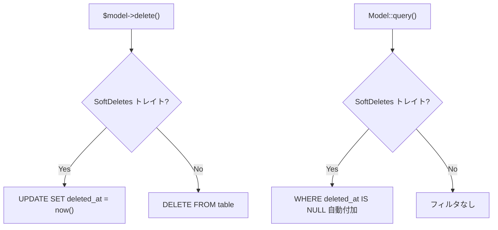
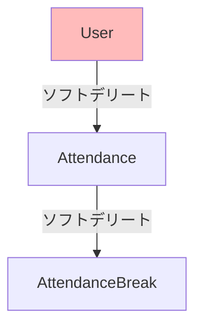

# ソフトデリート戦略

## 概要

論理削除（Soft Delete）の適用方針、テーブル設計、クエリへの影響、復元ポリシーを定義する。

## 適用一覧

| テーブル | SoftDeletes | 理由 |
|---|---|---|
| `users` | ✅ | 退職者の勤怠データ参照が必要 |
| `attendances` | ✅ | 修正ログ・監査証跡として保持 |
| `attendance_breaks` | ✅ | 勤怠に紐づく休憩データの整合性 |
| `departments` | ❌ | マスタデータ。無効化は `status` で管理 |
| `roles` | ❌ | マスタデータ。無効化は `status` で管理 |
| `holidays` | ❌ | 年度ごとに作成。不要分は物理削除 |
| `login_histories` | ❌ | 監査ログ。削除しない |
| `user_settings` | ❌ | User に 1:1。User 削除で参照不要になる |
| `user_notification_settings` | ❌ | User に 1:1。同上 |

## Eloquent の SoftDeletes 動作



## ソフトデリートされたデータのアクセス

```php
// 通常クエリ（削除済みは除外）
$users = User::all();

// 削除済みを含む
$users = User::withTrashed()->get();

// 削除済みのみ
$deleted = User::onlyTrashed()->get();

// 復元
$user->restore();

// 完全削除
$user->forceDelete();
```

## ユニーク制約との共存

```sql
-- ソフトデリート考慮のユニーク制約
CREATE UNIQUE INDEX users_email_unique_active
    ON users(email) WHERE deleted_at IS NULL;
```

```
これにより：
✅ アクティブユーザーのメール重複を防止
✅ 削除済みユーザーと同じメールで新規登録可能
✅ 同一メールの削除済みユーザーが複数存在可能
```

## カスケード削除の考慮



## 注意: 設計レビュー指摘事項

| 問題 | 影響 | 改善案 |
|---|---|---|
| **User ソフトデリート時に子レコードが未処理** | `User::delete()` で Attendance は残る。User 参照が論理削除済みになるが、データ整合性に問題 | Observer で User 削除時に関連レコードもソフトデリートするか、`ON DELETE` ポリシーを定義 |
| **`deleted_at` にインデックスがない** | `WHERE deleted_at IS NULL` が全スキャンになる可能性 | Partial Index: `CREATE INDEX idx_users_active ON users(id) WHERE deleted_at IS NULL` |
| **物理削除ポリシーが未定義** | ディスク容量の際限ない増大 | 退職後 N 年経過したデータの物理削除バッチを定義する |
| **`user_settings` が User 削除後も残る** | User ソフトデリート後も `user_settings` はアクティブ | `user_settings` を User と一緒にクリーンアップする Observer を追加 |
| **Partial Index が PostgreSQL 依存** | MySQL への移行時に互換性がない | 現状 PostgreSQL 固定なので許容。移行計画がある場合は別途対応 |
