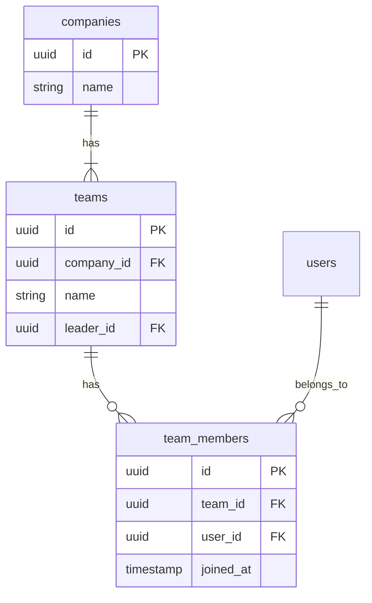
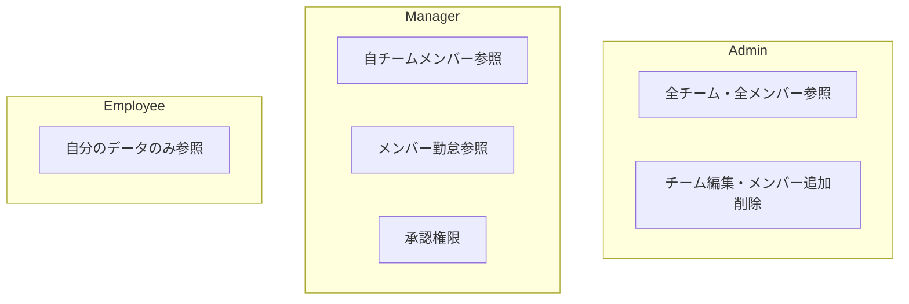
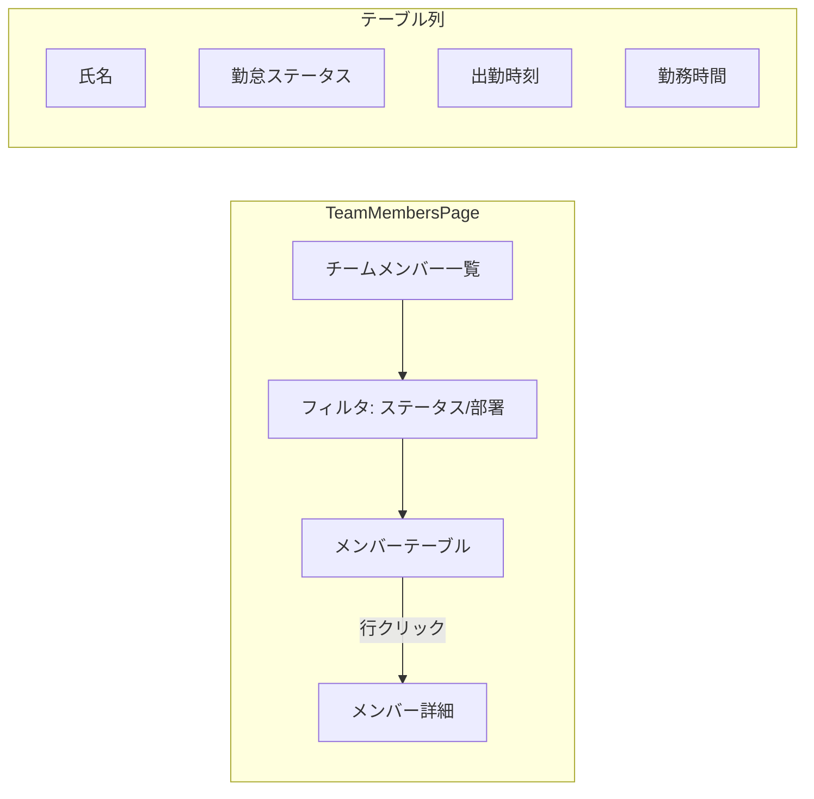

# チーム管理設計

## 概要

チーム（部署/グループ）の管理機能設計。管理者・マネージャーによるチームメンバー一覧の参照、メンバーの勤怠状況把握、権限ベースのアクセス制御を解説する。

## チーム構成モデル



## 権限モデル



## API エンドポイント

| メソッド | パス | 権限 | 説明 |
|---|---|---|---|
| `GET` | `/api/team/members` | manager, admin | チームメンバー一覧 |
| `GET` | `/api/team/members/{id}` | manager, admin | メンバー詳細 |
| `GET` | `/api/team/members/{id}/attendances` | manager, admin | メンバー勤怠一覧 |

## コントローラ実装

```php
class TeamController extends BaseController
{
    public function members(Request $request): JsonResponse
    {
        $user = $request->user();
        $members = $this->teamService->getTeamMembers($user);

        return ApiResponse::success($members);
    }
}
```

## サービス層

```php
class TeamService extends BaseService
{
    public function getTeamMembers(User $user): Collection
    {
        // Admin は全メンバー参照可能
        if ($user->isAdmin()) {
            return User::where('company_id', $user->company_id)
                ->with(['latestAttendance'])
                ->get();
        }

        // Manager は自チームのメンバーのみ
        if ($user->isManager()) {
            return User::whereHas('teams', function ($q) use ($user) {
                $q->whereIn('team_id', $user->managingTeamIds());
            })
            ->with(['latestAttendance'])
            ->get();
        }

        throw new DomainException('チームメンバーの参照権限がありません');
    }
}
```

## チームメンバー一覧画面



## フロントエンド実装

```typescript
// front/src/features/team/pages/TeamMembersPage.tsx
export const TeamMembersPage = () => {
  const { data: members } = useTeamMembers();

  return (
    <PageLayout title="チームメンバー">
      <MemberTable members={members?.data ?? []} />
    </PageLayout>
  );
};

// API hooks
const useTeamMembers = () => {
  return useQuery({
    queryKey: teamKeys.members(),
    queryFn: () => getTeamMembers(),
  });
};
```

## 注意: 設計レビュー指摘事項

| 問題 | 影響 | 改善案 |
|---|---|---|
| **チーム階層構造が未対応** | 部→課→グループの階層がフラット | `parent_id` による再帰リレーションで階層化 |
| **マネージャーの兼務** | 複数チームを管理する場合の権限管理が複雑 | `team_members` テーブルに `role` カラムを追加 |
| **メンバー数が多い場合のパフォーマンス** | 全メンバーを一括取得すると遅い | ページネーション + 検索フィルタを実装 |
| **リアルタイム勤怠ステータス** | 画面を開いた時点のデータしか表示されない | WebSocket または Polling で定期更新 |
| **退職者の扱い** | ソフトデリートされたメンバーがチームに残る | `team_members.left_at` で離任日を管理 |
