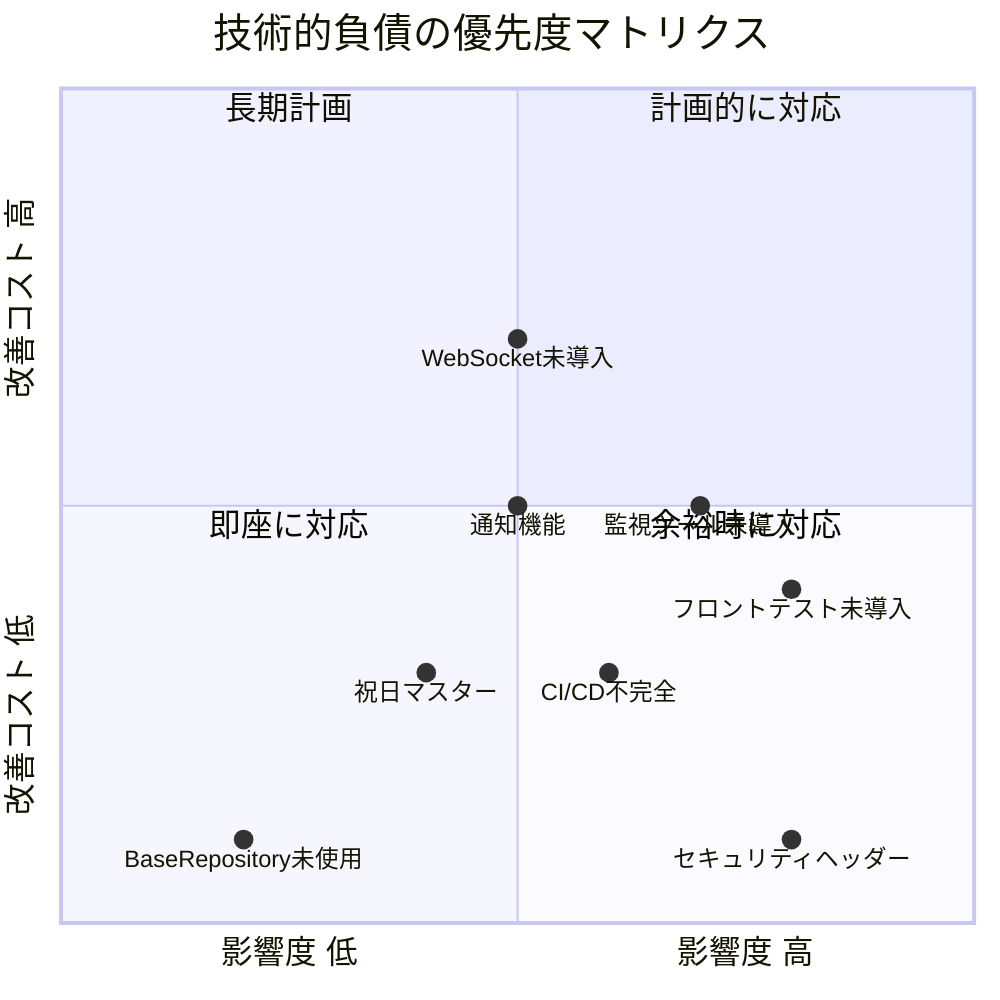
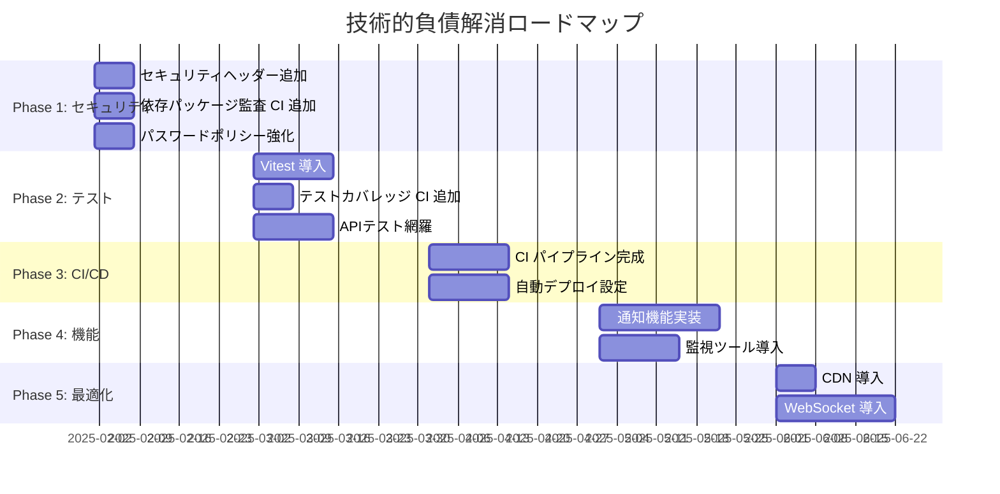

# 技術的負債とロードマップ

## 概要

現時点で認識している技術的負債と、段階的な解消ロードマップ。優先度・影響度・推定工数を整理し、計画的な改善を促進する。

## 技術的負債マトリクス



## カテゴリ別技術的負債

### テスト

| 項目 | 現状 | 影響 | 優先度 |
|---|---|---|---|
| フロントエンドテスト | Vitest 未導入 | フロントのバグが検出されない | **高** |
| E2E テスト | Playwright/Cypress 未導入 | 統合テストがない | 中 |
| テストカバレッジ計測 | CI で未実行 | カバレッジ推移が不明 | 中 |
| API テストの網羅性 | 一部エンドポイントのみ | デグレのリスク | **高** |

### セキュリティ

| 項目 | 現状 | 影響 | 優先度 |
|---|---|---|---|
| セキュリティヘッダー | Nginx に未設定 | XSS/クリックジャッキングリスク | **高** |
| 依存パッケージ監査 | CI で未実行 | 脆弱性のあるパッケージ | **高** |
| CSRF 対策 | SPA のため不要（JWT 使用） | — | 対応済み |
| パスワードポリシー | 基本バリデーションのみ | 弱いパスワードが設定可能 | 中 |

### インフラ

| 項目 | 現状 | 影響 | 優先度 |
|---|---|---|---|
| 監視ツール | 未導入 | 障害検知が遅れる | **高** |
| CI/CD パイプライン | OpenAPI チェックのみ | 手動デプロイ | **高** |
| SSL/TLS | 開発環境のみ HTTP | 本番未準備 | 中 |
| CDN | 未導入 | アセット配信が遅い | 低 |

### アーキテクチャ

| 項目 | 現状 | 影響 | 優先度 |
|---|---|---|---|
| `BaseRepository` | 定義のみ未使用 | 不要なコードが残存 | 低 |
| 通知機能 | 未実装 | 承認ワークフローが成立しない | 中 |
| WebSocket | 未導入 | リアルタイム更新がない | 低 |
| ジョブキュー | 未使用 | 重い処理が同期実行 | 中 |

## 改善ロードマップ



## Phase 別作業内容

### Phase 1: セキュリティ強化（即座に対応）

```bash
# 1. Nginx セキュリティヘッダー追加
# 2. composer audit / pnpm audit の CI ジョブ追加
# 3. バリデーションルールの強化
```

### Phase 2: テスト基盤整備

```bash
# 1. pnpm add -D vitest @testing-library/react
# 2. hooks/utils のユニットテスト追加
# 3. Codecov 連携
```

### Phase 3: CI/CD 完成

```bash
# 1. backend + frontend の CI ジョブ
# 2. ECS デプロイの CD ジョブ
# 3. ステージング環境の構築
```

## 注意: 設計レビュー指摘事項

| 問題 | 影響 | 改善案 |
|---|---|---|
| **技術的負債のトラッキング** | 負債が可視化されていない | GitHub Issues にラベル `tech-debt` でトラッキング |
| **負債の蓄積速度** | 新機能開発で負債が増え続ける | Sprint の 20% を負債解消に充当するルール化 |
| **優先度の判断基準** | 主観で優先度が決まる | 影響度 × 発生確率 × 改善コストのスコアリング |
| **ロードマップの実現可能性** | 開発リソースとの兼ね合い | 四半期ごとに見直し、 Phase の粒度を調整 |
