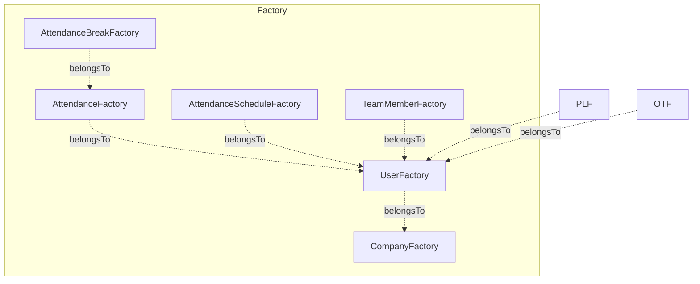
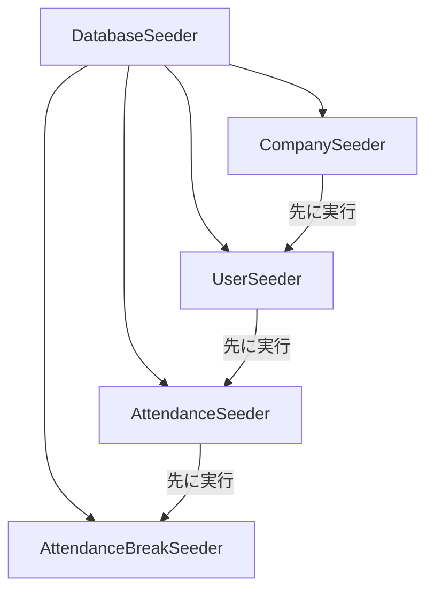

# テスト Factory 設計

## 概要

Laravel の Model Factory と Seeder の設計パターン。テスト用データ生成の一貫性を保ち、Feature テストでの再利用性を最大化する構成を解説する。

## Factory 一覧



## Factory 設計パターン

### 基本 Factory

```php
// database/factories/UserFactory.php
class UserFactory extends Factory
{
    protected $model = User::class;

    public function definition(): array
    {
        return [
            'id' => Str::uuid(),
            'company_id' => Company::factory(),
            'employee_code' => $this->faker->unique()->numerify('EMP####'),
            'last_name' => $this->faker->lastName(),
            'first_name' => $this->faker->firstName(),
            'email' => $this->faker->unique()->safeEmail(),
            'password' => Hash::make('password'),
            'role' => UserRole::EMPLOYEE,
        ];
    }

    // State: 管理者
    public function admin(): static
    {
        return $this->state(fn () => [
            'role' => UserRole::ADMIN,
        ]);
    }

    // State: マネージャー
    public function manager(): static
    {
        return $this->state(fn () => [
            'role' => UserRole::MANAGER,
        ]);
    }
}
```

### リレーション付き Factory

```php
// database/factories/AttendanceFactory.php
class AttendanceFactory extends Factory
{
    public function definition(): array
    {
        $clockIn = $this->faker->dateTimeBetween('-30 days', 'now');

        return [
            'id' => Str::uuid(),
            'user_id' => User::factory(),
            'date' => $clockIn->format('Y-m-d'),
            'clock_in' => $clockIn,
            'clock_out' => (clone $clockIn)->modify('+8 hours'),
            'status' => AttendanceStatus::CLOCKED_OUT,
        ];
    }

    // State: 出勤中（clock_out なし）
    public function clockedIn(): static
    {
        return $this->state(fn () => [
            'clock_out' => null,
            'status' => AttendanceStatus::CLOCKED_IN,
        ]);
    }

    // State: 休憩付き
    public function withBreaks(int $count = 1): static
    {
        return $this->afterCreating(function (Attendance $attendance) use ($count) {
            AttendanceBreak::factory()
                ->count($count)
                ->for($attendance)
                ->create();
        });
    }
}
```

## テストでの使用パターン

```php
// tests/Feature/AttendanceTest.php
class AttendanceTest extends TestCase
{
    // 基本的な Factory 使用
    public function test_ユーザーの勤怠一覧を取得できる(): void
    {
        $user = User::factory()->create();
        Attendance::factory()->count(5)->for($user)->create();

        $response = $this->actingAs($user)
            ->getJson('/api/attendances');

        $response->assertOk()
            ->assertJsonCount(5, 'data');
    }

    // State を使った Factory
    public function test_管理者は全ユーザーの勤怠を参照できる(): void
    {
        $admin = User::factory()->admin()->create();
        $employee = User::factory()->create([
            'company_id' => $admin->company_id,
        ]);
        Attendance::factory()->for($employee)->create();

        $response = $this->actingAs($admin)
            ->getJson('/api/team/members');

        $response->assertOk();
    }
}
```

## Seeder 構成



## Seeder の実行順序

| 順序 | Seeder | 依存 | 生成数 |
|---|---|---|---|
| 1 | `CompanySeeder` | なし | 1 社 |
| 2 | `UserSeeder` | Company | 管理者 1 + 社員数名 |
| 3 | `AttendanceSeeder` | User | 各ユーザー 30 日分 |
| 4 | `AttendanceBreakSeeder` | Attendance | 各日 1-2 休憩 |

## 注意: 設計レビュー指摘事項

| 問題 | 影響 | 改善案 |
|---|---|---|
| **Factory でパスワードが固定** | テスト環境のみなら OK だが、Seeder で本番に流れるリスク | `APP_ENV !== 'production'` のガードを Seeder に追加 |
| **UUID の毎回生成** | テスト実行ごとに ID が変わるため再現が困難 | 特定テストでは `create(['id' => 'fixed-uuid'])` で固定 |
| **Factory 間の company_id 不整合** | User と Attendance で異なる company に属する可能性 | `for($user)` を使って常にリレーションを明示する |
| **Seeder の冪等性がない** | 2 回実行するとデータが重複する | `truncate` または `updateOrCreate` を使用する |
| **テスト用データと Seeder データの分離** | Feature テストが Seeder データに依存すると壊れやすい | テストは必ず Factory でデータを生成する。Seeder は開発/デモ用のみ |
