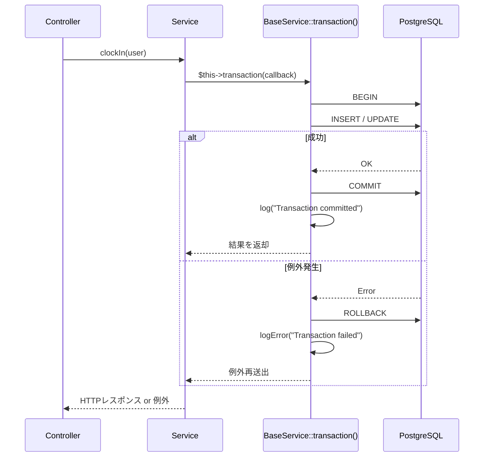
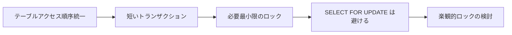

# トランザクション設計

## 概要

本システムにおけるトランザクション管理の設計方針、`BaseService::transaction()` の仕組み、デッドロック対策を解説する。

## トランザクション管理アーキテクチャ



## BaseService::transaction() の実装

```php
protected function transaction(callable $callback): mixed
{
    try {
        $result = DB::transaction($callback);

        // ポイント：COMMIT 後にログ記録
        $this->log('Transaction committed', [
            'service' => static::class,
        ]);

        return $result;
    } catch (\Throwable $e) {
        $this->logError('Transaction failed', [
            'service' => static::class,
            'error' => $e->getMessage(),
        ]);

        throw $e;
    }
}
```

## トランザクション設計ルール

| ルール | 理由 |
|---|---|
| `$this->transaction()` を使う | `DB::transaction()` 直接呼び出し禁止。ログタイミングが不正確になる |
| トランザクション内で外部 API を呼ばない | ロールバックしても外部副作用は戻せない |
| トランザクション内で重い処理をしない | ロック時間が長くなりデッドロックリスク増大 |
| ネストトランザクションを避ける | Laravel は SAVEPOINT を使うが、意図しないロールバック粒度になる可能性がある |

## 現在のトランザクション箇所

| サービス | メソッド | 操作 |
|---|---|---|
| `AttendanceService` | `clockIn()` | Attendance INSERT |
| `AttendanceService` | `clockOut()` | Attendance UPDATE |
| `AttendanceService` | `store()` | Attendance INSERT（手動入力） |
| `AttendanceService` | `update()` | Attendance UPDATE（修正） |

## デッドロック対策



### 推奨パターン

```php
// OK：短いトランザクション
return $this->transaction(function () use ($user): array {
    $attendance = Attendance::query()->create([...]);
    return $attendance->toLocalTimePayload();
});

// NG：トランザクション内で長時間処理
return $this->transaction(function () use ($user): array {
    $this->sendNotificationEmail($user); // ← 外部通信を含む
    $attendance = Attendance::query()->create([...]);
    return $attendance->toLocalTimePayload();
});
```

## PostgreSQL 分離レベル

| レベル | 設定 | 用途 |
|---|---|---|
| **READ COMMITTED** (デフォルト) | `config/database.php` 未指定 | 通常の CRUD |
| REPEATABLE READ | 明示的に指定 | 集計レポートなど一貫性が必要な場合 |
| SERIALIZABLE | 明示的に指定 | 金額計算など絶対的な一貫性が必要な場合 |

## 注意: 設計レビュー指摘事項

| 問題 | 影響 | 改善案 |
|---|---|---|
| **楽観的ロックが未実装** | 同一ユーザーが複数タブで同時打刻した場合、二重出勤が発生し得る | `updated_at` による楽観的ロック、または `SELECT ... FOR UPDATE` を導入 |
| **リトライ機構がない** | デッドロック発生時にそのまま 500 エラー | `DB::transaction($callback, $attempts)` の第2引数で自動リトライを設定 |
| **トランザクションログが `static::class` のみ** | どのメソッドで実行されたか特定しにくい | `$this->log('Transaction committed', ['service' => static::class, 'method' => __FUNCTION__])` |
| **読み取り専用クエリもトランザクション化の可能性** | 不要なロックが発生する | `getToday()` や `index()` はトランザクション外で OK（現状は正しい） |
