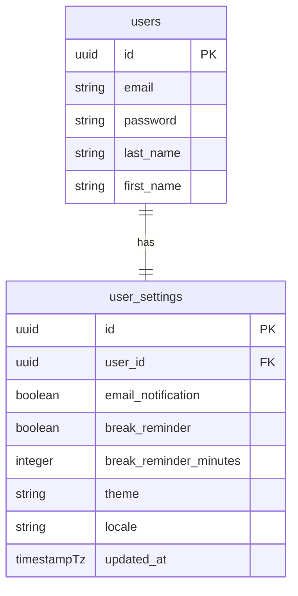
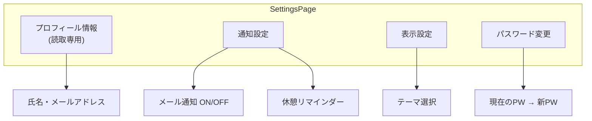
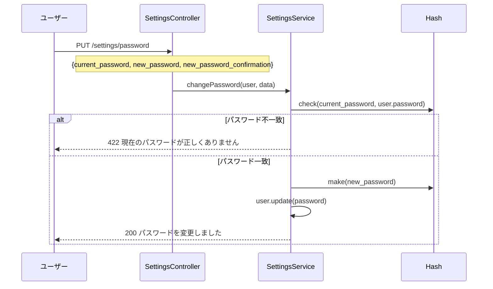

# ユーザー設定機能設計

## 概要

ユーザー個人の設定管理機能。通知設定、表示設定、パスワード変更などのユーザープリファレンスの CRUD 設計を解説する。

## データモデル



## API エンドポイント

| メソッド | パス | 説明 |
|---|---|---|
| `GET` | `/api/settings` | 現在の設定を取得 |
| `PUT` | `/api/settings` | 設定を更新 |
| `PUT` | `/api/settings/password` | パスワード変更 |

## 設定項目一覧

| カテゴリ | 設定項目 | 型 | デフォルト |
|---|---|---|---|
| 通知 | メール通知 | `boolean` | `true` |
| 通知 | 休憩リマインダー | `boolean` | `false` |
| 通知 | リマインダー時間(分) | `integer` | `60` |
| 表示 | テーマ | `string` | `light` |
| 表示 | 言語 | `string` | `ja` |

## 設定画面構成



## バックエンド実装

```php
// SettingsController
class SettingsController extends BaseController
{
    public function show(Request $request): JsonResponse
    {
        $settings = $this->settingsService->getUserSettings(
            $request->user()
        );
        return ApiResponse::success($settings);
    }

    public function update(UpdateSettingsRequest $request): JsonResponse
    {
        $settings = $this->settingsService->updateSettings(
            $request->user(),
            $request->validated()
        );
        return ApiResponse::success($settings);
    }
}

// SettingsService
class SettingsService extends BaseService
{
    public function updateSettings(User $user, array $data): UserSetting
    {
        return $user->settings()->updateOrCreate(
            ['user_id' => $user->id],
            $data
        );
    }
}
```

## パスワード変更フロー



## フロントエンド

```typescript
// front/src/features/settings/pages/SettingsPage.tsx
export const SettingsPage = () => {
  const { data: settings } = useSettings();
  const { mutate: updateSettings } = useUpdateSettings();

  const form = useForm<SettingsFormValues>({
    resolver: zodResolver(settingsSchema),
    defaultValues: settings,
  });

  const onSubmit = (values: SettingsFormValues) => {
    updateSettings(values, {
      onSuccess: () => toast.success('設定を保存しました'),
    });
  };

  return (
    <PageLayout title="設定">
      <Form {...form}>
        <NotificationSettings />
        <DisplaySettings />
        <PasswordChangeForm />
      </Form>
    </PageLayout>
  );
};
```

## 注意: 設計レビュー指摘事項

| 問題 | 影響 | 改善案 |
|---|---|---|
| **設定のキャッシュ** | 毎HTTPリクエストで DB 参照すると負荷が高い | Redis にユーザー設定をキャッシュし、更新時にキャッシュクリア |
| **パスワード変更後の JWT 無効化** | パスワード変更後も旧 JWT が有効 | パスワード変更時に `jwt_invalidated_at` を更新し、ミドルウェアでチェック |
| **デフォルト設定の管理** | `user_settings` レコードが存在しない新規ユーザー | ユーザー作成時に設定レコードも生成。または `firstOrCreate` で取得 |
| **楽観的ロックがない** | 複数タブから同時に設定変更すると後勝ちになる | `updated_at` による楽観的ロック、または差分更新 |
| **テーマの実装が不完全** | ダークテーマの CSS 変数が未定義の可能性 | Tailwind の `dark:` バリアントに合わせて CSS 変数を網羅する |
