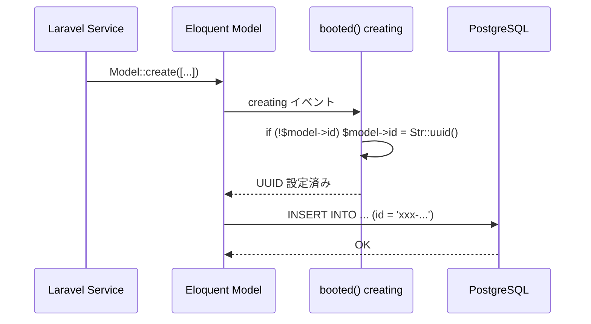

# UUID 主キー設計

## 概要

全テーブルで UUID v4 を主キーとして採用している。自動採番 (auto-increment) との違い、パフォーマンス特性、実装パターンを解説する。

## UUID vs Auto-Increment 比較

| 観点 | UUID v4 | Auto-Increment |
|---|---|---|
| **一意性** | グローバルに一意 | テーブル内で一意 |
| **推測困難性** | ✅ ランダム | ❌ 連番で推測可能 |
| **分散生成** | ✅ DB 不要で生成可 | ❌ DB にシーケンス依存 |
| **インデックスサイズ** | ❌ 36バイト | ✅ 4-8バイト |
| **クラスタードインデックスの断片化** | ❌ ランダム挿入 | ✅ 連番挿入 |
| **URL 安全性** | ✅ 列挙攻撃に強い | ❌ 次の ID が推測可能 |

## Eloquent モデル設定

```php
class Attendance extends BaseModel
{
    // UUID 文字列型
    protected $keyType = 'string';
    public $incrementing = false;

    protected static function booted(): void
    {
        static::creating(function (self $model) {
            if (!$model->id) {
                $model->id = (string) Str::uuid();
            }
        });
    }
}
```

## マイグレーション定義

```php
Schema::create('attendances', function (Blueprint $table) {
    $table->uuid('id')->primary();
    $table->uuid('user_id');
    // ...
    $table->foreign('user_id')->references('id')->on('users');
});
```

## PostgreSQL での UUID 最適化

```sql
-- uuid-ossp 拡張（init.sql で有効化済み）
CREATE EXTENSION IF NOT EXISTS "uuid-ossp";
CREATE EXTENSION IF NOT EXISTS "pgcrypto";

-- PostgreSQL は UUID 型をネイティブサポート（16バイト内部表現）
-- VARCHAR(36) より効率的
```

## UUID 生成フロー



## Factory / Seeder での UUID

```php
// Factory：UUID は booted() で自動生成されるため指定不要
Attendance::factory()->create([
    'user_id' => $user->id,
    'work_date' => '2026-03-21',
]);

// Seeder：明示的に指定する場合
Attendance::create([
    'id' => '550e8400-e29b-41d4-a716-446655440000', // テスト用固定UUID
    'user_id' => $user->id,
]);
```

## インデックス戦略

```sql
-- UUID主キーのB-treeインデックス（自動）
-- ランダム挿入による断片化を緩和するために FILLFACTOR を調整
ALTER TABLE attendances SET (fillfactor = 90);

-- 複合インデックスによる UUID の検索最適化
CREATE INDEX idx_attendances_user_clock_in
    ON attendances(user_id, clock_in_at);
```

## 注意: 設計レビュー指摘事項

| 問題 | 影響 | 改善案 |
|---|---|---|
| **UUID v4 のランダム性による B-tree 断片化** | INSERT パフォーマンスが低下、テーブルサイズ膨張 | UUID v7（時間順ソート可能）への移行を検討。`Str::orderedUuid()` が利用可能 |
| **`$fillable` に `id` が含まれるモデルがある** | マスアサインメントで外部から ID を上書きされるリスク | `$fillable` から `id` を除外し、`booted()` のみで生成する |
| **`AttendanceBreak` に `booted()` がない** | UUID が自動設定されず、INSERT 時に null エラーの可能性 | `booted()` フックを追加するか、Factory で明示的に UUID を設定 |
| **VARCHAR(36) vs UUID 型** | マイグレーションで `$table->uuid()` を使っているが、内部型が VARCHAR の場合がある | PostgreSQL では `uuid` 型（16バイト）で保存されることを確認 |
| **UUID の一括生成コスト** | Seeder で大量レコード作成時に `Str::uuid()` が毎回呼ばれる | バルクインサートとして `uuid_generate_v4()` を使った raw SQL を検討 |
