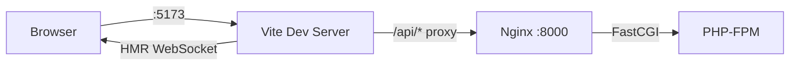

# Vite ビルド設定

## 概要

Vite による開発サーバー、ビルド最適化、プロキシ設定、パスエイリアスの設計を解説する。

## Vite 設定ファイル

```typescript
// front/vite.config.ts
import { defineConfig, loadEnv } from 'vite';
import react from '@vitejs/plugin-react';
import tailwindcss from '@tailwindcss/vite';
import path from 'path';

export default defineConfig(({ mode }) => {
    const env = loadEnv(mode, process.cwd(), '');

    return {
        plugins: [react(), tailwindcss()],

        resolve: {
            alias: {
                '@': path.resolve(__dirname, './src'),   // @/ → src/
                '@/': path.resolve(__dirname, './src/'),
            },
        },

        server: {
            host: true,      // Dockerコンテナ内で0.0.0.0にバインド
            port: 5173,
            proxy: {
                '/api': {
                    target: env.VITE_API_PROXY_TARGET || 'http://localhost:8000',
                    changeOrigin: true,
                },
            },
        },

        build: {
            sourcemap: true,
            outDir: 'dist',
            rollupOptions: {
                output: {
                    manualChunks: undefined,
                },
            },
        },
    };
});
```

## 開発サーバー構成



## TypeScript 設定

```json
// front/tsconfig.app.json
{
    "compilerOptions": {
        "target": "ES2022",
        "module": "ESNext",
        "moduleResolution": "bundler",
        "jsx": "react-jsx",
        "strict": true,
        "noUnusedLocals": true,
        "noUnusedParameters": true,
        "paths": {
            "@/*": ["./src/*"]
        }
    },
    "include": ["src"]
}
```

## 環境変数管理

```
front/.env              → VITE_API_URL, VITE_API_PROXY_TARGET
front/.env.development  → 開発環境固有
front/.env.production   → 本番環境固有
```

```typescript
// front/src/env.ts
export const env = {
    API_URL: import.meta.env.VITE_API_URL,           // '/api'
    API_TIMEOUT: import.meta.env.VITE_API_TIMEOUT,   // 30000
    NODE_ENV: import.meta.env.VITE_NODE_ENV,          // 'development'
};
```

## ビルド出力

```
dist/
├── index.html
├── assets/
│   ├── index-[hash].js      # メインバンドル
│   ├── index-[hash].css      # Tailwind CSS
│   └── vendor-[hash].js      # (手動チャンク時)
└── ...
```

## ESLint 設定

```javascript
// front/eslint.config.js (ESLint 9 flat config)
export default [
    { ignores: ['dist/', 'src/__generated__/'] },
    {
        plugins: {
            'react-hooks': reactHooks,
            'react-refresh': reactRefresh,
        },
        rules: {
            'react-hooks/rules-of-hooks': 'error',
            'react-hooks/exhaustive-deps': 'warn',
            'react-refresh/only-export-components': 'warn',
        },
    },
    ...tseslint.configs.strict,
];
```

## 注意: 設計レビュー指摘事項

| 問題 | 影響 | 改善案 |
|---|---|---|
| **`manualChunks: undefined`** | コード分割が最適化されない。全コードが 1 チャンクに含まれる | `vendor` チャンク分割（react, zustand, axios 等）を設定 |
| **`sourcemap: true` が本番ビルドにも適用** | ソースコードが公開される。デバッグ用途以外ではセキュリティリスク | 本番は `sourcemap: 'hidden'` または `false` に |
| **HMR が Docker 内で CHOKIDAR_USEPOLLING 依存** | CPU 使用率が高くなる | `usePolling: true` は Docker Compose で設定済み。ネイティブ fs.watch が使えれば不要 |
| **`VITE_API_URL` が `/api`（相対パス）** | SSR 導入時に問題になる可能性 | 現状 SPA のみなので問題なし。SSR 対応時に絶対 URL への切り替えが必要 |
| **Tailwind CSS 4 + Vite プラグイン** | PostCSS ベースから Vite プラグインへの移行で、既存の PostCSS プラグインが使えない | 現時点では PostCSS プラグイン不使用のため問題なし |
