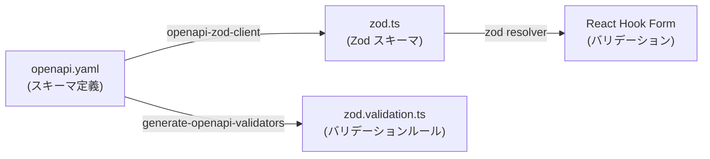
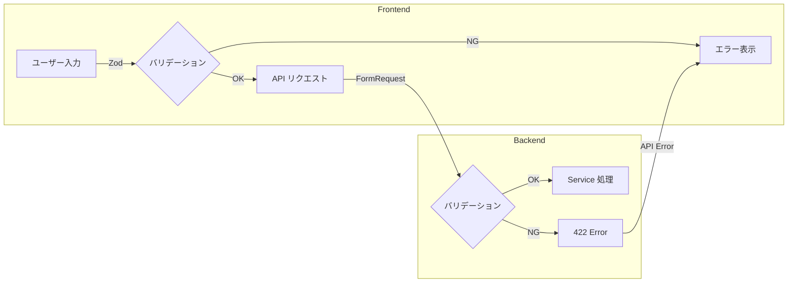

# Zod スキーマパターン

## 概要

OpenAPI 定義から自動生成される Zod スキーマによるフロントエンドバリデーション設計。React Hook Form との統合パターンを解説する。

## 生成パイプライン



## 生成される Zod スキーマ例

```typescript
// front/src/__generated__/zod.ts（自動生成）
import { z } from 'zod';

export const LoginRequestSchema = z.object({
    email: z.string().email(),
    password: z.string().min(8),
});

export const AttendanceClockInRequestSchema = z.object({
    clock_in_local_time: z.string().optional(),
    work_timezone: z.string().optional(),
});

export const UpdateSettingsRequestSchema = z.object({
    theme: z.enum(['light', 'dark']),
    language: z.enum(['ja', 'en']),
});
```

## React Hook Form との統合

```typescript
import { useForm } from 'react-hook-form';
import { zodResolver } from '@hookform/resolvers/zod';
import { LoginRequestSchema } from '@/__generated__/zod';

type LoginForm = z.infer<typeof LoginRequestSchema>;

export function LoginPage() {
    const { register, handleSubmit, formState: { errors } } = useForm<LoginForm>({
        resolver: zodResolver(LoginRequestSchema),
        defaultValues: {
            email: '',
            password: '',
        },
    });

    const onSubmit = handleSubmit(async (data) => {
        const result = await login(data);
        if (!result.ok) {
            // エラーハンドリング
        }
    });

    return (
        <form onSubmit={onSubmit}>
            <Input {...register('email')} error={errors.email?.message} />
            <Input type="password" {...register('password')} error={errors.password?.message} />
            <SubmitButton>ログイン</SubmitButton>
        </form>
    );
}
```

## バリデーション二重チェック



| レイヤー | バリデーション手段 | 目的 |
|---|---|---|
| **フロントエンド** | Zod + React Hook Form | UX 向上（即座にエラー表示） |
| **バックエンド** | FormRequest (OpenAPI ルール) | セキュリティ（改ざん防止） |
| **ルールソース** | OpenAPI 定義（SSOT） | 一貫性保証 |

## フィールドラベル

```json
// front/src/__generated__/field-labels.json
{
    "email": "メールアドレス",
    "password": "パスワード",
    "theme": "テーマ",
    "language": "言語",
    "work_date": "勤務日",
    "clock_in_local_time": "出勤時刻",
    "clock_out_local_time": "退勤時刻"
}
```

## カスタムバリデーションの追加

```typescript
// 自動生成スキーマを拡張
const ExtendedLoginSchema = LoginRequestSchema.extend({
    email: z.string()
        .email('正しいメールアドレスを入力してください')
        .max(255, '255文字以内で入力してください'),
    password: z.string()
        .min(8, 'パスワードは8文字以上です')
        .regex(/[A-Z]/, '大文字を含めてください')
        .regex(/[0-9]/, '数字を含めてください'),
});
```

## 注意: 設計レビュー指摘事項

| 問題 | 影響 | 改善案 |
|---|---|---|
| **Zod スキーマとバックエンドルールの乖離** | OpenAPI が SSOT だが、カスタム拡張すると差分が発生 | カスタム拡張は最小限にし、OpenAPI 定義を充実させる |
| **エラーメッセージが英語** | 自動生成の Zod エラーメッセージは英語デフォルト | `z.setErrorMap()` でグローバルに日本語化するか、各フィールドで指定 |
| **`zod.ts` と `zod.validation.ts` の役割不明確** | 2つの自動生成ファイルの使い分けがわかりにくい | ドキュメントで用途を明記：`zod.ts` は型、`zod.validation.ts` はルール |
| **全フォームで Zod 統合されていない** | 一部フォームが `useState` のみで Zod 未使用 | 全フォームで `zodResolver` を統一的に使用する |
| **バリデーションタイミング** | `onChange` で毎回バリデーションするとパフォーマンス問題 | `mode: 'onBlur'` または `mode: 'onSubmit'` に設定 |
